# خواننده تلگرام

<!-- TOP_NAV START -->

<!-- TOP_NAV END -->

<!-- MSG START -->

---
📅 بروزرسانی: 1405/02/29 13:17
---

## VahidOOnLine — post 240932

  

رسانه‌های ایران گزارش دادند حمید خانی، عضو پیشین سپاه پاسداران، در جریان ماموریت خنثی‌سازی بمب‌های عمل‌نکرده ناشی از حملات مشترک اسرائیل و آمریکا در تهران کشته شده است. بر اساس این گزارش‌ها، او به صورت داوطلبانه در بخش مهندسی قرارگاه خاتم‌الانبیا فعالیت می‌کرده است.

جزئیات بیشتری درباره زمان دقیق حادثه و نحوه وقوع آن منتشر نشده است.
‌🏁 🇬🇧 IranintlTV

🤖 @VahidOOnLine

## VahidOOnLine — post 240931

  

♦️ تدروس ادهانوم قبریسوس، رئیس سازمان جهانی بهداشت روز سه‌شنبه ۲۹ اردیبهشت اعلام کرد سرعت و ابعاد شیوع ویروس ابولا در کشور جمهوری دموکراتیک کنگو، بسیار نگران‌کننده است.

رئیس سازمان جهانی بهداشت در دومین روز مجمع عمومی کشورهای عضو این نهاد بین‌المللی گفت امروز برای بررسی وضعیت شیوع این بیماری یک کمیته فوق‌العاده تشکیل خواهد شد.

از هفته گذشته تاکنون دست‌کم ۱۰۳ نفر براثر ابتلا به سویه بوندیبوگیو ویروس ابولا در جمهوری دموکراتیک کنگو جان خود را از دست داده‌اند.

کارشناسان سازمان جهانی بهداشت می‌گویند واکسنی که برای سویه «زئیر» این ویروس در سال‌های قبل به‌کار گرفته شده بود، ممکن است در پیشگیری از گونه جدید موثر باشد.
‌🇸🇦 Indypersian

🤖 @VahidOOnLine

## VahidOOnLine — post 240930

  <a href="telegram/content/VahidOOnLine_240930_1779184032.mp4" target="_blank">🎬 Download video</a>

ویدیوی ارسال‌شده به ایران‌اینترنشنال، برگزاری مراسم عقد میان حامیان حکومت را در یکی از تجمع‌های حکومتی در تهران نشان می‌دهد.
‌🏁 🇬🇧 IranintlTV

🤖 @VahidOOnLine

## VahidOOnLine — post 240929

🗣روایت شما از بحران اقتصادی و زندگی در آتش‌بس- سه‌شنبه ۲۹ اردیبهشت:

🔹یک بسته برنج یک کیلویی، یک بسته بال مرغ، ۶ تا تخم‌مرغ و یه روغن کوچیک گرفتیم شد ۲ میلیون و ۱۰۰ هزار تومن.

🔹یارانه یک خانواده‌ ۳ نفره ۳ میلیون تومانه، اما یک روغن جامد ۵ کیلویی قیمتش ۳ میلیون و ۴۰۰ هزار تومانه.

🔹ما از دی ماه نه دانشگاه رفتیم نه خوابگاه ولی هر ماه شهریه خوابگاه رو باید بدیم. پدر من بازنشسته‌است، از کجا بیاریم آخه.

🔹صنعت گردشگری و هتلداری فرو پاشیده. ۴ ماهه حقوق نگرفتیم.

🔹برا ۵ تا نان لواش با یه کیسه پلاستیکی ۵۵ هزار تومان پرداختم. گرونی جوریه که اگه بیمار باشی، ناتوان باشی، یا برای یه سالمند بخواهی سفارش آنلاین بدی، مجبور به پرداخت مبلغ زیادی هستی.

🔹ما بازنشسته‌ها با این حقوق‌های پایین داریم له می‌شیم، حتی نمی‌تونیم به درمان خودمون برسیم.

🔹من پارسال بعد ازدواجم یه آپارتمان گرفتم با مبلغ ۸۰۰ میلیون رهن و ۱۰ میلیون تومان اجاره. امسال صاحبخانه گفته باید یک میلیارد و ۲۰۰ رهن بدی با ۲۵ میلیون تومان اجاره... کادر درمان هستم و موندم چکار کنم.

🔹قطعی برق شهرک‌های صنعتی تهران از ۲۶ اردیبهشت شروع شده. فعلا طبق برنامه مدیریت بار، یک روز در هفته از ساعت ۸ صبح تا ۱۲ شب!

🔹قطعی آب در زاهدان طولانی مدت شده و حتی به ۱۲ ساعت هم می‌رسه. زمان‌های قطعی هم متفاوته، یک‌بار صبح زود یک‌بار ظهر یک‌بار عصر.
‌🏁 🇬🇧 IranintlTV

🤖 @VahidOOnLine

## VahidOOnLine — post 240928

  <a href="telegram/content/VahidOOnLine_240928_1779184035.mp4" target="_blank">🎬 Download video</a>

نت‌بلاکس، نهاد ناظر بر دسترسی اینترنت، اعلام کرد ایران برای هشتاد و یکمین روز متوالی با قطعی گسترده اینترنت روبه‌رو است و این رخداد اکنون به طولانی‌ترین خاموشی اینترنتی ملی ثبت‌شده در یک کشور متصل به اینترنت تبدیل شده است.

بر اساس داده‌های نت‌بلاکس، دسترسی کاربران داخل ایران به اینترنت جهانی به‌شدت محدود مانده و ارتباطات دیجیتال کشور در سطحی بسیار پایین‌تر از وضعیت عادی قرار دارد.
‌🏁 🇬🇧 ManotoTV

🤖 @VahidOOnLine

## VahidOOnLine — post 240927

  

♦️محمد کاظم غریب‌آبادی، معاون وزیر امور خارجه جمهوری اسلامی روز سه‌شنبه ۲۹ اردیبهشت‌ماه گفت که خروج نیروهای نظامی آمریکا از «محیط پیرامونی ایران» یکی از شروط تهران برای مذاکره پایان جنگ با واشنگتن است.

به گزارش خبرگزای ایرنا، غریب‌آبادی در جریان دیدار با اعضای کمیسیون امنیت ملی مجلس شورای اسلامی در باره روند «مذاکرات با آمریکا» گفت: «تاکید بر حق غنی سازی و برخورداری جمهوری اسلامی ایران از حقوق هسته‌ای صلح‌آمیز، خاتمه جنگ در تمامی جبهه‌ها از جمله لبنان، رفع محاصره دریایی آمریکا، آزادسازی اموال و دارائی‌های ایران، تامین خسارت‌های وارد شده در جنگ تحمیلی توسط ایالات متحده جهت بازسازی، خاتمه تمامی تحریم‌های یکجانبه و قطعنامه‌های شورای امنیت ، خروج نیروهای آمریکایی از محیط پیرامونی جمهوری اسلامی ، از جمله محورها و چهارچوب‌هایی است که در پیشنهادهای اخیر ایران مطرح شده است.»

دونالد ترامپ گفته است آمریکا هیچ امتیازی به ایران نخواهد داد.
‌🇸🇦 Indypersian

🤖 @VahidOOnLine

## VahidOOnLine — post 240926

♦️ مادر جاویدنام متین پرویزی، یکی از هزاران جان‌باخته انقلاب ملی ایرانیان، تولد ۲۲ سالگی جگرگوشه‌اش را بر مزار او برگزار کرد.

در ویدیویی که از این مراسم در شبکه‌های اجتماعی منتشر شده، بی‌تابی وگریه‌های مادار داغدار متین بر سر مزارفرزندش که کیک تولدی به شکل نقشه ایران و سه رنگ پرچم ملی میهن روی آن قرار دارد و با شاخه‌های گل آراسته شده، دیده می‌شود. روی کیک جاویدنام شعار «فرزند ایران، جان فدای وطن» نوشته شده است.

متین پرویزی شامگاه ۱۸ دی‌ماه و در تظاهرات انقلاب ملی ایرانیان هدف گلوله سرکوبگران جمهوری اسلامی قرار گرفت و کشته شد.
‌🇸🇦 Indypersian

🤖 @VahidOOnLine

## VahidOOnLine — post 240925

  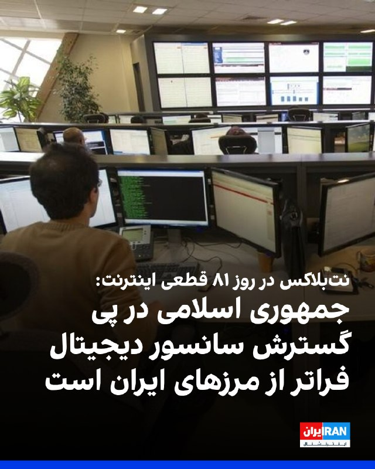

نت‌بلاکس، نهاد مستقل پایش وضعیت اینترنت در جهان، سه‌شنبه ۲۹ اردیبهشت اعلام کرد قطع اینترنت در ایران اکنون به هشتاد و یکمین روز رسیده است.

نت‌بلاکس افزود: «هم‌زمان، حکومت در تلاش است کنترل دیجیتال خود را به سطح بین‌المللی گسترش دهد؛ از جمله با مطالبه کنترل کابل‌های سایر کشورها در تنگه هرمز و وادار کردن شرکت‌های بزرگ فناوری به تبعیت از قوانین جمهوری اسلامی.»
‌🏁 🇬🇧 IranintlTV

🤖 @VahidOOnLine

## VahidOOnLine — post 240924

  <a href="telegram/content/VahidOOnLine_240924_1779184038.mp4" target="_blank">🎬 Download video</a>

وزارت دفاع روسیه اعلام کرد نیروهای مسلح این کشور از سه‌شنبه ۲۹ اردیبهشت تا ۳۱ اردیبهشت رزمایش نیروهای هسته‌ای برگزار می‌کنند.

بر اساس این اعلام، بیش از ۶۴ هزار نیروی نظامی و ۷۸۰۰ قطعه تجهیزات نظامی در این رزمایش شرکت دارند و قرار است موشک‌های بالستیک و کروز از پایگاه‌های آزمایشی در خاک روسیه شلیک شوند.

این خبر هم‌زمان با افزایش تنش‌های امنیتی میان روسیه و غرب منتشر شده است. یک روز پیشتر نیز بلاروس اعلام کرد با مشارکت روسیه رزمایشی را برای تمرین جابه‌جایی و آماده‌سازی مهمات هسته‌ای برگزار می‌کند. بلاروس میزبان تسلیحات هسته‌ای تاکتیکی روسیه است، اما مسکو کنترل این تسلیحات را در اختیار دارد.
‌🏁 🇬🇧 ManotoTV

🤖 @VahidOOnLine

## VahidOOnLine — post 240923

  

مسعود پزشکیان، رییس دولت جمهوری اسلامی، در نشست با مدیران وزارت کار گفت: «برای غلبه بر آثار و پیامدهای ناشی از جنگ باید با تدبیر، برنامه‌ریزی و نگاه بلندمدت عمل کرد.»

او افزود: «برخی اقدامات فعلی اگرچه برای کنترل شرایط ضروری است، اما در عمل به‌مثابه مُسَکِن و درمان موقت محسوب می‌شود و لازم است برای حل ریشه‌ای مشکلات اقتصادی و اجتماعی، برنامه‌ریزی ساختاری و پایدار صورت گیرد.»

پزشکیان ادامه داد: «باید به‌گونه‌ای برنامه‌ریزی شود که به‌جای اتکای صرف به پرداخت بیمه بیکاری، زمینه ایجاد فرصت‌های شغلی پایدار برای افرادی که در جریان جنگ شغل خود را از دست داده‌اند، فراهم شود.»

رییس دولت جمهوری اسلامی «مدیریت مصرف و پرهیز از اسراف» را یک «ضرورت ملی» دانست و تاکید کرد: «همه دستگاه‌ها باید در این زمینه پیشگام باشند.»
‌🏁 🇬🇧 IranintlTV

🤖 @VahidOOnLine

## VahidOOnLine — post 240922

  

⭕️ایلان ماسک: اسرائیل در نوآوری و فناوری در خط مقدم جهان قرار دارد

♦️ایلان ماسک، مدیرعامل تسلا روز دوشنبه ۲۸ اردیبهشت و در جریان یک سخنرانی مجازی در نهمین کنفرانس بین‌المللی حمل‌ونقل هوشمند در اسرائیل، از جایگاه این کشور در حوزه فناوری و نوآوری تمجید کرد و گفت: «اسرائیل فراتر از آنچه با توجه به جمعیتش انتظار می‌رود عمل می‌کند.»

مدیرعامل تسلا و اسپیس‌ایکس همچنین پیش‌بینی کرد طی یک دهه آینده، ۹۰ درصد خودروها خودران خواهند بود و افزود اسرائیل از نظر «سرانه نوآوری» با اختلاف در رتبه نخست جهان قرار دارد.

ماسک تاکید کرد از نوآوری‌هایی که از اسرائیل ارائه می‌شود، «حمایت جدی» می‌کند.
‌🇸🇦 Indypersian

🤖 @VahidOOnLine

## VahidOOnLine — post 240921

  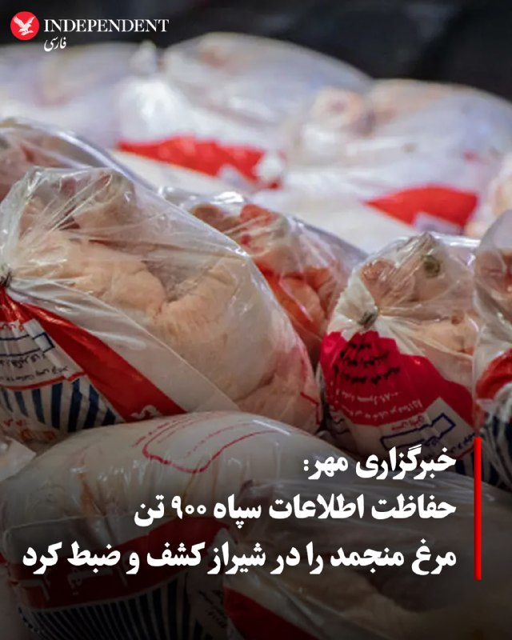

♦️ خبرگزاری مهر، وابسته به سازمان تبلیغات اسلامی روز سه‌شنبه ۲۹ اردیبهشت‌ماه از «کشف و ضبط ۹۰۰ تن مرغ منجمد احتکار شده در شیراز» خبر داد.

به گزارش مهر، موسی رهبر، مدیرکل تعزیرات حکومتی  استان فارس گفت: «با گزارش سربازان گمنام امام زمان در سازمان اطلاعات سپاه فجر فارس مبنی بر احتکار مرغ در سردخانه‌ای واقع در شهر شیراز ، اکیپی مشترک از بازرسان تعزیرات حکومتی و سازمان جهاد کشاورزی به محل اعزام شدند.
 در بازرسی از این سردخانه، مقدار ۹۰۰ تن مرغ منجمد که توسط صاحب آن احتکار شده بود، کشف و ضبط گردید.»

در هفته‌های گذشته و همزمان با سیر بی‌سابقه صعودی نرخ تورم کالاهای خوراکی و مصرفی، قوه قضائیه و نهادهای اطلاعاتی جمهوری اسلامی چند بار از کشف انبارهای محصولات احتکار شده خبر داده‌اند.
‌🇸🇦 Indypersian

🤖 @VahidOOnLine

## VahidOOnLine — post 240920

  

کاظم غریب‌آبادی، معاون وزیر خارجه جمهوری اسلامی، در دیدار با نمایندگان مجلس اعلام کرد مجموعه‌ای از مطالبات جمهوری اسلامی در پیشنهاد اخیر تهران به آمریکا درج شده است.

او گفت تاکید بر حق غنی‌سازی، خاتمه جنگ در همه جبهه‌ها از جمله لبنان، رفع محاصره دریایی آمریکا، آزادسازی اموال بلوکه‌شده، تامین خسارت‌های واردشده در جنگ، پایان همه تحریم‌ها و خروج نیروهای آمریکایی از محیط پیرامونی جمهوری اسلامی در این پیشنهاد گنجانده شده است.

غریب‌آبادی جزئیات بیشتری درباره روند بررسی این پیشنهاد یا واکنش طرف آمریکایی ارائه نکرد.
‌🏁 🇬🇧 IranintlTV

🤖 @VahidOOnLine

## VahidOOnLine — post 240919

  <a href="telegram/content/VahidOOnLine_240919_1779184041.mp4" target="_blank">🎬 Download video</a>

در پی کارزار ایران‌اینترنشنال برای یافتن هویت پیکر جاویدنامان در بیمارستان الغدیر تهران، ویدیویی از لحظه قتل جاویدنام آیدا عقیلی به دست ما رسیده است.
آیدا عقیلی، ۳۴ ساله، شامگاه ۱۸ دی ۱۴۰۴ در شرق تهران با شلیک دو گلوله ماموران به سرش کشته شد که پیکر او را پیچیده در پتویی چهارخانه در حیاط پشتی بیمارستان الغدیر یافتند.
‌🏁 🇬🇧 IranintlTV

🤖 @VahidOOnLine

## VahidOOnLine — post 240918

  

♦️ بازار بورس تهران روز سه‌شنبه ۲۹ اردیبهشت ماه و پس از ۸۰ روز تعطیلی بازگشایی شد.
بورس تهران پس از حمله نظامی آمریکا و اسرائیل و آغاز جنگ تعطیل شد و با وجود نزدیک به ۴۰ روز پس از آتش‌بس، همچنان بسته مانده بود.

بازار بورس تهران در هفته‌های منتهی به آغاز جنگ و همزمان با سقوط ارزش ریال، تشدید تحریم‌ها و افزایش نگرانی‌ از احتمال حمله نظامی، عمدتا با ریزش شاخص‌ها مواجه بود و بسیاری از دارندگان سهام، تلاش می‌کردند تا پول خود را از این بازار پرخطر خارج کنند.
‌🇸🇦 Indypersian

🤖 @VahidOOnLine

## VahidOOnLine — post 240917

  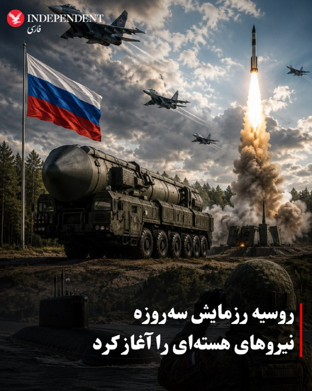

♦️وزارت دفاع روسیه اعلام کرد ارتش این کشور از روز سه‌شنبه رزمایش سه‌روزه نیروهای هسته‌ای را با مشارکت هزاران نظامی در مناطق مختلف آغاز کرده است.
به گفته این وزارتخانه، این مانور از ۱۹ تا ۲۱ مه با هدف تمرین «آماده‌سازی و استفاده از نیروهای هسته‌ای در صورت تهدید به تجاوز» برگزار می‌شود.

آغاز این رزمایش هم‌زمان با تشدید حملات پهپادی اوکراین به خاک روسیه و در آستانه سفر ولادیمیر پوتین به چین صورت گرفته است. روسیه از زمان آغاز جنگ اوکراین بارها بر آمادگی نیروهای بازدارندگی هسته‌ای خود تأکید کرده است.

روسیه و بلاروس، روز گذشته رزمایش هسته‌ای مشترک برگزار کرده بودند.
به گفته وزارت دفاع بلاروس، در این رزمایش نیروهای دو کشور برای
تحویل مهمات هسته‌ای و آماده‌سازی برای استفاده از آن تمرین کردند.
‌🇸🇦 Indypersian

🤖 @VahidOOnLine

## VahidOOnLine — post 240916

  

♦️ موسسه نت‌بلاکس اعلام کرد قطعی سراسری اینترنت در ایران وارد هشتادمین روز خود شده و از مرز ۱۸۹۶ ساعت عبور کرده است.

 به گفته این نهاد ناظر بر شبکه جهانی در حالی که شبکه‌های اجتماعی مملو از محتوای هم‌سو با جمهوری اسلامی شده است، کاربران ایرانی می‌گویند برای دریافت دسترسی به اینترنت «پرو»، مجبور به قبول بازنشر حداقلی از محتوای تبلیغات حکومتی هستند. نت‌بلاکس می‌گوید جمهوری اسلامی از طریق هوش مصنوعی بر این روند نظارت می‌کند.
‌🇸🇦 Indypersian

🤖 @VahidOOnLine

## VahidOOnLine — post 240915

  <a href="telegram/content/VahidOOnLine_240915_1779184045.mp4" target="_blank">🎬 Download video</a>

علی عبداللهی، فرمانده قرارگاه مرکزی حضرت خاتم‌الانبیا، در اظهاراتی خطاب به آمریکا و هم‌پیمانانش هشدار داد که «دوباره مرتکب خطای محاسباتی نشوند».

او گفت اگر «خطای دیگری» از سوی دشمنان جمهوری اسلامی رخ دهد، نیروهای مسلح ایران با «قدرت و توانایی به مراتب بالاتر از جنگ تحمیلی رمضان» با آن برخورد خواهند کرد.

این اظهارات در حالی مطرح می‌شود که در روزهای گذشته احتمال حمله نظامی به ایران افزایش یافته و دونالد ترامپ نیز دیشب گفت چند کشور عربی از او خواسته‌اند حمله‌ای «بسیار بزرگ» را برای چند روز به تعویق بیندازد.
‌🏁 🇬🇧 ManotoTV

🤖 @VahidOOnLine

## VahidOOnLine — post 240914

⭕️کیم جونگ اون دستور تقویت خطوط مرزی با کره جنوبی را صادر کرد

♦️رسانه‌های دولتی کره شمالی گزارش دادند کیم جونگ اون به فرماندهان ارشد نظامی دستور داده است یگان‌های خط مقدم را تقویت کرده و مرز جنوبی با کره جنوبی را به «دژی نفوذناپذیر» تبدیل کنند.
او در نشست فرماندهان نظامی تاکید کرد باید «نگاه به دشمن اصلی» تقویت شود؛ عبارتی که به‌طور ضمنی به کره جنوبی اشاره دارد.

به گزارش خبرگزاری رسمی کره شمالی، پیونگ‌یانگ همچنین در حال بازنگری در مفاهیم عملیاتی ارتش و توسعه توانمندی‌ها در حوزه‌های پهپادی، جنگ الکترونیک، سایبری و فضایی است؛ تحولاتی که تحلیلگران آن را متاثر از جنگ اوکراین و درگیری‌های خاورمیانه می‌دانند.

این اظهارات در شرایطی مطرح می‌شود که روابط دو کره در یکی از پرتنش‌ترین دوره‌های سال‌های اخیر قرار دارد.
‌🇸🇦 Indypersian

🤖 @VahidOOnLine

## VahidOOnLine — post 240913

  

فاطمه مهاجرانی، سخنگوی دولت جمهوری اسلامی، گفت: «دولت طرفدار محدودیت در دسترسی به اینترنت نیست. نگاه دولت نگاه عادلانه است، فلذا از هرگونه تبعیضی در دسترسی به هر منبعی از جمله اینترنت دفاع نمی‌کند.»

او اضافه کرد: «به دنبال این هستیم که با حفظ همه موضوعاتی که وجود دارد، منویات مقام معظم رهبری و ملاحظاتی که وجود دارد، بتوانیم از موضوع اینترنت گره‌گشایی‌هایی کنیم تا شاهد وضعیت عادلانه‌ای باشیم.»

مهاجرانی ادامه داد: «البته این نکته را هم باید بگوییم که در شرایط جنگی قرار داریم و بدیهی است که برخی از تصمیمات ناشی از تبعات شرایط جنگی است.»
‌🏁 🇬🇧 IranintlTV

🤖 @VahidOOnLine

## WithYashar — post 11635

روزنامه واشنگتن پست به نقل از یک مقام پاکستانی: ایران می‌خواهد پیش از اعلام توافق هسته‌ای، به توافقی برای پایان دادن به جنگ دست یابد.
واشنگتن می‌خواهد توافق بر سر همه مسائل را یکجا اعلام کند.
@withyashar

## WithYashar — post 11634

  <a href="telegram/content/WithYashar_11634_1779184047.mp4" target="_blank">🎬 Download video</a>

سم جدید .. 😂
@withyashar

## WithYashar — post 11633

صدای شدید پدافند دزفول اینم حتما پدافند کنترل شدست چیزی‌ نیست 😂

## WithYashar — post 11632

کمی پیش صدای انفجار و ستون دود در پادگان موشکی ۱۵ خرداد اصفهان @withyashar

## WithYashar — post 11631

@withyashar part6

## WithYashar — post 11629

دیشب خود گوهشون گفتن فردا اصفهان صدا میشنوید

## WithYashar — post 11628

دیشب خود گوهشون گفتن فردا اصفهان صدا میشنوید

## WithYashar — post 11627

  <a href="telegram/content/WithYashar_11627_1779184049.mp4" target="_blank">🎬 Download video</a>

کمی پیش صدای انفجار و ستون دود در پادگان موشکی ۱۵ خرداد اصفهان
@withyashar

## WithYashar — post 11626

  <a href="telegram/content/WithYashar_11626_1779184052.mp4" target="_blank">🎬 Download video</a>

پیت هگست وزیر جنگ با تقلید صدای ترامپ گفت وقتی ترامپ صمت وزیر جنگ را به او داد گفت : پیت، باید خیلی خشن و محکم باشی… آماده ای؟
@withyashar

## WithYashar — post 11622

@withyashar

## WithYashar — post 11621

@withyashar ⚔️

## WithYashar — post 11620

  <a href="telegram/content/WithYashar_11620_1779184054.webm" target="_blank">🎬 Download video</a>

🎬 Video

## WithYashar — post 11619

نیویورک تایمز: در صورت ازسرگیری جنگ، ایران ممکنه تاکتیک‌های جدیدی به کار بگیره.
@withyashar

## WithYashar — post 11618

گزارش فایننشال تایمز: شی جین‌پینگ، رئیس جمهور چین، به ترامپ گفته است که پوتین از تصمیم خود برای حمله به اوکراین پشیمان است. از سوی دیگر، اشاره شد که ترامپ به شی گفته است که ایالات متحده، چین و روسیه باید علیه دادگاه بین‌المللی کیفری در لاهه با هم همکاری کنند زیرا این دادگاه «سیاسی عمل می‌کند»
@withyashar

## mwarmonitor — post 9296

🔴انور قرقاش ؛ «اختلاط نقش‌ها در جریان این تجاوز وحشیانه ایران گیج‌کننده است و کشورهای منطقه پیرامون خلیج فارس را نیز در بر می‌گیرد. در نتیجه نقش قربانی با نقش میانجی در هم آمیخته شده و برعکس، و دوست به جای اینکه پشتیبان و حامی باشد، به میانجی تبدیل شده است.

🔸در این مرحله که خطرناک‌ترین دوره در تاریخ خلیج فارسِ معاصر است، و در میانه این تجاوز خائنانه، موضع خاکستری خطرناک‌تر از بی‌موضعی است.»

@mwarmonitor

## mwarmonitor — post 9294

  

✈️نیروی هوایی آمریکا (USAF)

بوئینگ KC-135 استراتوتانکر (سوخت‌رسان) – ۱ فروند
AE04EA 61-0276 – REACH 756
AE07BA 62-3557 – REACH 164

✈️پروازهای REACH 756 و REACH 164 امروز صبح از فرودگاه بن گوریون تل‌آویو به سمت پایگاه هوایی RAF Mildenhall در بریتانیا در حرکت هستند.

@mwarmonitor

## mwarmonitor — post 9293

🔴به گفته افرادی که با ارزیابی آمریکا از این نشست آشنا هستند، شی جین‌پینگ، رئیس‌جمهور چین، در جریان گفت‌وگوها در پکن در هفته گذشته به دونالد ترامپ گفته است که ولادیمیر پوتین، رئیس‌جمهور روسیه، ممکن است از تصمیم خود برای حمله به اوکراین پشیمان شود. — فایننشال تایمز

@mwarmonitor

## mwarmonitor — post 9292

✈️پرواز هواپیماهای جنگی بر فراز آسمان استان واسط عراق (هم مرز با استان ایلام).

@mwarmonitor

## mwarmonitor — post 9291

🔴 سنای ایالات متحده قصد دارد امروز ـ برای هشتمین بار ـ درباره قطعنامه «اختیارات جنگی» رأی‌گیری کند؛ قطعنامه‌ای که به مشارکت نیروهای آمریکا در جنگ با ایران بدون مجوز کنگره پایان می‌دهد. این موضوع را دموکرات‌های سنا اعلام کردند.

🔸همچنین مجلس نمایندگان آمریکا ممکن است در همین هفته درباره قطعنامه‌ای مشابه رأی‌گیری کند.

@mwarmonitor

## mwarmonitor — post 9290

🔸باراک راوید خبرنگار آکسیوس:

🚨 پشت‌پرده: به گفته دو منبع آگاه، ترامپ در ۲۴ ساعت پیش از اعلام موضعش، با رهبران عربستان سعودی، قطر و امارات متحده عربی به‌صورت تلفنی گفت‌وگو کرده است.

🚨 یک مقام آمریکایی گفت: «پیام واحدی از دوحه، ابوظبی و ریاض منتقل شد؛ در این مضمون که به مذاکرات فرصت بدهید، چون اگر به ایران حمله کنید، همه ما بهای آن را خواهیم پرداخت.»

🚨 یک منبع آگاه دیگر گفت ترامپ به برخی از متحدان سیاسی تندروِ خود گفته است که این سه رهبر عرب به او گفته‌اند: «آن‌ها نمی‌خواهند تأسیسات نفت و انرژی‌شان در نتیجه تلافی‌جویی ایران هدف قرار بگیرد.»

@mwarmonitor

## mwarmonitor — post 9289

🔴«به گزارش منابع، ترامپ بخشی از حملات بیشتر علیه ایران را متوقف کرد؛ اقدامی که تا حدی به‌دلیل نگرانی‌های پنتاگون بود مبنی بر اینکه تهران در حال مؤثرتر شدن در ردیابی عملیات‌های هوایی آمریکا و بهبود پدافند هوایی خود است.»

🔸«نیویورک‌تایمز گزارش می‌دهد که پنتاگون معتقد بود ایران در جریان درگیری به‌سرعت در حال تطبیق است؛ الگوهای پروازی آمریکا را بررسی می‌کند، پدافند هوایی خود را بهبود می‌بخشد و عنصر غافلگیری در حملات آمریکا را کاهش می‌دهد.»

@mwarmonitor

## pm_afshaa — post 91016

🔴نشریه AFP : همزمان با سفر پوتین به چین، روسیه قصد داره رزمایش نیروهای هسته‌ایشو برگزار کنه

💧 Rainbet.com the #1 Non-KYC Crypto Casino & Sportsbook @rainbetcom

😁 @Pm_Afshaa

## pm_afshaa — post 91015

🔴وال استریت ژورنال: ترامپ هنوز تمایل به حمله به ایران دارد

💧 Rainbet.com the #1 Non-KYC Crypto Casino & Sportsbook @rainbetcom

😁 @Pm_Afshaa

## DEJradio — post 4714

  <a href="telegram/content/DEJradio_4714_1779184056.mp4" target="_blank">🎬 Download video</a>

🔺🎥 پیام یک شهروند:
قیمت سوسیس و کالباس انقدر زیاده دیگه نمیشه خرید...

#تورم #سوسیس #کالباس
@DEJradio

## DEJradio — post 4713

  <a href="telegram/content/DEJradio_4713_1779184058.webm" target="_blank">🎬 Download video</a>

🔺📢 “دارو خیلی گرون شده، بچه من جلوی چشمم داره پرپر می‌زنه، به‌خدا با حقوق کارگری نمی‌شه تهیه کرد، بیمه قبول نمی‌کنه، به کی بگیم؟

پیام دریافتی

#تورم #دارو
@DEJradio

## DEJradio — post 4712

  <a href="telegram/content/DEJradio_4712_1779184059.mp4" target="_blank">🎬 Download video</a>

🔺📢 در جیرفت کرمان، مردم برای تنها ۲۰ لیتر بنزین از شب تا صبح در صف می‌مانند...

#کرمان #بنزین
@DEJradio

## DEJradio — post 4711

  <a href="telegram/content/DEJradio_4711_1779184061.mp4" target="_blank">🎬 Download video</a>

🤡
🔺 کاروان عروسی و صیغه با ماشین‌های جنگی و دوشکا!

#صیغه #تجمعات_حکومتی
@DEJradio

## IranIntlTV — post 337901

  <a href="telegram/content/IranIntlTV_337901_1779184064.mp4" target="_blank">🎬 Download video</a>

مستند «تمرین‌هایی برای یک انقلاب» ساخته پگاه آهنگرانی، برنده جایزه ویژه هیات داوران مستند گلدن گلوبز شد. این مستند با استفاده از تصاویر آرشیوی، روایت وقایع پس از انقلاب ۵۷ تا امروز را با زندگی شخصی فیلمساز پیوند می‌دهد.
لی‌لی نیکفر، خبرنگار ایران‌اینترنشنال، گزارش می‌دهد
@iranintltv

## IranIntlTV — post 337900

🔻نیویورک‌تایمز: جمهوری اسلامی از فرصت آتش‌بس برای احیای توان موشکی خود استفاده کرد

نیویورک‌تایمز گزارش داد جمهوری اسلامی در دوره آتش‌بس شکننده میان تهران و واشینگتن، بازسازی بخشی از توان موشکی خود را آغاز کرده و هم‌زمان برای احتمال ازسرگیری درگیری‌ها آماده می‌شود.

بر اساس این گزارش، جمهوری اسلامی از این فرصت برای بازگشایی ده‌ها محل استقرار موشک‌های بالستیک که در جریان حملات هدف قرار گرفته بودند، استفاده کرده است.

جابه‌جایی پرتابگرهای متحرک موشکی و تطبیق تاکتیک‌های نظامی برای دور تازه احتمالی جنگ نیز از دیگر اقدام‌های تهران عنوان شده است.

یک مقام نظامی آمریکا به نیویورک‌تایمز گفت بسیاری از موشک‌های بالستیک جمهوری اسلامی در تاسیسات زیرزمینی عمیق در دل کوه‌های گرانیتی نگهداری می‌شدند و آمریکا در حملات خود عمدتا ورودی این مراکز را هدف قرار داده بود.

به گفته او، فروریختن دهانه این تاسیسات باعث مدفون شدن آن‌ها شد، اما ساختار اصلی سایت‌ها از بین نرفت و اکنون حکومت ایران بخش قابل توجهی از این مراکز را دوباره بازگشایی کرده است.

این مقام آمریکایی افزود تهران همچنین بسیاری از تسلیحات باقی‌مانده خود را جابه‌جا کرده و در میان مقام‌های جمهوری اسلامی این باور تقویت شده که می‌توانند در برابر آمریکا مقاومت کنند؛ چه از طریق بستن موثر تنگه هرمز، چه با حمله به زیرساخت‌های انرژی کشورهای خلیج فارس و چه با تهدید هواپیماهای آمریکایی.

جمهوری اسلامی در انتظار جنگی کوتاه اما شدید

نیویورک‌تایمز نوشت با وجود ادامه مذاکرات، مقام‌های جمهوری اسلامی خود را برای احتمال ازسرگیری حملات آماده کرده‌اند و هشدار داده‌اند در صورت وقوع جنگ تازه، هزینه سنگینی به همسایگان و اقتصاد جهانی تحمیل خواهند کرد.

حمیدرضا عزیزی، پژوهشگر مسائل امنیتی ایران در موسسه آلمانی امور بین‌الملل و امنیت، به این روزنامه گفت مقام‌های جمهوری اسلامی در دور نخست جنگ، خود را برای یک درگیری طولانی‌مدت حدود سه ماهه آماده کرده بودند و به همین دلیل استفاده از موشک‌ها را محدود کردند تا بتوانند هفته‌ها حملات را ادامه دهند.

اما به گفته او، اگر جنگ دوباره آغاز شود، رهبران جمهوری اسلامی انتظار یک نبرد «کوتاه اما بسیار شدید» را دارند؛ جنگی که می‌تواند با حملات هماهنگ به زیرساخت‌های انرژی ایران همراه باشد.

به نوشته نیویورک‌تایمز، جمهوری اسلامی ممکن است در دور تازه درگیری‌ها روزانه ده‌ها یا حتی صدها موشک شلیک کند تا «محاسبات طرف مقابل را تغییر دهد».

تهدید خلیج فارس و باب‌المندب

این گزارش افزود که کشورهای عربی خلیج فارس در صورت آغاز دوباره جنگ، ممکن است با حملات شدیدتر به زیرساخت‌های انرژی خود روبه‌رو شوند. هدف قرار دادن میادین نفتی، پالایشگاه‌ها و بنادر نفتی، یکی از مهم‌ترین ابزارهای تهران برای وارد آوردن فشار بر اقتصاد جهانی توصیف شده است.

نیویورک‌تایمز همچنین به افزایش تهدیدهای لفظی علیه امارات متحده عربی اشاره کرد و نوشت برخی مقام‌ها و تحلیلگران نزدیک به جمهوری اسلامی معتقدند امارات با میزبانی پایگاه‌های نظامی آمریکا، در حملات علیه حکومت ایران نقش داشته است.

مهدی خراطیان، تحلیلگر نزدیک به نهادهای امنیتی جمهوری اسلامی، ماه گذشته گفته بود: «ما حتما باید امارات را به دوران شترسواری برگردانیم و می‌توانیم این کار را بکنیم. اگر لازم باشد، ابوظبی را اشغال خواهیم کرد.»

این روزنامه همچنین نوشت جمهوری اسلامی ممکن است علاوه بر تنگه هرمز، بر تنگه باب‌المندب نیز فشار وارد کند. آبراهی راهبردی میان دریای سرخ و خلیج عدن که حدود یک‌دهم تجارت جهانی از آن عبور می‌کند و در نزدیکی مناطق تحت کنترل حوثی‌های مورد حمایت جمهوری اسلامی قرار دارد.

به نوشته نیویورک‌تایمز، اگر تهران احساس کند کنترلش بر تنگه هرمز در خطر است، ممکن است تلاش کند آمریکا را هم‌زمان در دو جبهه دریایی درگیر کند.

این گزارش در پایان افزود اگرچه حوثی‌ها وعده داده‌اند در صورت وقوع جنگ منطقه‌ای از تهران حمایت کنند، اما در دور قبلی درگیری‌ها واکنش محتاطانه‌ای نشان دادند. موضوعی که تحلیلگران آن را ناشی از نگرانی این گروه درباره کاهش ذخایر نظامی‌اش می‌دانند.

🔗 وب‌سایت ایران اینترنشنال

@iranintltv

## IranIntlTV — post 337899

  

رسانه‌های ایران گزارش دادند حمید خانی، عضو پیشین سپاه پاسداران، در جریان ماموریت خنثی‌سازی بمب‌های عمل‌نکرده ناشی از حملات مشترک اسرائیل و آمریکا در تهران کشته شده است. بر اساس این گزارش‌ها، او به صورت داوطلبانه در بخش مهندسی قرارگاه خاتم‌الانبیا فعالیت می‌کرده است.

جزئیات بیشتری درباره زمان دقیق حادثه و نحوه وقوع آن منتشر نشده است.
https://iranintl.com/202605198404

## IranIntlTV — post 337898

  <a href="telegram/content/IranIntlTV_337898_1779184067.mp4" target="_blank">🎬 Download video</a>

پگاه آهنگرانی، بازیگر و مستندساز، پیش از نمایش فیلم «تمرین‌هایی برای یک انقلاب» در جشنواره فیلم کن، گفت این فیلم را به مادرانی تقدیم می‌کند که فرزندانشان را در «راه آزادی» از دست دادند.
@iranintltv

## IranIntlTV — post 337897

  <a href="telegram/content/IranIntlTV_337897_1779184069.mp4" target="_blank">🎬 Download video</a>

مدیرکل دفتر بهبود تغذیه وزارت بهداشت با اشاره به ادامه آموزش «تغذیه ارزان‌قیمت» گفت خانواده‌ها با استفاده از جایگزین‌های غذایی تلاش می‌کنند حداقل کالری و پروتئین مورد نیاز خود را تامین کنند. او همچنین گفت حدود ۵ درصد کودکان زیر ۵ سال در ایران دچار کوتاه‌قدی ناشی از سوءتغذیه هستند.
گفت‌وگو با بابک خطی، پزشک و متخصص کودکان
@iranintltv

## IranIntlTV — post 337896

  <a href="telegram/content/IranIntlTV_337896_1779184071.mp4" target="_blank">🎬 Download video</a>

هاکان فیدان، وزیر خارجه ترکیه، در کنفرانس خبری مشترک با همتای آلمانی‌اش گفت مهم‌ترین موضوع درباره ایران، باز ماندن تنگه هرمز و پس از آن، پرونده هسته‌ای جمهوری اسلامی است. فیدان افزود: «ذخایر اورانیوم غنی‌شده باید از ایران خارج شود.»

گفت‌وگو با احمد صمدی، خبرنگار ایران‌اینترنشنال
@iranintltv

## IranIntlTV — post 337895

  <a href="telegram/content/IranIntlTV_337895_1779184073.mp4" target="_blank">🎬 Download video</a>

ویدیوی ارسال‌شده به ایران‌اینترنشنال، برگزاری مراسم عقد میان حامیان حکومت را در یکی از تجمع‌های حکومتی در تهران نشان می‌دهد.

## IranIntlTV — post 337894

  <a href="telegram/content/IranIntlTV_337894_1779184076.mp4" target="_blank">🎬 Download video</a>

دونالد ترامپ، رییس‌جمهوری آمریکا، اعلام کرد به‌درخواست امارات متحده عربی، عربستان سعودی و قطر، حمله احتمالی علیه جمهوری اسلامی را برای چند روز به تعویق انداخته تا فرصت بیشتری برای دستیابی به توافق فراهم شود.

گفت‌وگو با مرتضی کاظمیان، عضو تحریریه ایران‌اینترنشنال
@iranintltv

## IranIntlTV — post 337893

🗣روایت شما از بحران اقتصادی و زندگی در آتش‌بس- سه‌شنبه ۲۹ اردیبهشت:

🔹یک بسته برنج یک کیلویی، یک بسته بال مرغ، ۶ تا تخم‌مرغ و یه روغن کوچیک گرفتیم شد ۲ میلیون و ۱۰۰ هزار تومن.

🔹یارانه یک خانواده‌ ۳ نفره ۳ میلیون تومانه، اما یک روغن جامد ۵ کیلویی قیمتش ۳ میلیون و ۴۰۰ هزار تومانه.

🔹ما از دی ماه نه دانشگاه رفتیم نه خوابگاه ولی هر ماه شهریه خوابگاه رو باید بدیم. پدر من بازنشسته‌است، از کجا بیاریم آخه.

🔹صنعت گردشگری و هتلداری فرو پاشیده. ۴ ماهه حقوق نگرفتیم.

🔹برا ۵ تا نان لواش با یه کیسه پلاستیکی ۵۵ هزار تومان پرداختم. گرونی جوریه که اگه بیمار باشی، ناتوان باشی، یا برای یه سالمند بخواهی سفارش آنلاین بدی، مجبور به پرداخت مبلغ زیادی هستی.

🔹ما بازنشسته‌ها با این حقوق‌های پایین داریم له می‌شیم، حتی نمی‌تونیم به درمان خودمون برسیم.

🔹من پارسال بعد ازدواجم یه آپارتمان گرفتم با مبلغ ۸۰۰ میلیون رهن و ۱۰ میلیون تومان اجاره. امسال صاحبخانه گفته باید یک میلیارد و ۲۰۰ رهن بدی با ۲۵ میلیون تومان اجاره... کادر درمان هستم و موندم چکار کنم.

🔹قطعی برق شهرک‌های صنعتی تهران از ۲۶ اردیبهشت شروع شده. فعلا طبق برنامه مدیریت بار، یک روز در هفته از ساعت ۸ صبح تا ۱۲ شب!

🔹قطعی آب در زاهدان طولانی مدت شده و حتی به ۱۲ ساعت هم می‌رسه. زمان‌های قطعی هم متفاوته، یک‌بار صبح زود یک‌بار ظهر یک‌بار عصر.

## IranIntlTV — post 337892

  <a href="telegram/content/IranIntlTV_337892_1779184078.mp4" target="_blank">🎬 Download video</a>

دونالد ترامپ، رییس‌جمهوری آمریکا، با اشاره به توقف کوتاه‌مدت حمله برنامه‌ریزی‌شده به جمهوری اسلامی در پی تقاضای عربستان‌ سعودی، امارات متحده عربی و قطر، گفت این موضوع را به اسرائیل و دیگر کشورهای منطقه نیز اطلاع داده است.

گفت‌وگو با محمد جواد اکبرین، عضو تحریریه ایران‌اینترنشنال
@iranintltv

## IranIntlTV — post 337891

  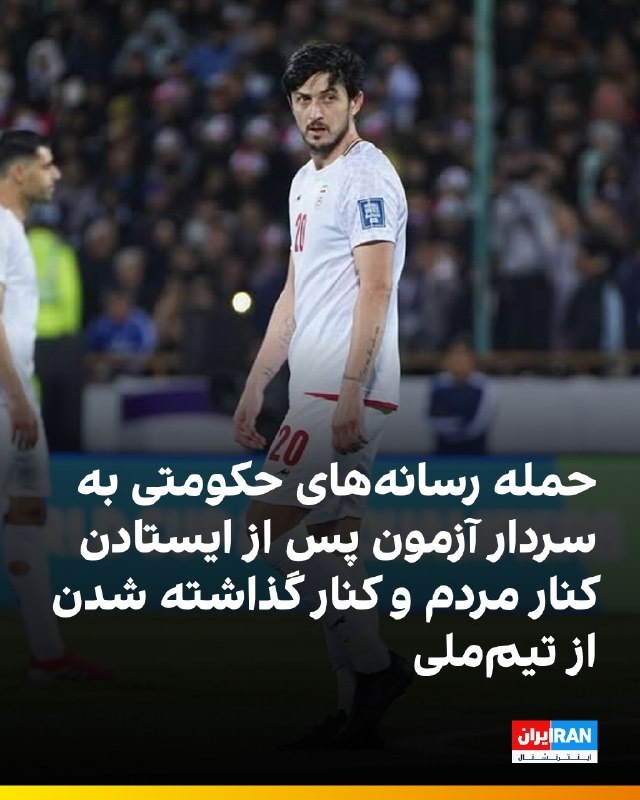

🔻سردار آزمون، مهاجم ایرانی شباب الاهلی امارات پس از موضع‌گیری‌هایی در مخالفت با جمهوری اسلامی، از فهرست تیم ملی برای جام جهانی کنار گذاشته شد. هم‌زمان، رسانه‌های حکومتی از جمله روزنامه‌های فرهیختگان و خراسان به او حمله کردند و از «رفوزه شدن» سردار در آزمونی بزرگ نوشتند.

🔹سردار آزمون پس از قرار نگرفتن در فهرست تیم ملی، عکس پروفایل اینستاگرام خود با لباس تیم ملی را تغییر داد و همچنین صفحه تیم ملی در اینستاگرام را آنفالو کرد.

🔹روزنامه خراسان در واکنش به تغییر عکس سردار آزمون نوشت: «حذف یک عکس چیزی از ارزش پیراهن ملی کم نمی‌کند، اما یک چیز را پررنگ می‌کند: سردار دوباره ذهنیت خام و واکنشی خود را به نمایش گذاشت. چه خوب اگر یک‌بار برای همیشه روشن کند کدام برایش مهم‌تر بود؛ ایرانی بودن یا بازی در جام جهانی؟»

🔹روزنامه فرهیختگان نیز در یادداشتی علیه سردار آزمون نوشت: «چطور ممکن است وسط جنگ، به جای ایستادن کنار کشورت، در آغوش دشمن بروی و مستقیما علیه منافع ملی فعالیت کنی؟ چطور ممکن است حتی یک عذرخواهی ساده برای بازگشت به تیم ملی انجام ندهی؟»

🔹جزییات بیشتر را در سایت بخوانید

@iranintltvsport

## IranIntlTV — post 337890

  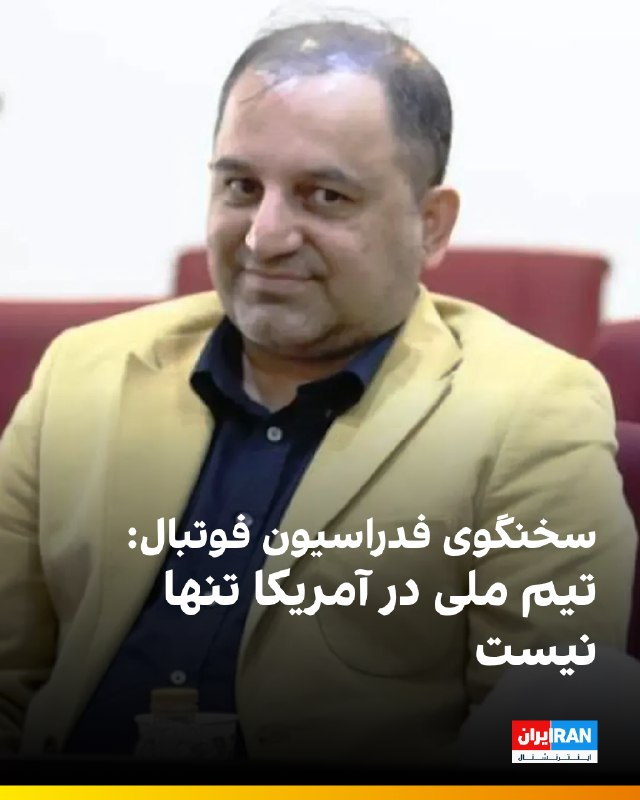

🔻​امیرمهدی علوی، سخنگوی فدراسیون فوتبال در یک گفت‌و‌گوی تلویزیونی مدعی شد که «تیم ملی در آمریکا تنها نیست. تا کنون ایرانی‌های زیادی از داخل کشور بلیت بازی‌های تیم ملی در جام جهانی را خریداری کرده‌اند و این امکان در ۴۸ ساعت آینده برای ایرانی‌های خارج کشور هم فراهم می‌شود.»

🔹​این اظهارات در حالی مطرح می‌شود که یکی از دغدغه‌های اصلی مقامات جمهوری اسلامی، احتمال شکل‌گیری فضا و سر دادن شعارهای اعتراضی و ضدحکومتی در جریان این مسابقات است. بر اساس برنامه بازی‌ها، تیم ملی ایران قرار است در شهرهای لس‌آنجلس و سیاتل به میدان برود؛ شهرهایی که از کانون‌های اصلی و مهم ایرانیان خارج از کشور و مخالفان جمهوری اسلامی به شمار می‌روند. پیش‌بینی کارشناسان و ناظران حاکی از آن است که هم‌زمان با برگزاری این مسابقات، تجمعات و تظاهرات گسترده‌ای علیه حکومت ایران در اطراف و درون ورزشگاه‌ها شکل خواهد گرفت.

🔹جزییات بیشتر را در سایت بخوانید

@iranintltvsport

## IranIntlTV — post 337889

  <a href="telegram/content/IranIntlTV_337889_1779184082.mp4" target="_blank">🎬 Download video</a>

سازمان عفو بین‌الملل اعلام کرد شمار اعدام‌ها در جهان در سال ۲۰۲۵ به بالاترین سطح ثبت‌شده در ۴۴ سال گذشته رسیده و اعدام‌های انجام شده به‌دست جمهوری اسلامی، اصلی‌ترین عامل این افزایش بوده است.
@iranintltv

## IranIntlTV — post 337888

  <a href="telegram/content/IranIntlTV_337888_1779184084.mp4" target="_blank">🎬 Download video</a>

ولادیمیر پوتین، رییس‌جمهوری روسیه، سه‌شنبه به چین سفر می‌کند. به‌گفته کاخ کرملین، پوتین و شی جین‌پینگ درباره مسائل دوجانبه، راه‌های تقویت پیمان راهبردی و موضوعات کلیدی بین‌المللی و منطقه‌ای، از جمله ایران، گفت‌وگو خواهند کرد.

گفت‌وگو با توماج طاهباز، خبرنگار ایران‌اینترنشنال
@iranintltv

## IranIntlTV — post 337887

  <a href="telegram/content/IranIntlTV_337887_1779184086.mp4" target="_blank">🎬 Download video</a>

روزنامه گاردین در گزارشی با طرح این پرسش که آیا جمهوری اسلامی می‌تواند برای کابل‌های زیردریایی در تنگه هرمز هزینه دریافت کند، نوشت تحقق این موضوع بسیار بعید است.

گفت‌وگو با علیرضا محبی، خبرنگار ایران‌اینترنشنال
@iranintltv

## IranIntlTV — post 337886

  <a href="telegram/content/IranIntlTV_337886_1779184088.mp4" target="_blank">🎬 Download video</a>

فدراسیون فوتبال ایران از آغاز فروش بلیت مسابقات تیم ایران در جام جهانی ۲۰۲۶ آمریکا خبر داد. این در حالی‌ست که پیش‌تر کاخ سفید اعلام کرده بود بازیکنان تیم اعزامی ایران اجازه ورود به آمریکا را خواهند داشت، اما ورود هواداران ایرانی به دلیل محدودیت‌های سفر ممنوع است.
گفت‌وگو با مهدی رستم‌پور، خبرنگار ورزشی
@iranintltv

## IranIntlTV — post 337885

  

نت‌بلاکس، نهاد مستقل پایش وضعیت اینترنت در جهان، سه‌شنبه ۲۹ اردیبهشت اعلام کرد قطع اینترنت در ایران اکنون به هشتاد و یکمین روز رسیده است.

نت‌بلاکس افزود: «هم‌زمان، حکومت در تلاش است کنترل دیجیتال خود را به سطح بین‌المللی گسترش دهد؛ از جمله با مطالبه کنترل کابل‌های سایر کشورها در تنگه هرمز و وادار کردن شرکت‌های بزرگ فناوری به تبعیت از قوانین جمهوری اسلامی.»
https://iranintl.com/202605199233

## IranIntlTV — post 337884

  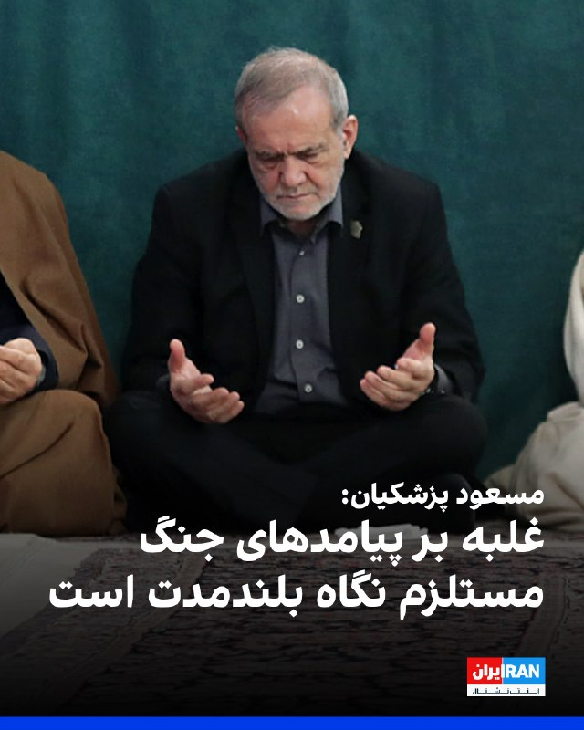

مسعود پزشکیان، رییس دولت جمهوری اسلامی، در نشست با مدیران وزارت کار گفت: «برای غلبه بر آثار و پیامدهای ناشی از جنگ باید با تدبیر، برنامه‌ریزی و نگاه بلندمدت عمل کرد.»

او افزود: «برخی اقدامات فعلی اگرچه برای کنترل شرایط ضروری است، اما در عمل به‌مثابه مُسَکِن و درمان موقت محسوب می‌شود و لازم است برای حل ریشه‌ای مشکلات اقتصادی و اجتماعی، برنامه‌ریزی ساختاری و پایدار صورت گیرد.»

پزشکیان ادامه داد: «باید به‌گونه‌ای برنامه‌ریزی شود که به‌جای اتکای صرف به پرداخت بیمه بیکاری، زمینه ایجاد فرصت‌های شغلی پایدار برای افرادی که در جریان جنگ شغل خود را از دست داده‌اند، فراهم شود.»

رییس دولت جمهوری اسلامی «مدیریت مصرف و پرهیز از اسراف» را یک «ضرورت ملی» دانست و تاکید کرد: «همه دستگاه‌ها باید در این زمینه پیشگام باشند.»
https://iranintl.com/202605193691

## IranIntlTV — post 337883

  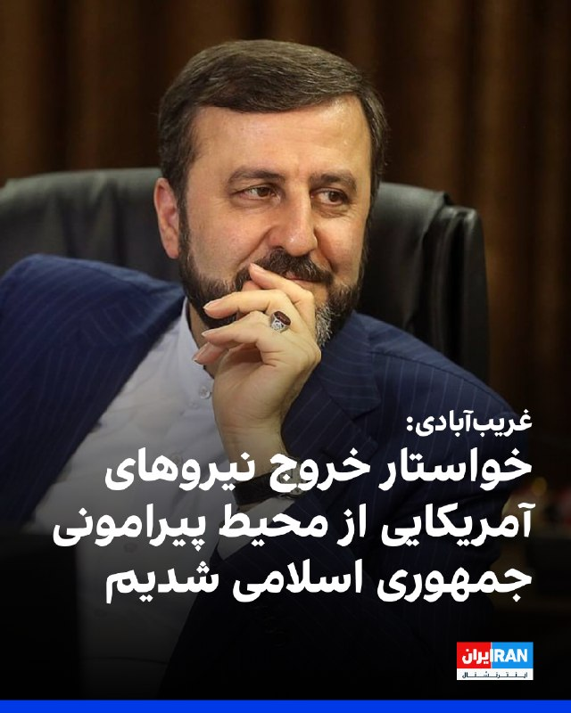

کاظم غریب‌آبادی، معاون وزیر خارجه جمهوری اسلامی، در دیدار با نمایندگان مجلس اعلام کرد مجموعه‌ای از مطالبات جمهوری اسلامی در پیشنهاد اخیر تهران به آمریکا درج شده است.

او گفت تاکید بر حق غنی‌سازی، خاتمه جنگ در همه جبهه‌ها از جمله لبنان، رفع محاصره دریایی آمریکا، آزادسازی اموال بلوکه‌شده، تامین خسارت‌های واردشده در جنگ، پایان همه تحریم‌ها و خروج نیروهای آمریکایی از محیط پیرامونی جمهوری اسلامی در این پیشنهاد گنجانده شده است.

غریب‌آبادی جزئیات بیشتری درباره روند بررسی این پیشنهاد یا واکنش طرف آمریکایی ارائه نکرد.
https://iranintl.com/202605196235

## IranIntlTV — post 337882

  <a href="telegram/content/IranIntlTV_337882_1779184092.mp4" target="_blank">🎬 Download video</a>

در پی کارزار ایران‌اینترنشنال برای یافتن هویت پیکر جاویدنامان در بیمارستان الغدیر تهران، ویدیویی از لحظه قتل جاویدنام آیدا عقیلی به دست ما رسیده است.
آیدا عقیلی، ۳۴ ساله، شامگاه ۱۸ دی ۱۴۰۴ در شرق تهران با شلیک دو گلوله ماموران به سرش کشته شد که پیکر او را پیچیده در پتویی چهارخانه در حیاط پشتی بیمارستان الغدیر یافتند.

## Shin_Persian — post 6080

  

DefenceGeek 🇬🇧 @DefenceGeek Tue, 19 May 2026 09:04:39 UTC UPDATE: US Air Force Tanker Fleet 19/05/2026 (Ceasefire Day 42) #FreeIran‌ --- Operation EPIC FURY / Project FREEDOM --- Another weekly update. Overall tanker numbers remain around the same from…

## Shin_Persian — post 6079

DefenceGeek 🇬🇧 @DefenceGeek
Tue, 19 May 2026 09:04:39 UTC

UPDATE: US Air Force Tanker Fleet 19/05/2026 (Ceasefire Day 42) #FreeIran‌
--- Operation EPIC FURY / Project FREEDOM ---

Another weekly update. Overall tanker numbers remain around the same from my last update, although we're starting to see a growing number of airframes previously deployed into the region returning from CONUS after rest/maintenance.

Usual rule, exact distribution I won't give out for now on the off chance that hostilities begin again in the coming days/weeks.

@MATA_osint @vcdgf555 @steffanwatkins @ArmchairAdml @TheIntelFrogbu @jamjake01 @Andyyyyrrrr @Saint1Mil @rocketron101 @Faytuks

فارسی

به‌روزرسانی: ناوگان تانکرهای نیروی هوایی ایالات متحده (USAF) ۱۴۰۵/۰۲/۲۹ (روز ۴۲ آتش‌بس) #FreeIran‌
--- عملیات خشم حماسی (Operation EPIC FURY) / پروژه آزادی ---

یک به‌روزرسانی هفتگی دیگر. تعداد کل تانکرها نسبت به آخرین به‌روزرسانی من تقریباً در همان سطح باقی مانده است، هرچند شاهد بازگشت تعداد فزاینده‌ای از هواگردهایی هستیم که پیش‌تر در منطقه مستقر بودند و پس از استراحت/تعمیرات از ایالات متحده (CONUS) باز می‌گردند.

طبق روال معمول، توزیع دقیق را فعلاً به دلیل احتمال ناچیز از سرگیری درگیری‌ها در روزها یا هفته‌های آینده اعلام نخواهم کرد.

@MATA_osint @vcdgf555 @steffanwatkins @ArmchairAdml @TheIntelFrogbu @jamjake01 @Andyyyyrrrr @Saint1Mil @rocketron101 @Faytuks_

𝕏 · @shin_persian

## ManotoTV — post 105626

  <a href="telegram/content/ManotoTV_105626_1779184095.mp4" target="_blank">🎬 Download video</a>

نت‌بلاکس، نهاد ناظر بر دسترسی اینترنت، اعلام کرد ایران برای هشتاد و یکمین روز متوالی با قطعی گسترده اینترنت روبه‌رو است و این رخداد اکنون به طولانی‌ترین خاموشی اینترنتی ملی ثبت‌شده در یک کشور متصل به اینترنت تبدیل شده است.

بر اساس داده‌های نت‌بلاکس، دسترسی کاربران داخل ایران به اینترنت جهانی به‌شدت محدود مانده و ارتباطات دیجیتال کشور در سطحی بسیار پایین‌تر از وضعیت عادی قرار دارد.

## ManotoTV — post 105625

  <a href="telegram/content/ManotoTV_105625_1779184096.mp4" target="_blank">🎬 Download video</a>

وزارت دفاع روسیه اعلام کرد نیروهای مسلح این کشور از سه‌شنبه ۲۹ اردیبهشت تا ۳۱ اردیبهشت رزمایش نیروهای هسته‌ای برگزار می‌کنند.

بر اساس این اعلام، بیش از ۶۴ هزار نیروی نظامی و ۷۸۰۰ قطعه تجهیزات نظامی در این رزمایش شرکت دارند و قرار است موشک‌های بالستیک و کروز از پایگاه‌های آزمایشی در خاک روسیه شلیک شوند.

این خبر هم‌زمان با افزایش تنش‌های امنیتی میان روسیه و غرب منتشر شده است. یک روز پیشتر نیز بلاروس اعلام کرد با مشارکت روسیه رزمایشی را برای تمرین جابه‌جایی و آماده‌سازی مهمات هسته‌ای برگزار می‌کند. بلاروس میزبان تسلیحات هسته‌ای تاکتیکی روسیه است، اما مسکو کنترل این تسلیحات را در اختیار دارد.

## ManotoTV — post 105624

  <a href="telegram/content/ManotoTV_105624_1779184097.mp4" target="_blank">🎬 Download video</a>

علی عبداللهی، فرمانده قرارگاه مرکزی حضرت خاتم‌الانبیا، در اظهاراتی خطاب به آمریکا و هم‌پیمانانش هشدار داد که «دوباره مرتکب خطای محاسباتی نشوند».

او گفت اگر «خطای دیگری» از سوی دشمنان جمهوری اسلامی رخ دهد، نیروهای مسلح ایران با «قدرت و توانایی به مراتب بالاتر از جنگ تحمیلی رمضان» با آن برخورد خواهند کرد.

این اظهارات در حالی مطرح می‌شود که در روزهای گذشته احتمال حمله نظامی به ایران افزایش یافته و دونالد ترامپ نیز دیشب گفت چند کشور عربی از او خواسته‌اند حمله‌ای «بسیار بزرگ» را برای چند روز به تعویق بیندازد.

## FarsiVOA — post 218122

🔺وزیر خارجه بریتانیا: جهان دیگر نمی‌تواند برای بازگشایی تنگه هرمز صبر کند

▪️ایووت کوپر، وزیر خارجه بریتانیا، هشدار داد جهان دیگر نمی‌تواند برای بازگشایی تنگه هرمز صبر کند و ادامه بسته‌ماندن این آبراه، امنیت غذایی کشورهای آسیب‌پذیر را با بحران جدی‌تری روبه‌رو می‌کند.

▪️وزارت خارجه بریتانیا اعلام کرد برنامه‌هایی برای «مأموریت چندملیتی تنگه هرمز» در حال پیشبرد است تا در صورت دستیابی به توافق، از بازگشایی فوری و بدون محدودیت این مسیر حمایت شود.

▪️کوپر تأکید کرد بحران‌هایی مانند بحران جمهوری اسلامی در مرزها متوقف نمی‌شوند و راه‌حل آنها نیز نیازمند همکاری بین‌المللی است.

⬇️ بیشتر بخوانید:
https://ir.voanews.com/a/8151592.html

## FarsiVOA — post 218121

  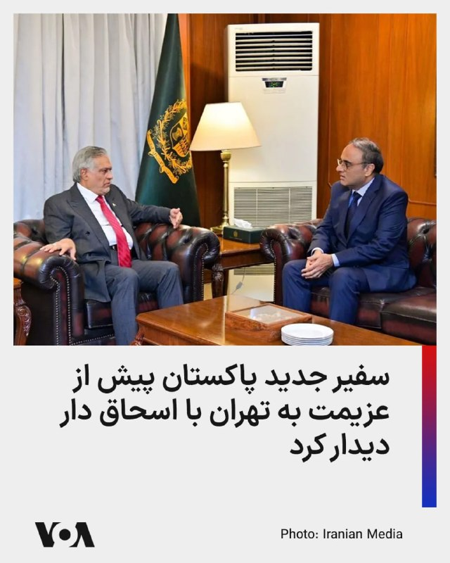

عمران احمد صدیقی، سفیر منصوب پاکستان در تهران، پیش از آغاز مأموریت خود با محمد اسحاق دار، معاون نخست‌وزیر و وزیر خارجه پاکستان دیدار و گفت‌وگو کرد.

به گزارش وزارت خارجه پاکستان، در این دیدار، اسحاق دار با اشاره به روابط میان پاکستان و ایران، بر «تعهد اسلام‌آباد به گسترش همکاری‌های دوجانبه در حوزه‌های مختلف، به‌ویژه تجارت، اتصال منطقه‌ای، تبادلات مردمی و همکاری‌های مشترک منطقه‌ای» تأکید کرد.

او همچنین بر ضرورت «حفظ روند مثبت تعاملات میان دو کشور از طریق هماهنگی نزدیک و درک متقابل» تأکید کرد و «نقش سازنده پاکستان در حمایت از صلح، گفت‌وگو و ثبات منطقه‌ای» را یادآور شد.

در روزهای اخیر، وزیر کشور پاکستان به تهران سفر و با مقامات بلندپایه جمهوری اسلامی، از جمله مسعود پزشکیان و محمدباقر قالیباف دیدار کرده بود.

پاکستان نقش میانجی را در جنگ علیه جمهوری اسلامی بر عهده دارد.
@FarsiVOA

## FarsiVOA — post 218120

  

زهرا بهروزآذر، معاون امور زنان در دولت جمهوری اسلامی، می‌گوید: زنان بیش از دیگر گروه‌ها از قطع و محدودیت اینترنت در ایران آسیب دیده‌اند؛ محدودیت‌هایی که به گفته او به تشدید نابرابری و گسترش شکاف دیجیتال منجر شده است.

به گزارش رسانه‌های داخلی، زهرا بهروزآذر در دیدار با ستار هاشمی، وزیر ارتباطات گفت بسیاری از زنان، به‌ویژه فعالان مشاغل خانگی و فروشندگان آنلاین، در نتیجه محدودیت‌های اینترنتی با آسیب‌های شغلی و اقتصادی روبه‌رو شده‌اند.

او همچنین با اشاره به طرح «اینترنت پرو» هشدار داد که دسترسی طبقاتی به اینترنت می‌تواند تبعیض دیجیتال را تشدید کند، زیرا بسیاری از زنان به دلیل محدودیت‌های اقتصادی توان استفاده از اینترنت باکیفیت‌تر را ندارند.

بهروزآذر افزود: ادامه محدودیت‌ها می‌تواند اینترنت را از ابزار کاهش شکاف اجتماعی به عاملی برای تشدید نابرابری تبدیل کند، زیرا دسترسی به اینترنت باکیفیت بیش از پیش به توان مالی وابسته شده و بسیاری از زنان از فرصت‌های آموزشی، شغلی و اجتماعی محروم می‌شوند.
@FarsiVOA

## FarsiVOA — post 218119

  

معاون حقوقی و بین‌الملل وزارت خارجه جمهوری اسلامی اعلام کرد که پیشنهاد اخیر حکومت ایران به آمریکا شامل لغو تحریم‌ها، آزادسازی دارایی‌های مسدودشده و پایان دادن به محاصره دریایی علیه بنادر جنوب ایران است.

به گزارش خبرگزاری دولتی ایرنا، کاظم غریب‌آبادی روز سه‌شنبه در نشستی با اعضای کمیسیون امنیت ملی مجلس شورای اسلامی همچنین گفت که این پیشنهاد شامل پایان دادن به جنگ در تمام جبهه‌ها از جمله در لبنان، خروج نیروهای آمریکایی از مناطق نزدیک به ایران و جبران خسارت‌های ناشی از جنگ است.

همچنین بر اساس گزارش ایرنا، «تأکید بر حق غنی‌سازی و برخورداری جمهوری اسلامی ایران از حقوق هسته‌ای صلح‌آمیز» از جمله شروط جمهوری اسلامی بوده است. آمریکا با غنی‌سازی اورانیوم در خاک ایران مخالفت کرده است.

پیشتر دونالد ترامپ، رئیس‌جمهور آمریکا، در گفت‌وگویی با نشریه فورچون، با اعلام این که مقامات حکومت ایران علی‌رغم اظهارات تند علنی خود، به شدت به امضای یک توافق با واشنگتن نیاز دارند، افزود: «اما یک توافق می‌کنند و بعد یک کاغذ برایت می‌فرستند که هیچ ربطی به توافقی که کرده بودی ندارد. من می‌گویم: "شما دیوانه‌اید؟"»
@FarsiVOA

## FarsiVOA — post 218118

🔺فایننشال تایمز: شی به ترامپ گفته پوتین ممکن است از تهاجم به اوکراین «پشیمان» شود

▪️فایننشال تایمز به نقل از منابع آگاه گزارش داد که رئیس‌جمهور چین در جریان گفت‌وگوهای خود با دونالد ترامپ رئیس‌جمهور آمریکا در پکن در هفته گذشته، گفته که ولادیمیر پوتین ممکن است در نهایت از تهاجم خود به اوکراین «پشیمان» شود.

▪️فایننشال تایمز نوشت که اظهارات شی درباره تصمیم پوتین برای آغاز تهاجم تمام‌عیار به کشور همسایه‌اش در سال ۲۰۲۲، به نظر می‌رسد فراتر از مواضع پیشین او بوده است. بر اساس این گزارش، شی تاکنون چنین برداشتی‌ از مواضع پوتین در جنگ اوکراین ارائه نکرده بود.

▪️هنوز مقامات آمریکا، چین و روسیه رسماً به این گزارش فایننشال تایمز واکنشی نشان نداده‌اند.

⬇️ بیشتر بخوانید:
https://ir.voanews.com/a/8151591.html

## FarsiVOA — post 218117

🔺برق واحد آسیب‌دیده نیروگاه هسته‌ای امارات وصل شد

▪️آژانس بین‌المللی انرژی اتمی اعلام کرد امارات متحده عربی برق خارجی واحد ۳ نیروگاه هسته‌ای براکه را پس از حمله پهپادی روز یکشنبه دوباره برقرار کرده است.

▪️رویترز پیش‌تر گزارش داده بود یک پهپاد به ژنراتور برق خارج از محدوده داخلی نیروگاه براکه برخورد کرد و دو پهپاد دیگر رهگیری شدند. مقام‌های امارات گفته‌اند منشأ حمله در دست بررسی است و سطح ایمنی پرتوی نیروگاه تحت تأثیر قرار نگرفته است.

▪️این حملات در شرایطی رخ داد که مقام‌هایی در جمهوری اسلامی پیش‌تر امارات را تهدید کرده بودند.

▪️حمله به نیروگاه براکه با موجی از محکومیت‌های منطقه‌ای و بین‌المللی روبه‌رو شد.

⬇️ بیشتر بخوانید:
https://ir.voanews.com/a/8151590.html

## FarsiVOA — post 218116

  <a href="telegram/content/FarsiVOA_218116_1779184100.mp4" target="_blank">🎬 Download video</a>

تشدید حملات پهپادی اوکراین به مسکو؛ تغییر استراتژی به سمت زیرساخت‌های حیاتی؛

خبرگزاری رویترز گزارش داد، در جریان بزرگ‌ترین حمله پهپادی اوکراین به پایتخت روسیه، مسکو، در یک سال گذشته، دست‌کم ۴ نفر کشته شدند که ۳ تن از آن‌ها در منطقه مسکو و یک نفر در منطقه مرزی بلگورود بوده‌اند.

ارتش اوکراین اعلام کرد که در این عملیات، تأسیسات نفتی و یک کارخانه تولید تسلیحات نظامی روسیه را با موفقیت هدف قرار داده است.

مقامات روسیه اعلام کردند که پدافند هوایی این کشور توانسته ۱۱ فروند پهپاد را از میان یک موج بزرگ ۴۵ فروندی رهگیری و منهدم کند.

ولودیمیر زلنسکی، رئیس‌جمهور اوکراین، با دفاع از این عملیات تأکید کرد که این حملات «پاسخی مشروع» به حملات مداوم روسیه به خاک اوکراین است.

کارشناسان این حملات را نشانه‌ای از تغییر استراتژی اوکراین از «اقدامات نمادین» به سمت «حملات هماهنگ به زیرساخت‌های حیاتی» از جمله پالایشگاه‌های نفت و تأسیسات نظامی روسیه می‌دانند.
@FarsiVOA

## FarsiVOA — post 218115

🔺نفت ایران به دلیل محاصره آمریکا، روی نفتکش‌های فرسوده ذخیره می‌شود

▪️فایننشال تایمز گزارش داد که مقامات جمهوری اسلامی به دلیل فشار ناشی از محاصره و تحریم‌های آمریکا که توان صادرات نفت ایران به کشورهای شرق آسیا را محدود کرده، مجبور شده نفت خود را روی نفتکش‌های قدیمی و لنگر انداخته در خلیج فارس ذخیره کند.

▪️بر اساس داده‌های سازمان «اتحاد علیه ایران هسته‌ای» نوشت حدود ۳۹ نفتکش حامل نفت و پتروشیمی ایران در حال حاضر در خلیج فارس حضور دارند، در حالی که پیش از آغاز محاصره آمریکا در بیش از یک ماه پیش، این رقم ۲۹ فروند بوده است.

▪️طبق داده‌های کپلر، در مجموع ۴۲ میلیون بشکه نفت خام روی نفتکش‌های ایران در خاورمیانه قرار دارد که ۶۵ درصد نسبت به آغاز درگیری افزایش یافته است.

⬇️ بیشتر بخوانید:
https://ir.voanews.com/a/8151589.html

## FarsiVOA — post 218114

🔺بازگشایی قرمز بورس تهران پس از ۸۰ روز توقف؛ صف فروش سنگین در نخستین روز معاملات

▪️بورس تهران پس از ۸۰ روز توقف معاملات سهام، روز سه‌شنبه ۲۹ اردیبهشت ۱۴۰۵ بازگشایی شد؛ اما نخستین روز معاملات بیشتر از آن‌که نشانه بازگشت عادی بازار باشد، تصویری از فشار فروش، احتیاط سهامداران و تداوم ابهام پس از جنگ ارائه داد.

▪️با وجود بازگشایی بازار، معاملات کامل از سر گرفته نشد و ۴۲ نماد بزرگ، که حدود ۳۵ درصد ارزش بازار را تشکیل می‌دهند، متأثر از آسیب‌های ناشی از جنگ همچنان بسته ماندند.

▪️توقف معاملات سهام از ۹ اسفندآغاز شد، اما در این مدت همه بخش‌های بازار سرمایه تعطیل نبودند. معاملات صندوق‌های درآمد ثابت، صندوق‌های طلا، صندوق‌های املاک و مستغلات و گواهی سپرده ادامه داشت.

⬇️ بیشتر بخوانید:
https://ir.voanews.com/a/8151588.html

## FarsiVOA — post 218113

🔺بلومبرگ: اتحادیه اروپا به‌دنبال نهایی‌کردن توافق تجاری با آمریکا است

▪️بلومبرگ گزارش داد مقام‌های اتحادیه اروپا تلاش می‌کنند قانون لازم برای اجرای توافق تجاری با آمریکا را نهایی کنند؛ توافقی که بروکسل امیدوار است با آن از موج تازه تعرفه‌های ترامپ علیه کالاهای اروپایی جلوگیری کند.

▪️ترامپ پیش‌تر هشدار داده بود اگر اتحادیه اروپا تعهدات توافق تجاری سال گذشته را اجرا نکند، تعرفه خودروهای اروپایی از ۱۵ درصد به ۲۵ درصد افزایش می‌یابد.

▪️رویترز گزارش داده است مذاکره‌کنندگان اروپایی برای جلوگیری از افزایش تعرفه‌ها، در تلاش‌اند متن مشترکی درباره حذف تعرفه کالاهای آمریکایی نهایی کنند.

▪️افزایش تعرفه خودرو به ۲۵ درصد، بیش از همه صنعت خودروسازی اروپا، به‌ویژه آلمان، را تهدید می‌کند.

⬇️ بیشتر بخوانید:
https://ir.voanews.com/a/8151587.html

## FarsiVOA — post 218112

  

استرالیا از خرید سه محموله سوخت جت از چین و مقدار بیشتری اوره کشاورزی از برونئی خبر داد

دولت استرالیا روز سه‌شنبه اعلام کرد که پس از گفت‌وگوهای میان نخست‌وزیر آنتونی آلبانیزی و نخست‌وزیر چین لی چیانگ، بیش از ۶۰۰ هزار بشکه، معادل حدود ۱۰۰ میلیون لیتر، سوخت جت از اوایل ماه ژوئن وارد خواهد شد.

پکن پس از بسته شدن تنگه هرمز که جریان نفت خام و سوخت را مختل کرده، برای حفاظت از ذخایر داخلی خود، صادرات سوخت را محدود کرده بود.

دولت استرالیا همچنین اعلام کرد که ۳۸ هزار و ۵۰۰ تُن اوره از برونئی برای حمایت از کشاورزان و بخش کشاورزی تأمین کرده است.

هر دو محموله سوخت و کود به ارزش ۷.۵ میلیارد دلار استرالیا (۵.۳۶ میلیارد دلار آمریکا) تأمین شده‌اند.

استرالیا در مقابله با فشارهای تأمین ایجاد شده ناشی از انسداد تنگه هرمز، سازوکاری برای کمک به صنایع کشاورزی و حمل‌ونقل و از طریق ارائه وام، بیمه و کمک مالی ایجاد کرده است.
@FarsiVOA

## FarsiVOA — post 218111

  

وزارت خزانه‌داری آمریکا اعلام کرد شرکت آدانی اینترپرایزس، مستقر در احمدآباد هند، با پرداخت ۲۷۵ میلیون دلار برای حل‌وفصل مسئولیت احتمالی مدنی خود در ارتباط با نقض تحریم‌های ایران موافقت کرده است.

دفتر کنترل دارایی‌های خارجی وزارت خزانه‌داری آمریکا، اوفک، اعلام کرد این توافق مربوط به ۳۲ مورد نقض احتمالی تحریم‌های ایران است. به گفته اوفک، آدانی اینترپرایزس از نوامبر ۲۰۲۳ تا ژوئن ۲۰۲۵ محموله‌های گاز مایع، ال‌پی‌جی، را از یک تاجر مستقر در دبی خریداری کرده بود که مدعی بود این محموله‌ها از عمان و عراق تأمین شده‌اند، اما نشانه‌هایی وجود داشت که منشأ واقعی آنها ایران بوده است.

بر اساس اعلام وزارت خزانه‌داری آمریکا، این شرکت در این دوره باعث شد مؤسسات مالی آمریکایی ۳۲ پرداخت دلاری به ارزش حدود ۱۹۲ میلیون دلار را برای این محموله‌ها پردازش کنند.

رویترز نیز گزارش داد این پرونده در ادامه بررسی‌های آمریکا درباره خرید گاز مایع با منشأ ایرانی از طریق مسیرهای واسطه‌ای مطرح شده بود. آدانی پیش‌تر هرگونه دور زدن عمدی تحریم‌ها را رد کرده بود.
@FarsiVOA

## DW_Farsi — post 124861

🔶 دیدار پوتین و شی در پکن؛ اندک‌زمانی پس از ترامپ
 
چند روز پس از سفر دونالد ترامپ، رئیس جمهور آمریکا، ولادیمیر پوتین، رئیس کرملین، نیز سه‌شنبه ۱۹ مه (۲۹ اردیبهشت) سفر دو روزه‌ای به چین را آغاز می‌کند. دمیتری پسکوف، سخنگوی کرملین، گفت پوتین با هیأتی متشکل از وزیران و مدیران شرکت‌های دولتی و خصوصی به این سفر می‌رود.
 
به گفت پسکوف، گفت‌وگوها که به دعوت شی جین‌پینگ، رئیس جمهور چین، انجام می‌شود، بر گسترش "شراکت راهبردی ممتاز" میان دو کشور متمرکز خواهد بود.
 
بر اساس اطلاعات رسمی مسکو، روس‌ها و چینی‌ها قصد دارند در مجموع حدود ۴۰ سند امضا کنند. این اسناد از جمله به همکاری در حوزه‌های صنعت، تجارت، حمل‌ونقل و ساخت‌وساز مربوط می‌شوند. همچنین انتظار می‌رود تجاوز نظامی روسیه به اوکراین و نیز جنگ آمریکا و اسرائیل علیه ایران از موضوعات گفت‌وگوها باشد.
 
کرملین تأکید کرده است که سفر پوتین هیچ ارتباطی با دیدار ترامپ از چین ندارد. یوری اوشاکوف، مشاور سیاست خارجی پوتین، گفت تاریخ این سفر از ماه فوریه تعیین شده بوده است.
 
به گفته اوشاکوف، بیست‌وپنجمین سالگرد امضای پیمان حسن همجواری و همکاری دوستانه میان دو کشور نیز از دلایل این سفر است. طبق اعلام کرملین، پوتین همچنین قصد دارد درباره سفر هفته گذشته ترامپ به چین اطلاعات بیشتری کسب کند.
 
در پکن نیز این روایت رد نشده است. با این حال رسانه‌های دولتی چین بر توالی غیرمعمول این دیدارها تأکید کرده‌اند. روزنامه گلوبال تایمز، نزدیک به حزب کمونیست چین، نوشت که پکن بیش از پیش در حال تبدیل شدن به یکی از کانون‌های دیپلماسی جهانی است.
@dw_farsi

## DW_Farsi — post 124860

  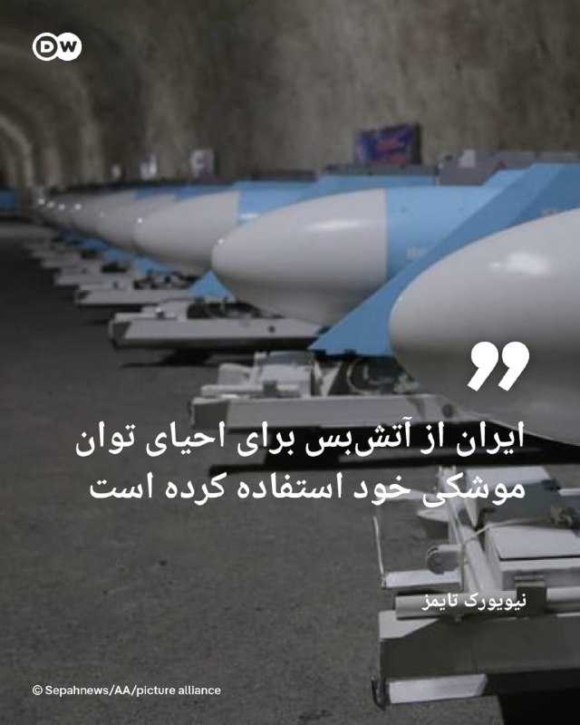

🔶 نیویورک تایمز: ایران از آتش‌بس برای احیای توان موشکی خود استفاده کرده است
 
به گزارش نیویورک تایمز، جمهوری اسلامی از آتش‌بس موقت میان تهران و واشنگتن استفاده کرده است تا قابلیت‌های موشکی خود را احیا کند، پرتابگرهای موشکی خود را از نو مستقر سازد و از آمادگی لازم برای احتمال از سرگیری درگیری‌ها برخوردار شود.
 
این نشریه آمریکایی به نقل از یک مقام نظامی ایالات متحده که نخواست نامش فاش شود گزارش داد، جمهوری اسلامی از زمان برقراری آتش‌بس موقت در ۸ آوریل تا کنون "بسیاری از موشک‌های بالستیک خود را در تأسیسات زیرزمینی که بمباران شده بودند، از عمق زمین بیرون کشیده، پرتابگرهای متحرک را جابه‌جا کرده و تاکتیک‌هایش را برای از سرگیری احتمالی درگیری‌ها تطبیق داده است".
 
در گزارش نیویورک تایمز به نقل از این مقام آگاه آمده است، آمریکا در چارچوب عملیات خود علیه ظرفیت موشکی ایران به صورت عمده ورودی‌های سایت‌های نظامی را مورد حمله قرار داد، اما خود پرتابگر‌ها را نابود نکرد، چرا که آن‌ها در عمق زمین مستقر بودند. ظاهرا ایران توانسته است با سودجویی از فرصت آتش‌بس، بخش درخور توجهی از این سایت‌ها را دوباره فعال کند.
 
@dw_farsi

## DW_Farsi — post 124859

  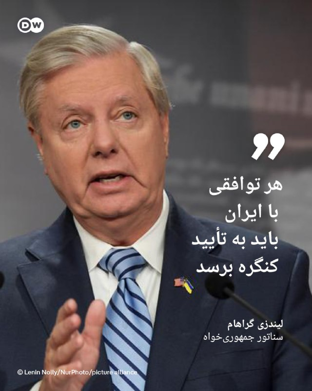

🔶 لیندزی گراهام: هر توافقی با ایران باید به تأیید کنگره برسد
 
لیندزی گراهام، سناتور جمهوری‌خواه شامگاه دوشنبه ۱۸ مه (۲۸ اردیبهشت) پس از اعلام به تعویق افتادن حمله برنامه‌ریزی‌شده ایالات متحده به جمهوری اسلامی از سوی ترامپ، با انتشار پستی در شبکه ایکس تأکید کرد، هر توافقی که در پی مذاکرات واشنگتن و تهران حاصل شود، باید به تأیید کنگره آمریکا برسد. 
 
این سناتور آمریکایی تصریح کرد، هر توافقی که میان ایالات متحده و جمهوری اسلامی امضاء شود، "مانند برجام در دوران ریاست‌جمهوری باراک اوباما، باید به منظور تأیید به کنگره ارائه گردد".
 
گراهام خاطرنشان کرد که همانگونه پیشتر گفته است، موضوع ترامپ در رابطه با جمهوری اسلامی این موارد را شامل می‌شود:
·       عدم غنی‌سازی اورانیوم
·       کنترل ایالات متحده بر حدود ۹۰۰ پوند (۴۵۰ کیلوگرم) اورانیوم با غنای بالا
·       بازگشایی تنگه هرمز بدون مداخله‌های ایران
·       ایران باید برنامه موشک‌های بالستیک دوربرود خود و همچنین تلاش برای توسعه سلاح هسته‌ای را متوقف کند
·       جمهوری اسلامی باید پشتیبانی خود از تمامی گروه‌های نیابتی تروریستی در منطقه را کنار بگذارد
 
@dw_farsi

## DW_Farsi — post 124858

🔶 حمله مرگبار به مرکز اسلامی سن دیگو چند کشته به جای گذاشت
 
در پی حمله و تیراندازی به یک مرکز اسلامی در سن دیگو در ایالت کالیفرنیا که روز دوشنبه ۱۸ مه (۲۸ اردیبهشت) روی داد، سه نفر کشته شدند. طبق اعلام پلیس یکی از قربانیان، نگهبان این مرکز بوده است. رسانه‌ها گزارش داده‌اند که دو فرد دیگر از کارکنان این مرکز اسلامی بوده‌اند که افزون بر بزرگ‌ترین مسجد سن دیگو، یک مدرسه را نیز در برمی‌گرفته است.
 
به گفته اسکات وال، رئیس پلیس سن دیگو، فرد نگهبان "نقشی تعیین‌کننده" داشته که این حمله "پیامدهای به مراتب بدتری" به همراه نداشته است. مأموران پلیس جسد کشته‌شدگان را جلوی ساختمان این مرکز پیدا کردند.
 
همچنین اعلام شد که جسد دو فرد مظنون در یک خودروی پارک‌شده پیدا شده است؛ دو جوان ۱۷ و ۱۹ ساله که پس از انجام حمله دست به خودکشی زده‌اند.
 
پلیس سن دیگو اعلام کرد، از آنجایی که حمله، به یک مؤسسه مذهبی صورت گرفته، این حادثه به عنوان "جنایت ناشی از نفرت" در دست بررسی است و از این رو کارآگاهان پلیس فدرال ایالات متحده (اف بی‌آی) نیز در بررسی‌ها و تحقیقات مشارکت دارند.
 
رئیس پلیس سن دیگو افزود، مادر یکی از دو جوان مظنون حدود دو ساعت پیش از وقوع این حمله مرگبار با پلیس تماس گرفته تا مفقود شدن پسرش را به مأموران اطلاع دهد. به گفته پلیس، او نگران بوده که فرزندش دست به خودکشی بزند و سپس متوجه شده که چندین سلاح موجود در خانه و همچنین خودروی او ناپدید شده است.
 
@dw_farsi

## Persian_Trend_Official — post 14468

  <a href="telegram/content/Persian_Trend_Official_14468_1779184105.mp4" target="_blank">🎬 Download video</a>

💢ویدیویی منتسب به چوپان عراقی که از پرواز هواپیما های اسرائیلی منتشر کرد و به گفته رسانه ها پیش زمینه لو رفتن پایگاه مخفی اسرائیل در خاک عراق شد.

🫆:Tony

📌 @persian_trend_official
پرشین ترند | متفاوت‌ترین کانال نظامی

## Persian_Trend_Official — post 14467

  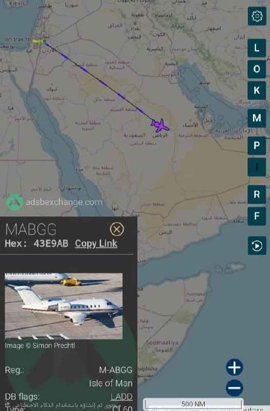

✍یک فروند هواپیمای اختصاصی اسرائیلی از تل‌آویو به مقصد ابوظبی در حال پرواز است.

.
🇮🇱
🇰🇼

👑Phantom
👑

📌 @persian_trend_official
پرشین ترند | متفاوت‌ترین کانال نظامی

## Persian_Trend_Official — post 14466

لینک اسپاتیفای لایو دیشب :

https://open.spotify.com/episode/6bpS3p3rcr8qKiJrfEaSaM?si=JvUGVU-RQ7WWFDKd7fnxMA

## RadioFarda — post 157336

  

🔸رسانه‌های ایران از آغاز به‌کار دوبارهٔ بورس کشور بعد از ۸۰ روز تعطیلی خبر می‌دهند.

🔸بر اساس این گزارش‌ها، نخستین معاملات بازار سهام در سال ۱۴۰۵ از ساعت ۹ صبح سه‌شنبه ۲۹ اردیبهشت در تالار معاملات بورس تهران آغاز شد.

🔸با این حال روزنامه «دنیای اقتصاد» نوشته بیش از ۴۰ نماد که شرکت‌های آن‌ها در جریان حملات آمریکا و اسرائیل دچار آسیب شده بودند، فعلاً بازگشایی نخواهند شد.

🔸بر اساس این گزارش، عمده نمادهای متوقف در گروه‌های شیمیایی و فلزات اساسی قرار دارند که به‌دلیل بمباران کارخانه‌های پتروشیمی و فولاد امکان فعالیت ندارند. تنها نمادهای بانکی و خودرویی در میان نمادهای آغاز معاملات امروز قرار دارند.

🔸تعدادی از نمادهای صندوق‌های اهرمی نیز که پیشتر گفته شده بود باز نمی‌شوند قرار است امروز بازگشایی شوند ولی محدودیت فروش ۱۰۰ هزار واحد دارند.

@RadioFarda

## RadioFarda — post 157335

  <a href="telegram/content/RadioFarda_157335_1779184108.mp4" target="_blank">🎬 Download video</a>

🔸تصاویری از یک گله قوچ اوریال در پارک ملی سالوک در خراسان‌شمالی که مشغول گشت‌وگذار هستند، منتشر شده است.

🔸قوچ‌ اوریال یا گوسفند وحشی اوریال گروهی از زیرگونه‌های گوسفند وحشی است که در مناطق کوهستانی و تپه‌ماهوری زندگی می‌کند.

🔸گوسفند وحشی به دو گروه زیرگونه‌ای تقسیم می‌شود که گروه غربی آن گوسفند وحشی ارمنی و گروه شرقی آن گوسفند وحشی اوریال است.

🔸گوسفند وحشی اوریال در پاکستان، کشمیر، شمال غربی هندوستان، افغانستان، تاجیکستان، ازبکستان، قزاقستان و ترکمنستان پراکنده است و در ایران در شمال خراسان رضوی، خراسان شمالی، شرق گلستان و شمال شرق استان سمنان دیده می‌شود.

🔸 پارک ملی سالوک در جنوب بجنورد در خراسان‌شمالی واقع شده و زیستگاه پرندگان و حیوانات بسیاری همچون آهو، قوچ، میش است.

@RadioFarda

## RadioFarda — post 157334

اتحادیه اروپا ۱۴ هزار پست مرتبط با سپاه پاسداران در فضای مجازی را هدف قرار داد

🔸آژانس اتحادیه اروپا برای همکاری در اجرای قانون، یوروپل، اعلام کرد در یک اقدام هماهنگ علیه محتوای تروریستی در فضای آنلاین، مجموعاً ۱۴ هزار و ۲۰۰ پست مرتبط با سپاه پاسداران انقلاب اسلامی را هدف قرار داد.

🔸یوروپل، مدیریت اطلاعات جنایی و مبارزه با سازماندهی جنایت و جرایم سازمان‌یافته بین‌المللی مانند تروریسم را بر عهده دارد.

🔸این اقدام ماه‌ها بعد از ۹ بهمن ۱۴۰۴ صورت می‌گیرد که وزیران خارجه اتحادیۀ اروپا پس از سال‌ها فشار از داخل و خارج این بلوک، سرانجام با قرار دادن نام سپاه پاسداران انقلاب اسلامی در فهرست «سازمان‌های تروریستی» موافقت کردند.

🔸این تصمیم پس از آن اتخاذ شد که حکومت ایران در دی‌ماه پارسال، اعتراضات مردمی را به‌صورتی خشونت‌بار سرکوب کرد.

🔸تروریستی اعلام شدن سپاه پاسداران به نهادهای مجری قانون در اتحادیه اروپا اجازه می‌دهد تا علیه فعالیت اعضا و نهادهای حامی این نیروی نظامی اقدام کنند.

🔸به گزارش وب‌سایت یوروپل، حساب اصلی سپاه پاسداران در شبکهٔ ایکس که بیش از ۱۵۰ هزار دنبال‌کننده داشت، در اتحادیه اروپا مسدود شد و هزاران لینک دیگر در چندین پلتفرم حذف شده‌اند یا در حال بررسی برای حذف هستند.

🔸این عملیات به رهبری «واحد ارجاع اینترنتی اتحادیه اروپا» در یوروپل انجام شد و بر شناسایی و مختل کردن حضور آنلاین این گروه که برای انتشار تبلیغات، جذب حامی و جمع‌آوری منابع مالی استفاده می‌شد، تمرکز داشت.

🔸واحد ارجاع اینترنتی که در مرکز اروپایی مبارزه با تروریسم یوروپل مستقر است، وظیفه شناسایی، تحلیل و ارجاع محتوای تروریستی و افراط‌گرایانه خشونت‌آمیز در فضای آنلاین را بر عهده دارد.

🔸نسخه کامل این گزارش را در وب‌سایت رادیوفردا بخوانید.

@RadioFarda

## RadioFarda — post 157333

🔸پلیس آمریکا اعلام کرد که دو نوجوان مسلح روز دوشنبه ۲۸ اردیبهشت به مرکز اسلامی سن‌ دیه‌گو در ایالت کالیفرنیا تیراندازی کردند و یک نگهبان امنیتی و دو مرد دیگر را در بیرون مسجد کشتند.
🔸 اجساد مظنونان بعد در حالی پیدا شد که ظاهراً بر اثر شلیک گلوله به خود جان باخته بودند.

🔸اسکات وال، رئیس پلیس سن‌ دیه‌گو، گفت نیروهای محلی و اف‌بی‌آی در حال بررسی این حمله به‌عنوان «جنایت ناشی از نفرت» هستند. با این حال، مقامات هنوز انگیزه یا عامل مشخصی برای این خشونت اعلام نکرده‌اند.

🔸به گفته پلیس پیش از این حادثه، پلیس از هیچ «تهدید مشخصی» علیه این مسجد یا هیچ مرکز مذهبی، مدرسه یا مکان دیگری مطلع نبوده است.

🔸این حمله در هفته‌ای رخ داد که به عید قربان و همچنین مراسم سالانهٔ حج مسلمانان نزدیک است.

🔸مرکز اسلامی سن‌ دیه‌گو بزرگ‌ترین مسجد در این شهر است و مدرسه‌ای به نام «آکادمی برایت هورایزن» را در خود جای داده که آموزش اسلامی ارائه می‌دهد.

@RadioFarda

## RadioFarda — post 157332

  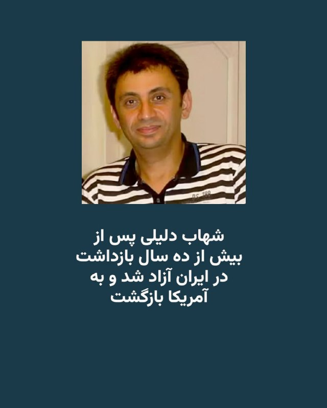

🔸سازمان «کمک به گروگان‌ها در سراسر جهان» اعلام کرد که شهاب دلیلی پس از بیش از یک دهه «بازداشت ناعادلانه» در ایران «سرانجام سالم به خانه و کنار خانواده‌اش» در آمریکا بازگشت.
🔸شهاب دلیلی که اقامت دائمی آمریکا را دارد، از سال ۱۳۹۵ در ایران زندانی بود.

🔸سازمان «کمک به گروگان‌ها در سراسر جهان» روز سه‌شنبه ۲۹ اردیبهشت در پستی در شبکهٔ ایکس نوشت: «پس از سفری طولانی از اوین به ایروان و سپس واشینگتن، با خوشحالی اعلام می‌کنیم که شهاب دلیلی پس از بیش از یک دهه بازداشت ناعادلانه در ایران، سرانجام سالم به خانه و در کنار خانواده‌اش بازگشته است».

🔸این نهاد افزوده است: «از همه می‌خواهیم که برای بازگشت هرچه بهتر شهاب به زندگی عادی از او حمایت کنند».

🔸شهاب دلیلی، کاپیتان پیشین شرکت کشتیرانی ایران و ساکن آمریکا، به گفتهٔ خانواده‌اش، برای شرکت در خاکسپاری پدرش به تهران رفته بود و پس از یک اقامت یک هفته‌ای، در حالی که با تاکسی به سوی فرودگاه می‌رفت تا به آمریکا بازگردد، از سوی نیروهای امنیتی بازداشت شد.

@RadioFarda

## RadioFarda — post 157331

  

🔸معاون وزیر خارجه ایران می‌گوید تهران در پیشنهادهای اخیر خود به آمریکا برای پایان جنگ میان دو کشور، خواستار برخورداری از حق غنی‌سازی، خاتمه جنگ در تمام جبهه‌ها از جمله لبنان و خروج نیروهای آمریکایی از محیط پیرامونی ایران شده است.

🔸کاظم غریب‌آبادی که روز سه‌شنبه ۲۹ اردیبهشت برای ارائه گزارشی در مورد روند مذاکرات میان تهران و واشینگتن، در کمیسیون امنیت ملی و سیاست خارجی مجلس حاضر شده بود، از دیگر شروط ایران را «رفع محاصرهٔ دریایی آمریکا، آزادسازی اموال و دارایی‌های ایران، تأمین خسارت‌های وارد شده در جنگ توسط ایالات متحده جهت بازسازی و خاتمه تمامی تحریم‌های یکجانبه و قطعنامه‌های شورای امنیت» اعلام کرد.

🔸ایران و ایالات متحده از زمان آتش‌بس شکننده میان دو کشور در ۱۹ فروردین امسال، درگیر یک دور مذاکره مستقیم و همچنین تبادل پیام‌هایی از طریق پاکستان بوده‌اند تا به توافقی برای پایان جنگ دست یابند.

🔸دونالد ترامپ، رئیس‌جمهور آمریکا، پیشتر پیشنهادهای ایران را «مزخرف» خوانده بود و روز ۲۸ اردیبهشت تهدید کرد که اگر ظرف دو سه روز آینده توافقی حاصل نشود، بار دیگر به ایران حمله نظامی خواهد کرد.

@RadioFarda

## RadioFarda — post 157330

  

🔸لیندزی گراهام، سناتور جمهوری‌خواه نزدیک به دونالد ترامپ، برای چندمین‌بار گفت که هرگونه توافق میان ایالات متحده و ایران باید به تأیید کنگره برسد.

🔸تأکید دوباره او در این زمینه پس از آن صورت گرفت که دونالد ترامپ اعلام کرد به درخواست رهبران چند کشور عربی حاشیه خلیج فارس، حملهٔ برنامه‌ریزی شده روز ‌سه‌شنبه به ایران را به تعویق انداخته ‌است.

🔸گراهام در واکنش در شبکهٔ ایکس نوشت که هر توافقی میان تهران و واشینگتن «باید، همانند برجام در دوران ریاست‌جمهوری باراک اوباما، برای تأیید به کنگره ارائه شود».

🔸او با ابراز تردید نسبت به احتمال دستیابی توافق با جمهوری اسلامی، با این حال اضافه کرد: «اگر بتوانیم از طریق راهکارهای دیپلماتیک و در چارچوب تحقق اهداف امنیت ملی‌مان به این درگیری پایان دهیم، این یک دستاورد بزرگ خواهد بود».

@RadioFarda

## RadioFarda — post 157329

ترامپ می‌گوید به درخواست رهبران عرب خلیج فارس حمله سه‌شنبه به ایران را عقب انداخت

🔸دونالد ترامپ، رئیس جمهور آمریکا، روز دوشنبه ۲۸ اردیبهشت خبر داد حملهٔ تازه‌ به ایران را که برای روز سه‌شنبه ۲۹ اردیبهشت برنامه‌ریزی شده بود، فعلاً به عقب می‌اندازد.

🔸پیش‌تر چنین حمله‌ای به‌طور رسمی اعلام نشده بود و خبرگزاری رویترز نوشته که نتوانسته است مشخص کند آیا واقعاً مقدمات حملاتی فراهم شده بود که می‌توانست به معنای از سرگیری جنگی باشد که ترامپ در ۹ اسفند پارسال آغاز کرد یا نه.

🔸آقای ترامپ در شبکه اجتماعی خود، تروث‌ سوشال، توضیح داده است که این حمله را به درخواست «امیر قطر، ولیعهد عربستان سعودی و رئیس امارات متحده عربی» به تعویق انداخته است.

🔸او نوشته که این سه رهبر جهان عرب، «از من خواسته‌اند حملهٔ نظامی برنامه‌ریزی‌شده‌مان علیه ایران را که قرار بود فردا انجام شود، متوقف کنم؛ زیرا اکنون مذاکرات جدی در جریان است و به نظر آن‌ها، به‌عنوان رهبران بزرگ و متحدان ما، توافقی حاصل خواهد شد که برای ایالات متحده آمریکا، همچنین همه کشورهای خاورمیانه و فراتر از آن، بسیار قابل قبول خواهد بود».

🔸او جزئیاتی درباره توافق مورد بحث ارائه نکرد،‌ اما تأکید کرد که «این توافق، مهم‌تر از همه، شامل این خواهد بود که ایران هیچ سلاح هسته‌ای نداشته باشد».

🔸رئیس‌جمهور آمریکا ساعاتی پیشتر در واکنش به پاسخ تازهٔ تهران به پیشنهادات آمریکا گفته بود که قرار نیست امتیازی به ایران بدهد. او در ادامه تهدید کرده بود که ایران می‌داند «خیلی زود چه اتفاقی خواهد افتاد».

🔸ایران روز دوشنبه اعلام کرد که به پیشنهاد جدید آمریکا با هدف پایان دادن به جنگ پاسخ داده است و افزود که تبادل نظر میان طرفین همچنان ادامه دارد.

🔸نسخه کامل این گزارش را در وب‌سایت رادیوفردا بخوانید.

@RadioFarda

## RadioFarda — post 157328

پنج نفر در حمله به مرکز اسلامی سن‌ دیه‌گو از جمله دو مهاجم کشته شدند

🔸پلیس آمریکا اعلام کرد که دو نوجوان مسلح روز دوشنبه ۲۸ اردیبهشت به مرکز اسلامی سن‌ دیه‌گو در ایالت کالیفرنیا تیراندازی کردند و یک نگهبان امنیتی و دو مرد دیگر را در بیرون مسجد کشتند. اجساد مظنونان بعد پیدا شد که ظاهراً بر اثر شلیک گلوله به خود جان باخته بودند.

🔸اسکات وال، رئیس پلیس سن‌ دیه‌گو، گفت نیروهای محلی و اف‌بی‌آی در حال بررسی این حمله به‌عنوان «جنایت ناشی از نفرت» هستند. با این حال، مقامات هنوز انگیزه یا عامل مشخصی برای این خشونت اعلام نکرده‌اند.

🔸مقامات گفتند تمامی کودکانی که در مدرسه روزانه داخل مجموعه مسجد حضور داشتند، پس از تیراندازی که حدود ساعت ۱۱:۴۰ پیش از ظهر به وقت محلی رخ داد، سالم هستند.

🔸وال در یک کنفرانس خبری عصرگاهی گفت که مادر یکی از مظنونان حدود دو ساعت پیش از حادثه با پلیس تماس گرفته و گزارش داده بود که پسرش، که او را دارای «افکار خودکشی» توصیف کرده، با سه اسلحه متعلق به او و خودرویش از خانه فرار کرده است.

🔸به گفته رئیس پلیس، مادر گفته بود که پسرش همراه یک فرد دیگر است و هر دو لباس مبدل به تن دارند. پلیس برای یافتن آن‌ها اقدام کرده و به‌عنوان اقدام احتیاطی نیروهایی را به یک مرکز خرید نزدیک و دبیرستان پسر اعزام کرده بود، که در همین حین تماس‌هایی درباره تیراندازی در مسجد دریافت شد.

🔸وال از افشای محتوای یادداشتی که به گفته او توسط مادر این نوجوان پیدا شده بود، خودداری کرد.

🔸نسخه کامل این گزارش را در وب‌سایت رادیوفردا بخوانید.

@RadioFarda

## IranianMinds — post 20376

  

🔴 پولیتیکو :

دولت ترامپ پس از ماه‌ها فشار اقتصادی که نتوانست حکومت کوبا را به انجام اصلاحات وادار کند، حالا در حال بررسی گزینه اقدام نظامی علیه هاواناست.

مقام‌های آمریکایی می‌گویند کاخ سفید از بی‌نتیجه ماندن تحریم‌ها، محدودیت‌های سوخت و فشارهای دیپلماتیک ناامید شده.

گفته می‌شود گزینه‌های نظامی از حملات هوایی محدود تا عملیات گسترده‌تر برای بی‌ثبات کردن حکومت کوبا را شامل می‌شود.

همچنین گزارش‌ها حاکی از آن است که فرماندهی جنوبی ارتش آمریکا در حال آماده‌سازی سناریوهای احتمالی است، هرچند هنوز تصمیم نهایی گرفته نشده.

@IranianMinds

## IranianMinds — post 20375

  <a href="telegram/content/IranianMinds_20375_1779184114.mp4" target="_blank">🎬 Download video</a>

🔴 ترامپ تو سخنرانی دیشبش :

شما دوتا خانوم چقدر خوشگلید , بیاید اینجا پیش من ببینم

@IranianMinds

## IranianMinds — post 20374

🔴 بعد از ۸۰ روز بورس ایران هم باز شد.

@IranianMinds

## BBCPersian — post 281471

🔻افزایش ساعات فعالیت دو فرودگاه اصلی در تهران

به گفته مجید اخوان، سخنگوی سازمان هواپیمایی کشوری در ایران ساعات فعالیت دو فرودگاه اصلی در تهران، یعنی مهرآباد و امام خمینی، افزایش یافته است.

بر این اساس، این دو فرودگاه از ساعت ۴:۳۰ صبح تا نه و نیم شب فعالیت خواهند داشت و «تمامی پروازهای داخلی و بین‌المللی می‌توانند طبق اطلاعیه هوانوردی صادرشده از سوی سازمان هواپیمایی کشوری، در این دو فرودگاه انجام شود.»

به گفته آقای اخوان با افزایش ساعات کاری فرودگاه‌ها، تاخیر در پروازها «کاهش خواهد یافت.»

پروازهای خارجی از ایران که از زمان شروع جنگ در نهم اسفند سال گذشته متوقف شده بود، در اوایل اردیبهشت از سر گرفته شد.

آمریکا و اسرائیل در طول جنگ شماری از فرودگاه‌ها و هواپیماهای ایران را هدف حملات هوایی قرار دادند.

https://bbc.in/4umE58h
@BBCPersian

## BBCPersian — post 281470

🔻رئیس کمیسیون امنیت ملی مجلس ایران: تنگه هرمز تا ابد اهرم استراتژیک خواهد بود

رئیس کمیسیون امنیت ملی و سیاست خارجی مجلس شورای اسلامی گفت که تنگه هرمز «برای همیشه در اختیار و مدیریت» ایران باقی خواهد ماند.

ابراهیم عزیزی به خبرگزاری ایسنا گفت که تنگه هرمز «یک اهرم اقتصادی، سیاسی و نظامی تمام‌عیار است که تا ابد در اختیار و مدیریت ملت رشید و با اقتدار ایران خواهد بود.»

او با هشدار به کشورهایی که «به هر دلیلی سودای قدرت‌نمایی در تنگه هرمز دارند»،‌ افزود: «با اقتدار کامل پیش می‌رویم و با هیچ‌کس تعارف نداریم.»

آقای عزیزی تاکید کرد که کنترل و مدیریت این آبراه از «حقوق مسلم ایران» است و هشدار داد که «هرگونه اقدام خصمانه یا تلاش برای محدود کردن نفوذ و حاکمیت ایران در این منطقه، با پاسخ قاطع و مقتدرانه مواجه خواهد شد.»

https://bbc.in/3RhcGpK
@BBCPersian

## BBCPersian — post 281469

🔻پیام ویدئویی پوتین به مردم چین

کرملین پیش از سفر ولادیمیر پوتین به پکن در روز سه‌شنبه، یک پیام ویدیویی از رئیس‌جمهور روسیه خطاب به مردم چین منتشر کرد.

در سخنانی سرشار از تمجید از رهبر چین، آقای پوتین از شی جین پینگ «دوست خوب و قدیمی» خود قدردانی کرد و گفت روابط دو کشور به «سطحی واقعاً بی‌سابقه» رسیده است.

آقای پوتین تاکید کرد که اتحاد راهبردی نزدیک روسیه و چین نقشی مهم و ثبات‌بخش در صحنه جهانی ایفا می‌کند.

سفر آقای پوتین به پکن تنها چند روز بعد از آن انجام می‌شود که آقای شی میزبان دونالد ترامپ بود.

https://bbc.in/4tNAGOt
@BBCPersian

## BBCPersian — post 281460

⭕️افزایش حملات دریایی در بحبوحه جنگ ایران؛ ناخدایی که به دزدان دریایی گفت: «شلیک نکنید، مسلمانم»

✍️ام. ایرهام، لینی بارون و فاطمه معلم

شامگاه شرجی یکی از روزهای آوریل، اندکی پس از نماز مغرب، تلفن سانتی سانایا با پیامی لرزید که مدت‌ها از رسیدنش می‌ترسید.

همسرش ناخدا نفت‌کشی بود که در میانه جنگ آمریکا و اسرائیل علیه ایران، محموله‌هایی را در سراسر خاورمیانه جابه‌جا می‌کرد.

ناخدا آشاری سامادیکون روز ۲ آوریل از امارات متحده عربی به راه افتاده بود. او در حوالی تنگه هرمز به‌سختی از پرتابه‌ها جان سالم به در برد، اما در ادامه مسیر، وارد آب‌هایی شد که در محدوده فعالیت دزدان‌دریایی قرار داشت.

آشاری که پدر دو فرزند است، در تماس‌هایی که از کشتی با خانواده‌اش در روستای زادگاهش در جزیره سولاوسی اندونزی می‌گرفت، می‌کوشید آرام به نظر برسد و به آن‌ها اطمینان بدهد. روستای او در میان ردیف‌هایی از درختان جک‌فروت قرار دارد. او به خانواده‌اش گفته بود که برای دولت نفت حمل می‌کند، «پس ان‌شاءالله اتفاقی نمی‌افتد».

📸BBC/ Getty/ Reuters

https://bbc.in/4nBAoJb
@BBCPersian

## BBCPersian — post 281459

🔻انفجارهای کنترل‌شده در شمال اصفهان

روابط عمومی سپاه پاسداران جمهوری اسلامی در استان اصفهان از احتمال شنیده شدن صدای انفجارهای کنترل شده در محدوده شمال اصفهان، خیابان کاوه خبر داده است.

به گزارش رسانه‌های ایرانی این انفجارها امروز سه‌شنبه، ۲۹ اردیبهشت‌ماه از ساعت ۸ صبح تا ۱۲ ظهر به وقت محلی انجام می‌شود.

در روزهای گذشته نیز مقام‌های ارتش جمهوری اسلامی از از انفجار کنترل شده بمب‌های عمل نکرده در استان‌های فارس و کهگیلویه و بویراحمد خبر داده بود.

https://bbc.in/4wtkF2S
@BBCPersian

## BBCPersian — post 281452

🔻چرا پهپادهای کوچک حزب‌الله برای اسرائیل دردسرساز شده است؟

✍️لوک اونگر و آدام دربین
بی‌بی‌سی وریفای

حزب‌الله لبنان استفاده از پهپادهای کوچک «دید اول‌شخص» یا اف‌پی‌وی را برای حمله به اسرائیل افزایش داده است؛ از جمله سامانه‌هایی که با کابل‌های فیبر نوری هدایت می‌شوند تا بتوانند از سامانه‌های پیشرفته دفاعی عبور کنند.
«بی‌بی‌سی وریفای» از ۲۶ مارس تاکنون ۳۵ ویدیو منتشرشده از سوی این گروه شبه‌نظامی لبنانی را مکان‌یابی کرده است. این ویدیوها حمله به سربازان اسرائیلی، خودروهای زرهی و سامانه‌های پدافند هوایی در جنوب لبنان و شمال اسرائیل را نشان می‌دهند.
کارشناسان به بی‌بی‌سی وریفای گفته‌اند ارتش اسرائیل «تاکنون نتوانسته هیچ راهکار موثری برای مقابله» با این پهپادهای کوچک پیدا کند، زیرا این پهپادها به راحتی می‌توانند از سامانه‌های شناسایی عبور کنند.

BBC/ Reuters / GettyImages/ Hezbollah Military Media/Global Images Ukraine via Getty Images

https://bbc.in/4nI5AGW
@BBCPersian

## idfinfarsi — post 11606

❌ارتش اسرائیل یک تروریست از گروه تروریستی حماس را که تهدیدی برای نیروهای ما بود و در قتل‌عام ۷ اکتبر به داخل خاک اسرائیل نفوذ کرده بود، به هلاکت رساند

⭕️دیروز (دوشنبه)، نیروهای تیم رزمی تیپ ۱۸۸ که در جنوب نوار غزه فعالیت می‌کنند، یک تروریست از گروه تروریستی حماس را شناسایی کردند که از خط زرد عبور کرده و به‌گونه‌ای به نیروها نزدیک شده بود که تهدیدی فوری محسوب می‌شد.

⭕️بلافاصله پس از شناسایی، نیروی هوایی با هدایت نیروهای زمینی این تروریست را برای رفع تهدید به هلاکت رساند.

⭕️تروریستی که به هلاکت رسید، در قتل‌عام ۷ اکتبر به داخل خاک اسرائیل نفوذ کرده بود و در دوره اخیر تلاش داشت طرح‌های تروریستی علیه نیروهای ارتش اسرائیل را اجرا کند.

🔻نیروهای ارتش اسرائیل در فرماندهی جنوب مطابق توافق در منطقه مستقر هستند و به فعالیت برای رفع هرگونه تهدید فوری ادامه خواهند داد.

## Dirty_Kids — post 389722

  <a href="telegram/content/Dirty_Kids_389722_1779184116.mp4" target="_blank">🎬 Download video</a>

دیگه صرف نداره یدونه یدونه این حشریارو عقد کنن، بصورت گوسفندی گله‌وار عقدشون میکنن برن جهاد نکاح

@Dirty_Kids 👻

## Dirty_Kids — post 389721

  <a href="telegram/content/Dirty_Kids_389721_1779184118.mp4" target="_blank">🎬 Download video</a>

پیت اَدای ترامپو دراورد 😂😂

مرتیکه ی جذاب 😂🤦🏻‍♀️

@Dirty_Kids 👻

## Hranews — post 113032

  

گزارشی از کیفیت نازل آموزش مجازی و محرومیت از دسترسی به آموزش

❗️
❗️
❗️
❗️
❗️– در شرایطی که آموزش مجازی قرار بود راهکاری موقت برای ادامه تحصیل دانش‌آموزان در دوران بحران جنگ باشد، اکنون بسیاری از خانواده‌ها و معلمان می‌گویند این شیوه بیش از آنکه جایگزینی پایدار برای مدرسه باشد، به تجربه‌ای فرساینده و بی‌ثبات تبدیل شده است. گزارش پیش رو که توسط هرانا و بر اساس گفت‌وگو با خانواده‌های دانش‌آموزان، معلمان، مدیران مدارس و کارشناسان آموزشی تهیه شده، تلاش دارد ابعاد بحران آموزش غیرحضوری در ایران را بررسی کند؛ بحرانی که از اختلال گسترده اینترنت و ضعف زیرساخت‌های آموزشی تا کمبود تجهیزات، فشار اقتصادی بر خانواده‌ها و نبود برنامه‌ریزی روشن برای یک دوره نامعلوم پیش رو را در بر می‌گیرد.

به گزارش خبرگزاری هرانا، ارگان خبری مجموعه فعالان حقوق بشر در ایران، تبدیل «آموزش مجازی» از یک راهکار موقت به یک بستر اجباری و فرساینده، نظام آموزشی کشور با چالش‌های ساختاری عمیقی مواجه شده است.

بررسی‌های میدانی و گزارش‌های دریافتی هرانا نشان می‌دهد که اختلالات تعمدی و ساختاری در شبکه اینترنت، فقدان زیرساخت‌های پلتفرمی، قطع مکرر برق، تبعیض در توزیع امکانات رقمی (دیجیتال) و سیاست‌گذاری‌های متناقض مسئولان، نه تنها کیفیت یادگیری را به حداقل رسانده، بلکه حق دسترسی برابر به آموزش مندرج در اسناد حقوق بشری و قوانین داخلی را به شکلی جدی نقض کرده است.

ادامه مطلب

#آموزش_مجازی #دانش‌آموزان

↘️
@hranews_bot تماس ✉️ - @Hranews کانال هرانا 🆑

## Hranews — post 113031

  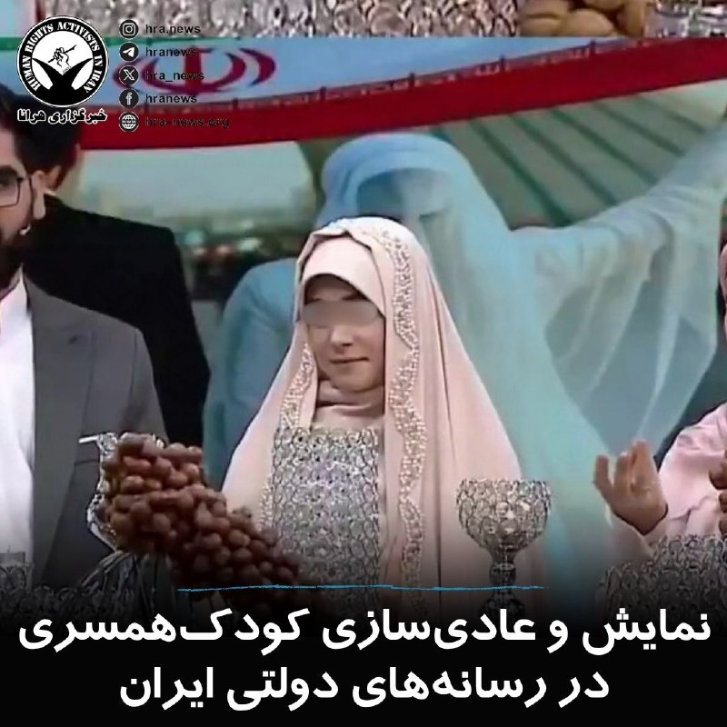

اخیراً در یکی از برنامه‌های صدا و سیما که به موضوع ازدواج و تبلیغ شیوه‌های سنتی مرتبط با آن می‌پردازد، نمونه‌هایی از کودک‌همسری به نمایش گذاشته شده و استفاده از ادبیات تبعیض‌آمیز علیه زنان و دختران نیز در آن مشاهده می‌شود. در این برنامه، زوج‌هایی حضور یافته‌اند که به نظر می‌رسد مصداق ازدواج دختران زیر ۱۸ سال یا «کودک‌همسری» باشند. همچنین مجری زن برنامه، در سخنان خود، سنت‌هایی را ترویج می‌کند که در آن‌ها تولد نوزاد پسر نوعی امتیاز تلقی می‌شود. این موضوعات، به‌ویژه در ادامه تبلیغات آشکار و پنهان برای ازدواج افراد زیر ۱۸ سال در رسانه‌های دولتی، نگرانی‌های جدی فعالان حوزه حقوق کودک و حقوق زنان را برانگیخته است.
#کودک‌همسری #زنان

↘️
@hranews_bot تماس ✉️ - @Hranews کانال هرانا 🆑

## Hranews — post 113030

  

بر اساس آخرین داده‌های نت‌بلاکس، #قطع_اینترنت در ایران پس از ۱۹۲۰ ساعت وارد هشتاد و یکمین روز خود شده است. این نهاد ناظر بر دسترسی به اینترنت در جهان اعلام کرده که هم‌زمان، حکومت ایران در تلاش است محدودیت و کنترل دیجیتال خود را به سطح بین‌المللی نیز گسترش دهد؛ به‌طوری‌ که خواستار کنترل بر کابل‌های ارتباطی سایر کشورها در تنگه هرمز شده و از شرکت‌های بزرگ فناوری خواسته است خود را با قوانین جمهوری اسلامی تطبیق دهند.

↘️
@hranews_bot تماس ✉️ - @Hranews کانال هرانا 🆑

## Hranews — post 113029

  

نورالدین نوری‌یزدان، مدیرعامل شرکت آب‌وفاضلاب استان لرستان، گفت: در حال حاضر، ۶۱۸ روستای این استان با #تنش_آبی مواجه هستند و ۲۴۵ روستا نیز از طریق تانکر آب‌رسانی می‌شوند. وی همچنین تاکید کرد که کمبود منابع آبی در سال‌های گذشته همچنان جبران نشده است.

↘️
@hranews_bot تماس ✉️ - @Hranews کانال هرانا 🆑

## Hranews — post 113028

بازداشت و ضبط تجهیزات استارلینک ۲ شهروند در تهران

❗️
❗️
❗️
❗️
❗️– فرمانده انتظامی تهران از #بازداشت دو شهروند در غرب و شمال این شهر به دلیل آنچه «ارسال اطلاعات و همکاری با شبکه معاند» عنوان کرده، خبر داد. در جریان این اقدام، تجهیزات اینترنت ماهواره‌ای استارلینک این افراد نیز ضبط شد.

ادامه مطلب

↘️
@hranews_bot تماس ✉️ - @Hranews کانال هرانا 🆑

## Hranews — post 113027

  

تداوم بازداشت؛ گزارشی از آخرین وضعیت حامد تیزرویان در زندان ساری

❗️
❗️
❗️
❗️
❗️– حامد تیزرویان، دانشجوی دکترای محیط زیست دانشگاه بهشتی و فعال محیط زیست، ۱۶ روز است که توسط ماموران اداره اطلاعات در ساری بازداشت شده و کماکان به صورت بلاتکلیف در زندان این شهر نگهداری می شود.

به گزارش خبرگزاری هرانا، ارگان خبری مجموعه فعالان حقوق بشر در ایران، حامد تیزرویان کماکان در بازداشت به‌سر می برد.

حامد تیزرویان در تاریخ ۱۴ اردیبهشت ماه، توسط ماموران اداره اطلاعات در ساری #بازداشت شد. همزمان، ماموران شماری از وسایل الکترونیکی این فعال محیط زیست را ضبط کردند. او هم اکنون در زندان ساری نگهداری می شود و با اتهاماتی از جمله اجتماع و تبانی به قصد اقدام علیه امنیت ملی مواجه شده است.

ادامه مطلب

#حامد_تیزرویان

↘️
@hranews_bot تماس ✉️ - @Hranews کانال هرانا 🆑

## manototv — post 105626

  <a href="telegram/content/manototv_105626_1779184122.mp4" target="_blank">🎬 Download video</a>

نت‌بلاکس، نهاد ناظر بر دسترسی اینترنت، اعلام کرد ایران برای هشتاد و یکمین روز متوالی با قطعی گسترده اینترنت روبه‌رو است و این رخداد اکنون به طولانی‌ترین خاموشی اینترنتی ملی ثبت‌شده در یک کشور متصل به اینترنت تبدیل شده است.

بر اساس داده‌های نت‌بلاکس، دسترسی کاربران داخل ایران به اینترنت جهانی به‌شدت محدود مانده و ارتباطات دیجیتال کشور در سطحی بسیار پایین‌تر از وضعیت عادی قرار دارد.

## manototv — post 105625

  <a href="telegram/content/manototv_105625_1779184122.mp4" target="_blank">🎬 Download video</a>

وزارت دفاع روسیه اعلام کرد نیروهای مسلح این کشور از سه‌شنبه ۲۹ اردیبهشت تا ۳۱ اردیبهشت رزمایش نیروهای هسته‌ای برگزار می‌کنند.

بر اساس این اعلام، بیش از ۶۴ هزار نیروی نظامی و ۷۸۰۰ قطعه تجهیزات نظامی در این رزمایش شرکت دارند و قرار است موشک‌های بالستیک و کروز از پایگاه‌های آزمایشی در خاک روسیه شلیک شوند.

این خبر هم‌زمان با افزایش تنش‌های امنیتی میان روسیه و غرب منتشر شده است. یک روز پیشتر نیز بلاروس اعلام کرد با مشارکت روسیه رزمایشی را برای تمرین جابه‌جایی و آماده‌سازی مهمات هسته‌ای برگزار می‌کند. بلاروس میزبان تسلیحات هسته‌ای تاکتیکی روسیه است، اما مسکو کنترل این تسلیحات را در اختیار دارد.

## manototv — post 105624

  <a href="telegram/content/manototv_105624_1779184123.mp4" target="_blank">🎬 Download video</a>

علی عبداللهی، فرمانده قرارگاه مرکزی حضرت خاتم‌الانبیا، در اظهاراتی خطاب به آمریکا و هم‌پیمانانش هشدار داد که «دوباره مرتکب خطای محاسباتی نشوند».

او گفت اگر «خطای دیگری» از سوی دشمنان جمهوری اسلامی رخ دهد، نیروهای مسلح ایران با «قدرت و توانایی به مراتب بالاتر از جنگ تحمیلی رمضان» با آن برخورد خواهند کرد.

این اظهارات در حالی مطرح می‌شود که در روزهای گذشته احتمال حمله نظامی به ایران افزایش یافته و دونالد ترامپ نیز دیشب گفت چند کشور عربی از او خواسته‌اند حمله‌ای «بسیار بزرگ» را برای چند روز به تعویق بیندازد.

## alonews — post 121042

  <a href="telegram/content/alonews_121042_1779184124.webm" target="_blank">🎬 Download video</a>

👈وزیر دفاع پاکستان : احساس می‌کنم جنگ ایران از سر گرفته نمی‌شه

✅ @AloNews خبر جنگ

## alonews — post 121041

  <a href="telegram/content/alonews_121041_1779184124.webm" target="_blank">🎬 Download video</a>

👈نشریه AFP : همزمان با سفر پوتین به چین، روسیه قصد داره رزمایش نیروهای هسته‌ایشو برگزار کنه

✅ @AloNews خبر جنگ

## alonews — post 121040

  <a href="telegram/content/alonews_121040_1779184124.webm" target="_blank">🎬 Download video</a>

👈منبع نظامی ایرانی المیادین: ایران تاکتیک‌های جدید مبتنی بر «دکترین دفاعی تهاجمی» آماده کرده و هیچ مشکلی برای دفاع از کشور ندارد!

✅ @AloNews خبر جنگ

## alonews — post 121039

  <a href="telegram/content/alonews_121039_1779184124.webm" target="_blank">🎬 Download video</a>

👈رئیس شرکت میهن: جوانان الان گشاد هستن و کار نمیکنن بعد میگن اوضاع جامعه خرابه

🔴منم جوون بودم و زحمت کشیدم ولی الانیا چی؟ تنبلن

✅ @AloNews خبر جنگ

## alonews — post 121038

  <a href="telegram/content/alonews_121038_1779184125.webm" target="_blank">🎬 Download video</a>

👈مدیرعامل صندوق قرض‌الحسن جهاددانشگاهی:
به دانشجوهایی که ازدواج کنند ۳۰ میلیون وام تعلق می‌گیرد😍😍😍😍😍😍😍😍😍😍😍😍😳😳😳😳😳😳😳😍😍😍😍😍😍😍

✅ @AloNews خبر جنگ

## alonews — post 121037

  <a href="telegram/content/alonews_121037_1779184125.webm" target="_blank">🎬 Download video</a>

👈منبع نظامی ایرانی به خبرگزاری ریانووستی: ایران تاکتیک‌های جدید مبتنی بر «دکترین دفاعی تهاجمی» آماده کرده و هیچ مشکلی برای دفاع از کشور ندارد.

✅ @AloNews خبر جنگ

## alonews — post 121036

  <a href="telegram/content/alonews_121036_1779184125.webm" target="_blank">🎬 Download video</a>

👈از فردا (چهارشنبه ۳۰ اردیبهشت) پرداخت بلیت مترو و اتوبوس در تهران به حالت عادی و پولی بازمی‌گردد.

✅ @AloNews خبر جنگ

## alonews — post 121035

  <a href="telegram/content/alonews_121035_1779184125.webm" target="_blank">🎬 Download video</a>

👈وال استریت ژورنال: ترامپ هنوز تمایل به حمله به ایران دارد

✅ @AloNews خبر جنگ

## alonews — post 121034

  <a href="telegram/content/alonews_121034_1779184126.webm" target="_blank">🎬 Download video</a>

👈به دلیل مسائل امنیتی؛ دادگاه نتانیاهو امروز کوتاهه

✅ @AloNews خبر جنگ

## alonews — post 121033

  <a href="telegram/content/alonews_121033_1779184126.webm" target="_blank">🎬 Download video</a>

👈ایران ابتدا به پیشنهاد آتش بس ۴۵ روزه پاسخ منفی داد ، بعد به آتش بس دو هفته ای آری گفت.

🔴۱ خرداد، میشود همان ۴۵ روز

✅ @AloNews خبر جنگ

## alonews — post 121030

  <a href="telegram/content/alonews_121030_1779184126.mp4" target="_blank">🎬 Download video</a>

👈فیلم آتیش‌سوزی‌های جنوب کالیفرنیا؛ آتیش با باد شدید پخش شده و باعث تخلیه بیشتر از ۲۳ هزار نفر شده

✅ @AloNews خبر جنگ

## alonews — post 121029

  

پائین‌ترین پینگ‌ها رو با ما تجربه کنید
✔️

🔄کانفیگ‌های استارلینگ با پشتیبانی 24ساعته و لینک ساب
🔄

💯مورد تایید مجموعه الونیوز
💯

📌تحویل زیر 1دقیقه

📌بدون هیچ گونه قطعی

💰خرید آسان و سریع
⬇️

💎@FastProxyMakerBot

💎@FastProxyMakerBot

## alonews — post 121028

  <a href="telegram/content/alonews_121028_1779184129.webm" target="_blank">🎬 Download video</a>

👈رسانه‌های اسرائیلی اعلام کردند یک هواپیمای دولتی اسرائیل لحظاتی پیش به سمت ابوظبی پرواز کرده است.

✅ @AloNews خبر جنگ

## alonews — post 121027

  <a href="telegram/content/alonews_121027_1779184130.webm" target="_blank">🎬 Download video</a>

👈رایزنی وزیران خارجه قطر و ترکیه درباره تحولات منطقه

✅ @AloNews خبر جنگ

## alonews — post 121026

  <a href="telegram/content/alonews_121026_1779184130.webm" target="_blank">🎬 Download video</a>

👈روزنامه واشنگتن پست به نقل از یک مقام پاکستانی: ایران می‌خواهد پیش از اعلام توافق هسته‌ای، به توافقی برای پایان دادن به جنگ دست یابد

🔴واشنگتن می‌خواهد توافق بر سر همه مسائل را یکجا اعلام کند

✅ @AloNews خبر جنگ

## alonews — post 121025

  <a href="telegram/content/alonews_121025_1779184130.webm" target="_blank">🎬 Download video</a>

👈نیویورک‌تایمز نوشت: در صورت ازسرگیری جنگ، ایران ممکن است تاکتیک‌های جدیدی به کار گیرد. ایران ممکن است به دنبال اعمال کنترل خود بر تنگه باب‌المندب باشد. در هر دور جدید از جنگ، ایران ممکن است روزانه ده‌ها یا صدها موشک شلیک کند.

✅ @AloNews خبر جنگ

## alonews — post 121024

  <a href="telegram/content/alonews_121024_1779184130.webm" target="_blank">🎬 Download video</a>

👈بر اساس گزارش‌های نیویورک تایمز، دونالد ترامپ تصمیم گرفت حملات نظامی بیشتری به ایران انجام ندهد، تصمیمی که عمدتاً تحت تأثیر هشدارهای پنتاگون بود که تهران در حال موفقیت در تطبیق با استراتژی هوایی آمریکا بود.

🔴مقامات دفاعی آمریکا اشاره کردند که فرماندهان ایرانی مسیرهای پروازی و روال‌های عملیاتی جنگنده‌ها و بمب‌افکن‌های آمریکایی را به دقت تحلیل کرده‌اند. این مطالعه تاکتیکی عملیات هوایی آمریکا را به طور فزاینده‌ای قابل پیش‌بینی کرده و به طور قابل توجهی توانمندی‌های سامانه‌های دفاع هوایی ایران را افزایش داده است.
به عنوان شاهد مستقیم این تهدید رو به افزایش برای هواپیماهای آمریکایی، مقامات به دو حادثه اخیر اشاره کردند: سرنگونی یک فروند F-15E استرایک ایگل و آسیب دیدن یک جنگنده پنهانکار F-35.

✅ @AloNews خبر جنگ

## alonews — post 121023

  <a href="telegram/content/alonews_121023_1779184130.mp4" target="_blank">🎬 Download video</a>

👈وضعیت شناورها در تنگه هرمز؛ هم‌اکنون

✅ @AloNews خبر جنگ

<!-- MSG END -->

<!-- NAV START -->

<!-- NAV END -->
