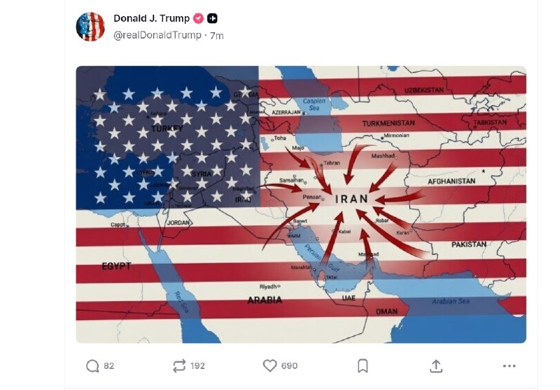
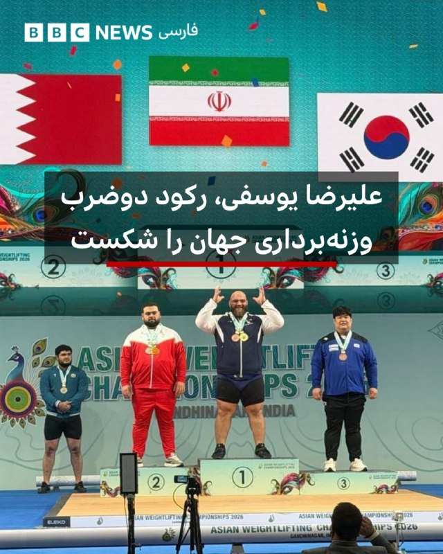
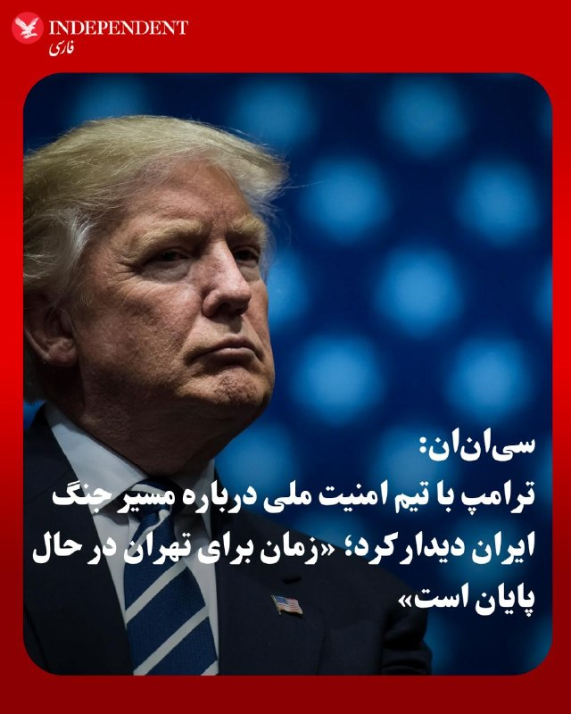
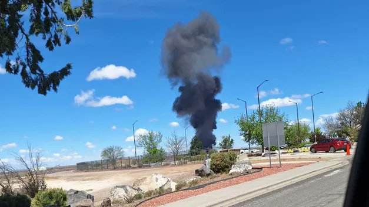
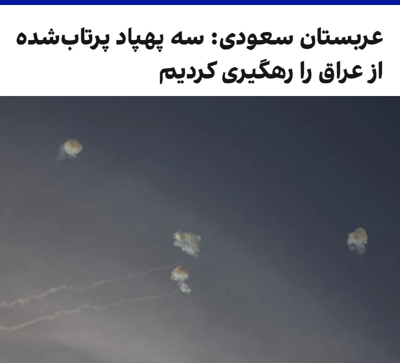
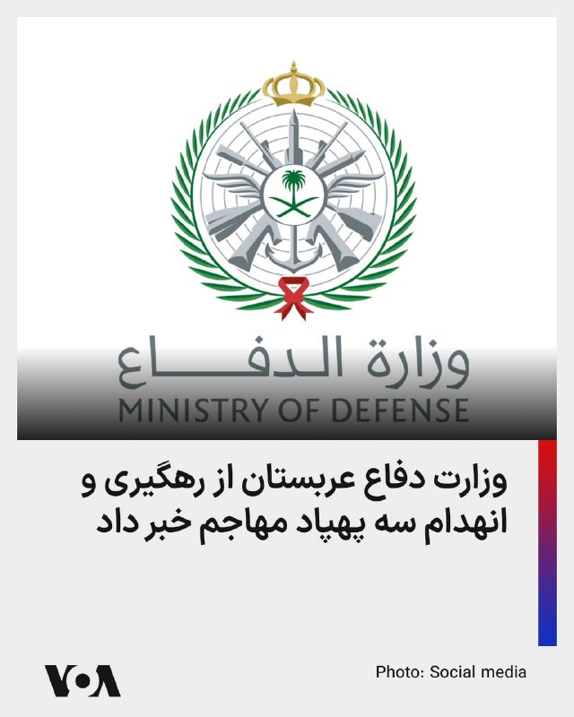
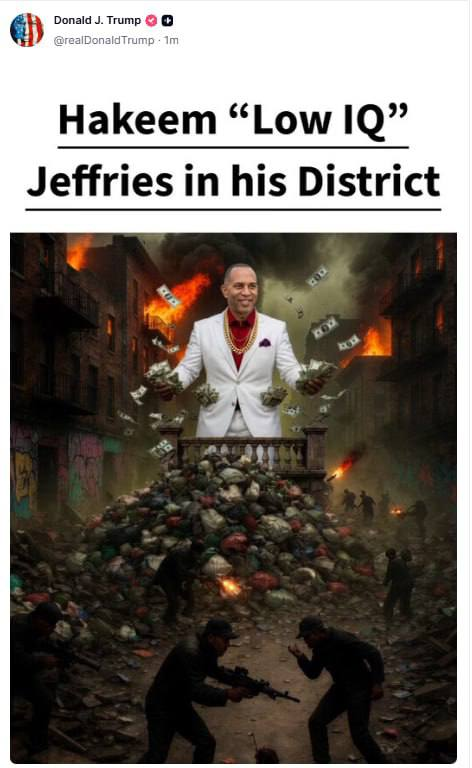
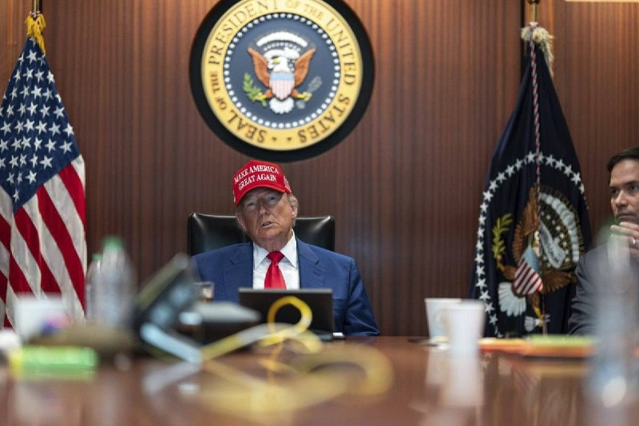

# خواننده تلگرام

<!-- TOP_NAV START -->

<!-- TOP_NAV END -->

<!-- MSG START -->

---
📅 بروزرسانی: 1405/02/28 01:59
---

## VahidOOnLine — post 240709

  <a href="telegram/content/VahidOOnLine_240709_1779056964.mp4" target="_blank">🎬 Download video</a>

ولودیمیر زلنسکی، رییس‌جمهوری اوکراین، یکشنبه ۲۷ اردیبهشت، با انتشار ویدیویی در ایکس از حمله گسترده پهپادی اوکراین به مناطقی در مسکو، در فاصله بیش از ۵۰۰ کیلومتری از مرزهای اوکراین خبر داد.
مقام‌های روسیه گفتند دست‌کم سه نفر کشته شدند.
پیش‌تر، زلنسکی پس از آن‌که روسیه در روزهای ۲۳ و ۲۴ اردیبهشت سنگین‌ترین حمله پهپادی و موشکی خود به کی‌یف را از آغاز جنگ انجام داد، وعده تلافی داده بود.
‌🏁 🇬🇧 IranintlTV

🤖 @VahidOOnLine

## VahidOOnLine — post 240708

♦️۲۸ اردیبهشت در تقویم رسمی ایران به نام روز بزرگداشت حکیم عمر خیام نیشابوری ثبت شده است؛ شاعر، ریاضی‌دان، ستاره‌شناس و فیلسوف برجسته ایرانی که از او به‌عنوان یکی از تاثیرگذارترین دانشمندان سده‌های میانی یاد می‌شود. خیام با تدوین گاه‌شماری جلالی و آثار علمی و ادبی خود، جایگاهی ماندگار در تاریخ علم و فرهنگ ایران و جهان به دست آورده است.

در انتهای بلوار خیام در جنوب شرقی نیشابور، باغی سرسبز قرار دارد که در قلب آن، اندیشمندی از تبار ستاره‌شناسان، شاعران و ریاضی‌دانان برجسته جهان در خاک آرمیده است. آرامگاه خیام نه‌تنها از مهم‌ترین نمادهای فرهنگی و گردشگری نیشابور محسوب می‌شود، بلکه جلوه‌ای از شکوه اندیشه، معماری و هنر است؛ بنایی که هوشنگ سیحون، معمار برجسته و نامدار، با الهام از رازورمز هستی، سروده‌های خیام و دانش ستاره‌شناسی و ریاضی او، چنان خلق کرد که پژواک سه بعد وجودی این نابغه ایرانی باشد.
آرامگاه خیام روز دوازدهم فروردین ۱۳۴۲ در مراسمی با حضور محمدرضاشاه و ⁧ شهبانو‌ فرح‌پهلوی ⁩ افتتاح شد و در سال ۱۳۵۴ در فهرست میراث ملی ایران به ثبت رسید.
‌🇸🇦 Indypersian

🤖 @VahidOOnLine

## VahidOOnLine — post 240707

  

‌ترامپ به فاصله چند دقیقه‌ چندین تصویر مرتبط با ایران را در تروث‌سوشال بازنشر کرد. ترامپ همچنین یک تصویر جدید از پرچم آمریکا را منتشر کرد که در پس‌زمینه آن نقشه خاورمیانه به مرکزیت ایران قرار دارد و از همه کشورهای همسایه فِلِش‌هایی به سمت ایران نشان داده شده است.
او همچنین چند تصویر و پویانما را بازنشر کرد که ناوها و پهپادهای آمریکایی را در حال هدف قرار دادن پهپادها و قایق‌های تندرو جمهوری اسلامی نشان می‌دهد.
ترامپ در یک پست نموداری را نیز بازنشر کرد که مدت‌زمان جنگ‌های مختلف آمریکا را نمایش می‌دهد. در این نمودار جنگ کنونی ایران با ۶ هفته به عنوان کوتاه‌مدت‌ترین و جنگ افغانستان با ۵۴۳ هفته به عنوان بلندمدت‌ترین جنگ نمایش داده شده است.
رییس‌جمهوری آمریکا همچنین دو تصویر مقایسه‌ای را بازنشر کرد که ناوگان کشتی‌های نظامی جمهوری اسلامی را در حال حرکت روی آب در زمان ریاست‌جمهوری اوباما و همین ناوگان را غرق شده در کف دریا در زمان دولت ترامپ نشان می‌دهد.

‌🏁 🇬🇧 IranintlTV

🤖 @VahidOOnLine

## VahidOOnLine — post 240706

  <a href="telegram/content/VahidOOnLine_240706_1779056967.mp4" target="_blank">🎬 Download video</a>

♦️دو فروند جنگنده ای‌ای-۱۸جی گرولر نیروی دریایی آمریکا روز یکشنبه در جریان نمایش هوایی «گان‌فایتر اسکایز» در پایگاه نیروی هوایی مانتین هوم در ایالت آیداهو در میانه آسمان با یکدیگر برخورد کردند، اما هر چهار عضو خدمه با موفقیت از هواپیماها خارج شدند.

آملیا اومایام، سخنگوی نیروهای هوایی نیروی دریایی آمریکا در ناوگان اقیانوس آرام، به فاکس‌نیوز گفت این دو هواپیما متعلق به اسکادران حمله الکترونیک ۱۲۹ مستقر در ویدبی آیلند ایالت واشنگتن بودند.

ویدیوهای منتشرشده در شبکه‌های اجتماعی لحظه برخورد دو جنگنده در آسمان و باز شدن چهار چتر نجات را نشان می‌دهد. سپس هواپیماها سقوط کردند و پس از برخورد با زمین منفجر شدند.

پایگاه «مانتین هوم گان‌فایترز» اعلام کرد نیروهای امدادی در محل حضور دارند و تحقیقات درباره علت حادثه آغاز شده است.
‌🇸🇦 Indypersian

🤖 @VahidOOnLine

## VahidOOnLine — post 240705

  <a href="telegram/content/VahidOOnLine_240705_1779056969.mp4" target="_blank">🎬 Download video</a>

‌
نیس | فرانسه؛ گردهمایی ایرانیان ـ گزارشگر یکشنبه ۲۷ اردیبهشت
‌🏁 🇬🇧 ManotoTV

🤖 @VahidOOnLine

## WithYashar — post 11524

  

پست جدید ترامپ در تروث مبنی بر فشار یا حمله همه جانبه به ایران
@withyashar

## mwarmonitor — post 9230

  <a href="telegram/content/mwarmonitor_9230_1779056973.mp4" target="_blank">🎬 Download video</a>

📝این مارمولکِ کثیف و فسیل‌شده‌ی نظام را هر چند وقت یک‌بار که با کمبود نفرات و قحط‌الرجال مواجه می‌شوند، مثل یک دلقک سیرک از انباری درمی‌آورند تا روی آنتن زنده با زر مفت زدنش، سوژه خنده و تفریح ما را فراهم کند. مرتیکه‌ی بی‌‌پدرومادر با وقاحتی بی‌شرمانه زل می‌زند در دوربین و می‌گوید «تنگه بازه!»؛ بله، باز است، ولی وای به حال هر کشتی و کشوری که باجِ سبیلِ شما مادر **** تروریست را ندهد، چون فوراً به سمتش شلیک می‌کنید و منطقه را به لجن می‌کشید.

🔸​این حد از وقاحت، دکانِ مظلوم‌نمایی و یکی به نعل و یکی به میخ زدن، اصلاً چیز جدیدی نیست؛ این مدل دروغ‌گوییِ کثیف و توجیه‌گریِ بی‌شرمانه، دقیقاً عین واقعیت و از صفاتِ بارز، ساختاری و ریشه‌ایِ شیعه رافضی است. جماعتی که کل هویت و تاریخش بر پایه‌ی نفاق، تقیه، باج‌خواهی و بحران‌زیستی بنا شده، حالا در قالب یک مشت آخوند و سردارِ ابلَه، از یک طرف تروریسم و موشک صادر می‌کنند و از طرف دیگر روی منبر ژست صلح‌طلبی می‌گیرند؛ حرامیانی که دروغ گفتن و خیانت در ذاتِ نجس و آیین کثیفشان است و با همین حرامزاده‌بازی‌ها دنیا را به آشوب کشیده‌اند.

@mwarmonitor

## mwarmonitor — post 9229

  

ترامپ در سوشال تروث

@mwarmonitor

## FoxNewsTwitter — post 341863

  <a href="telegram/content/FoxNewsTwitter_341863_1779056977.mp4" target="_blank">🎬 Download video</a>

Fox News (Twitter/X)

Terrifying video shows two U.S. Navy EA-18G Growler jets collide midair during the second day of the Gunfighter Skies Air Show at Mountain Home Air Force Base in Idaho on Sunday.

All four crew members successfully ejected and are being evaluated by medical personnel, the U.S. Navy confirmed to FOX News Digital.

The midair crash happened at about 12:10 p.m. MDT while the aircraft were performing an aerial demonstration during the air show, officials said.

## pm_afshaa — post 90932

🔴شاهزاده رضا پهلوی : ببینید، حتی همین چند روز پیش هم اعدام‌ها تقریباً روزانه ادامه داشته
این واقعیتیه که خیلی‌ها دارن کشته میشن و جنگ واقعی‌ای که جریان داره
همون جنگیه که رژیم 47 سال پیش علیه مردم خودش شروع کرده و هنوز هم تموم نشده
هیچ آتش‌بسی هم در کار نبوده و سرکوب مردم ایران همچنان ادامه داره

💧 Rainbet.com the #1 Non-KYC Crypto Casino & Sportsbook @rainbetcom

😁 @Pm_Afshaa

## pm_afshaa — post 90931

🔴شاهزاده رضا پهلوی : با اینکه بیشتر از 70 روزه اینترنتو کامل قطع کردن و مردم هیچ راهی برای ارتباط با بیرون ندارن ولی هنوز وایسادن و کوتاه نیومدن

فقط امیدشون اینه که این همه سختی و فداکاری هدر نره و آخرش این وضعیت تموم بشه و با به زانو اومدن این رژیم، کشور آزاد بشه

💧 Rainbet.com the #1 Non-KYC Crypto Casino & Sportsbook @rainbetcom

😁 @Pm_Afshaa

## pm_afshaa — post 90930

  

پست جدید ترامپ که تهدید به حمله کرده

💧 Rainbet.com the #1 Non-KYC Crypto Casino & Sportsbook @rainbetcom

😁 @Pm_Afshaa

## kianmeli1 — post 87456

  

🔴پست جدید ترامپ که نیاز به توضیح ندارد
https://t.me/kianmeli1

## IranIntlTV — post 337700

  <a href="telegram/content/IranIntlTV_337700_1779056982.mp4" target="_blank">🎬 Download video</a>

موج جدید تورم و بیکاری در کشور موجب تشدید بحران معیشت و گسترش فقر در جامعه شده است.

همزمان با تعطیلی مراکز اقتصادی و رکود بازار، یک عضو هیات رییسه مجلس جمهوری اسلامی گفت شمار متقاضیان بیمه بیکاری به بیش از ۳۰۰ هزار نفر رسیده است.

گفت‌وگو با احمد علوی، استاد دانشگاه و اقتصاددان
@iranintltv

## IranIntlTV — post 337699

  <a href="https://t.me/IranintlTV/337699" target="_blank">📎 Download file</a>

🎧نسخه صوتی سیاست با مراد ویسی: حملات پهپادی سپاه و نیابتی‌ها به امارات و عربستان
@iranintlTV

## IranIntlTV — post 337698

  <a href="telegram/content/IranIntlTV_337698_1779056984.mp4" target="_blank">🎬 Download video</a>

همزمان با ادامه بن‌بست مذاکرات میان واشینگتن و تهران و احتمال از سرگیری حملات به جمهوری اسلامی، دونالد ترامپ گفت جمهوری اسلامی باید «خیلی سریع» اقدام کند وگرنه چیزی از آن باقی نخواهد ماند.

گفت‌وگو با امیر گیتی، عضو تحریریه ایران‌اینترنشنال
@iranintltv

## IranIntlTV — post 337697

  <a href="telegram/content/IranIntlTV_337697_1779056987.mp4" target="_blank">🎬 Download video</a>

ولودیمیر زلنسکی، رییس‌جمهوری اوکراین، یکشنبه ۲۷ اردیبهشت، با انتشار ویدیویی در ایکس از حمله گسترده پهپادی اوکراین به مناطقی در مسکو، در فاصله بیش از ۵۰۰ کیلومتری از مرزهای اوکراین خبر داد.
مقام‌های روسیه گفتند دست‌کم سه نفر کشته شدند.
پیش‌تر، زلنسکی پس از آن‌که روسیه در روزهای ۲۳ و ۲۴ اردیبهشت سنگین‌ترین حمله پهپادی و موشکی خود به کی‌یف را از آغاز جنگ انجام داد، وعده تلافی داده بود.

## IranIntlTV — post 337696

  <a href="telegram/content/IranIntlTV_337696_1779056989.mp4" target="_blank">🎬 Download video</a>

🔻امیر قلعه‌نویی در حالی لیست تیم ملی برای حضور در جام‌جهانی را اعلام کرد که در مصاحبه‌ای گفت شریف‌ترین بازیکنان به تیم ملی دعوت شدند. این در حالی است که بازیکنانی در لیست تیم ملی قرار گرفتند که در تجمعات حکومتی حضور داشتند.

🔹توضیحات مزدک میرزایی، ایران‌اینترنشنال در برنامه هت‌تریک

🔹تماشای نسخه کامل هت‌تریک؛👇
https://youtu.be/gw3eJ0R9R5Y

@iranintltvsport

## IranIntlTV — post 337695

  <a href="telegram/content/IranIntlTV_337695_1779056991.mp4" target="_blank">🎬 Download video</a>

مراد ویسی، تحلیل‌گر ارشد ایران‌اینترنشنال، گفت: «۱۸ سالگی برای بسیاری آغاز ورود به دانشگاه، کار و آینده‌ای پر از آرزوست. سنی که خانواده‌ها انتظار دارند ثمره سال‌ها تلاش فرزندشان را ببینند. در کشتار دی‌ماه، بسیاری از نوجوانان و جوانانی که برای زندگی‌شان هزاران برنامه و امید داشتند، جان خود را از دست دادند؛ رخدادی که تلخی آن برای جامعه و خانواده‌ها عمیق‌تر شد.»
@iranintltv

## IranIntlTV — post 337694

  

‌ترامپ به فاصله چند دقیقه‌ چندین تصویر مرتبط با ایران را در تروث‌سوشال بازنشر کرد. ترامپ همچنین یک تصویر جدید از پرچم آمریکا را منتشر کرد که در پس‌زمینه آن نقشه خاورمیانه به مرکزیت ایران قرار دارد و از همه کشورهای همسایه فِلِش‌هایی به سمت ایران نشان داده شده است.
او همچنین چند تصویر و پویانما را بازنشر کرد که ناوها و پهپادهای آمریکایی را در حال هدف قرار دادن پهپادها و قایق‌های تندرو جمهوری اسلامی نشان می‌دهد.
ترامپ در یک پست نموداری را نیز بازنشر کرد که مدت‌زمان جنگ‌های مختلف آمریکا را نمایش می‌دهد. در این نمودار جنگ کنونی ایران با ۶ هفته به عنوان کوتاه‌مدت‌ترین و جنگ افغانستان با ۵۴۳ هفته به عنوان بلندمدت‌ترین جنگ نمایش داده شده است.
رییس‌جمهوری آمریکا همچنین دو تصویر مقایسه‌ای را بازنشر کرد که ناوگان کشتی‌های نظامی جمهوری اسلامی را در حال حرکت روی آب در زمان ریاست‌جمهوری اوباما و همین ناوگان را غرق شده در کف دریا در زمان دولت ترامپ نشان می‌دهد.

https://iranintl.com/202605173898

## IranIntlTV — post 337693

  <a href="telegram/content/IranIntlTV_337693_1779056994.mp4" target="_blank">🎬 Download video</a>

مراد ویسی، تحلیل‌گر ارشد ایران‌اینترنشنال، گفت: «مردم ایران، رفاه و پیشرفت دبی را با وضعیت نامساعد اقتصادی و معیشتی ایران مقایسه می‌کنند و این تفاوت را نتیجه عملکرد متفاوت رهبران جمهوری اسلامی می‌دانند. مقامات جمهوری اسلامی و فرماندهان سپاه نیز چون عقده دبی را دارند این چنین به امارات حمله می کنند.»
@iranintltv

## IranIntlTV — post 337692

  <a href="telegram/content/IranIntlTV_337692_1779056997.mp4" target="_blank">🎬 Download video</a>

آرش رازی، عضو حزب مشروطه ایران، در حاشیه تجمع اعتراضی ایرانیان در لس‌آنجلس به نیلوفر منصوری، خبرنگار ایران‌اینترنشنال، گفت: «پنج ماه است که هر هفته در لس‌آنجلس و شهرهای اطراف آن تجمع می‌کنیم و امروز هم در گلندیل حضور داریم.»

او افزود: «مهم‌ترین پیام ما "نه به اعدام" است. جمهوری اسلامی در هفته‌های اخیر موجی از اعدام‌ها را آغاز کرده و به گفته معترضان، هر روز و هر شب تعداد زیادی اعدام انجام می‌شود. ما اینجا هستیم تا علیه این روند اعتراض کنیم؛ نه به اعدام، نه به قطع اینترنت و نه به سرکوب زندانیان سیاسی.»
@iranintltv

## IranIntlTV — post 337691

  <a href="telegram/content/IranIntlTV_337691_1779056999.mp4" target="_blank">🎬 Download video</a>

مراد ویسی، تحلیل‌گر ارشد ایران‌اینترنشنال، گفت: «نیروگاه اتمی برکه امارات روز یکشنبه با سه پهپاد مورد حمله قرار گرفت. شامگاه یکشنبه هم وزارت دفاع عربستان اعلام کرد سه پهپاد شلیک‌شده از سمت عراق را سرنگون کرده است. دونالد ترامپ نیز روز یکشنبه ۳۰ دقیقه با بنیامین نتانیاهو درباره ایران گفت‌وگو کرد و قرار است سه‌شنبه نیز نشستی با دستیاران ارشدش درباره ایران برگزار کند.»
@iranintltv

## Shin_Persian — post 6055

Shin ✓ @hey_itsmyturn
Sun, 17 May 2026 22:09:31 UTC

Wael Abdel Halim, A PIJ terror commander has been eliminated following the #IAF 🇮🇱 strike on an apartment in Baalbek, Easter Lebanon

فارسی

وائل عبدالحلیم، یکی از فرماندهان تروریستی جهاد اسلامی فلسطین (PIJ)، در پی حمله نیروی هوایی اسرائیل (IAF) 🇮🇱 به آپارتمانی در بعلبک، در شرق لبنان حذف شد. #IAF 🇮🇱

𝕏 · @shin_persian

## ManotoTV — post 105581

  <a href="telegram/content/ManotoTV_105581_1779057002.mp4" target="_blank">🎬 Download video</a>

‌
نیس | فرانسه؛ گردهمایی ایرانیان ـ گزارشگر یکشنبه ۲۷ اردیبهشت

## FarsiVOA — post 218020

⚡️پوشش ویژه | دعای مایک جانسون در مراسم نیایش دویست‌وپنجاهمین سالروز استقلال آمریکا
@FarsiVOA

## FarsiVOA — post 218019

⚡️منیژه حکمت، کارگردان ایرانی و مادر پگاه آهنگرانی بعد از نمایش فیلم «تمرین‌هایی برای یک انقلاب» گفت چاره‌‌ای جز امیدواری وجود ندارد.
@FarsiVOA

## FarsiVOA — post 218018

⚡️روز جهانی ارتباطات در سایه قطع اینترنت در ایران؛ گفت‌وگو با امیر رشیدی
@FarsiVOA

## FarsiVOA — post 218017

⚡️وکلای تسخیری در جمهوری اسلامی وسیله‌ای برای سرعت‌بخشیدن به اعدام‌ها؛ گفت‌وگو با محمد مقیمی
@FarsiVOA

## FarsiVOA — post 218016

⚡️گفت‌وگو با کاوه فرنام تهیه کننده فیلم «تمرین‌هایی برای یک انقلاب »
@FarsiVOA

## FarsiVOA — post 218015

⚡️خشم رو به گسترش شیعیان لبنان علیه جمهوری اسلامی در پی اقدامات حزب‌الله و ناامنی مناطقی از لبنان
@FarsiVOA

## FarsiVOA — post 218014

  

⚡️مقامات آمریکایی گفتند که دو جت ائی‌ای-۱۸جی گرولر نیروی دریایی روز یکشنبه در نمایشگاه هوایی «گانفایتر اسکایز» در یک پایگاه نیروی هوایی در ایالت آیداهو، با هم در هوا برخورد کردند. به گفته مقامات، هر چهار خدمه با موفقیت ایجکت کردند و از هواپیما بیرون پریدند.
@FarsiVOA

## FarsiVOA — post 218013

⚡️از خاموشی اینترنت مردم تا چشم حکومت به درآمدِ کابل‌های هرمز

@FarsiVOA

## Persian_Trend_Official — post 14368

  <a href="telegram/content/Persian_Trend_Official_14368_1779057004.webm" target="_blank">🎬 Download video</a>

شبتون بخیر 🙏🤍

📝 Nick
📌 @persian_trend_official
پرشین ترند | متفاوت‌ترین کانال نظامی

## Persian_Trend_Official — post 14367

  

پست قابل تأمل ‌ترامپ که لحظاتی قبل در تروث سوشال منتشر کرده است.

☆Phantom☆

📌 @persian_trend_official
پرشین ترند | متفاوت‌ترین کانال نظامی

## Persian_Trend_Official — post 14366

♨️ دوستان عزیز، با توجه به شرایط پیش‌رو، بهتر است از همین حالا برای سناریوهای اضطراری آماده باشیم. آمادگی یعنی آرامش بیشتر و آسیب کمتر برای خودمان و خانواده‌مان. 🧭

⚠️ چند مورد مهم را جدی بگیرید:

• برای دست‌کم ۱ ماه، آذوقه‌ی غذایی فاسد نشدنی و آب آشامیدنی کافی برای همه اعضای خانواده تهیه کنید. 🥫💧

• همیشه تا جای ممکن باک بنزین خودرو را پر نگه دارید. ⛽️

• اگر نوزاد یا کودک شیرخوار دارید، حتماً به اندازه کافی شیر خشک و لوازم ضروری او را از قبل تهیه کنید. 👶🍼

• اگر در خانواده سالمند یا بیماری دارید که داروی حیاتی مصرف می‌کند، از داروهای ضروری او به میزان کافی ذخیره داشته باشید. 💊

• کوله اضطراری را جدی بگیرید؛ شامل مدارک مهم، مقداری پول نقد، پاوربانک، چراغ‌قوه، باتری، داروهای شخصی، لباس گرم، وسایل بهداشتی و شارژر. 🎒🔦

• مقداری پول نقد همراه داشته باشید؛ در شرایط بحران، دسترسی به کارت بانکی یا اینترنت ممکن است مختل شود. 💵

• دارایی و پول خود را فقط در یک محل متمرکز نکنید و برای شرایط قطع دسترسی، برنامه جایگزین داشته باشید. 🏦

• با اعضای خانواده درباره سناریوهای مختلف صحبت کنید: قطع برق، قطع اینترنت، تخلیه اضطراری و محل‌های امن یا محل تجمع خانوادگی. 👨‍👩‍👧‍👦

• یک رادیوی موج متوسط یا رادیوی باتری‌خور تهیه کنید تا در صورت قطع اینترنت، بتوانید خبرها و اطلاعیه‌های ضروری را دنبال کنید. 📻

• در خانه، شیشه‌ها و پنجره‌های حساس را بررسی و تا جای ممکن محکم‌کاری کنید. در صورت نگرانی از موج انفجار، می‌توان برای کاهش پخش شدن خرده‌شیشه‌ها از چسب نواری پهن به‌صورت ضربدری روی شیشه‌ها استفاده کرد. 🪟

• مدارک مهم، شماره تماس‌های ضروری، آدرس‌ها و اطلاعات حیاتی را هم به‌صورت کاغذی و هم در گوشی ذخیره کنید. 📄📱

• برای چند هفته بی‌برقی و بی‌ارتباطی هم آماده باشید: چراغ‌قوه، پاوربانک، آب، غذا و لوازم اولیه را از قبل کنار بگذارید. ⚠️

آمادگی به معنی ترسیدن نیست؛ یعنی از خانواده‌مان بهتر محافظت کنیم. ❤️

ما در تیم پرشین ترند امیدواریم هیچ اتفاق بدی برای هیچ‌یک از هم‌وطنان‌مان رخ ندهد، اما احتیاط از امروز می‌تواند فردا نجات‌بخش باشد.

📝 Nick

📌 @persian_trend_official
پرشین ترند | متفاوت‌ترین کانال نظامی

## IranianMinds — post 20312

  <a href="telegram/content/IranianMinds_20312_1779057006.mp4" target="_blank">🎬 Download video</a>

🔴 امشب تو صداوسیما مجری و دو تا سپاهی که از ترس کونشون صورتشونو پوشونده بودن اسلحه گرفته بودن دستشون و‌ داشتن به سمت ترامپ و نتانیاهو شلیک میکردن و داشتن دعا میکردن که ایشالا تیرشون به هدف میخوره

@IranianMinds

## IranianMinds — post 20311

  <a href="telegram/content/IranianMinds_20311_1779057008.webm" target="_blank">🎬 Download video</a>

💥 با هر ثبت نام 
🅰️
🅰️
🅰️ هزار تومن جایزه بگیرید

✔️ میتونید شرط‌بندی کنید و بونوس را به موجودی واقعی تبدیل کنید

⚽️  پوشش کامل مسابقات ورزشی 

💯  پیش‌بینی با بهترین ضرایب 

⭐️ تجربه سریع و حرفه‌ای

💰پرداخت مستقیم و سریع بدون واسطه، بدون دردسر، واریز و برداشت در سریع‌ترین زمان ممکن

☑️ کانال تلگرام: 

➡️ @winro_io  

🎁 هدیه خود را با ثبت نام در سایت دریافت کنید: 

➡️ Winro.io
A27
سایت اصلی در روزهای آینده بازگشایی خواهد شد
💎

## IranianMinds — post 20310

🔴 پست جدید ترامپ : @IranianMinds

## IranianMinds — post 20309

🔴 پست جدید ترامپ : @IranianMinds

## IranianMinds — post 20308

🔴 پست جدید ترامپ : @IranianMinds

## IranianMinds — post 20307

  

🔴 پست جدید ترامپ :

@IranianMinds

## BBCPersian — post 281330

  

‌ ‌ ‌ ‌
علیرضا یوسفی، وزنه‌بردار ایرانی وزن بعلاوه ۱۱۰ کیلوگرم موفق شد در جریان مسابقات قهرمانی آسیا رکود دو ضرب جهان را بشکند.

وزنه بردار فوق سنگین ایران روز یکشنبه در حرکت دو ضرب توانست با بالا بردن ۲۶۱ کیلوگرم، ضمن کسب مدال طلای مسابقات آسیایی که اکنون در هند در حال برگزاری است، رکود جهان را بهبود ببخشد.

او پس از شکست رکود جهان روی سکو دوبنده خود را کنار زد تا نوشته روی تی‌شرت مشکی خود را - «شهدای میناب ۱۶۸» - به دوربین و حاضران در ورزشگاه نشان دهد.

او در حرکت یک ضرب سوم شد تا در مجموع صاحب مدال نقره وزن بعلاوه ۱۱۰ کیلوگرم شود.

https://bbc.in/43dSUhn
📷Nasimonline
@BBCPersian

## Dirty_Kids — post 389647

  

ترامپ در تروث‌سوشال رگباری گاییده. بیست سی‌تا پست پشت هم گذاشته تا الان. @Dirty_Kids 👻

## Dirty_Kids — post 389646

  <a href="telegram/content/Dirty_Kids_389646_1779057010.mp4" target="_blank">🎬 Download video</a>

🔴 در ادامه شلیک‌ها تو صداوسيما؛

امشب مجری شبکه سه و یه فرد نظامی که قیافش رو پوشونده بود، به سمت عکس نتانیاهو و ترامپ شلیک کردن و به همديگه ماشالا گفتن...

@Dirty_Kids 👻

## Dirty_Kids — post 389642

ترامپ در تروث‌سوشال رگباری گاییده. بیست سی‌تا پست پشت هم گذاشته تا الان.

@Dirty_Kids 👻

## alonews — post 120725

  

🔥
💥اینترنت آزاد و رایگان

🌐
🚫تنها جایی که کانفیگ رایگان میزاره

⬇️
⬇️
@NetAazaadBot
@NetAazaadBot

⚠️هر ساعت 100گیگ شارژ میشه، رباتو داشته باشید تا مطلع بشید

## alonews — post 120724

  <a href="telegram/content/alonews_120724_1779057013.webm" target="_blank">🎬 Download video</a>

👈پست عجیب حسین دهباشی سازنده کلیپ تبلیغاتی حسن روحانی در سال ۱۳۹۶: حملات و ترورهای دشمن تا رهبری حسن روحانی ادامه خواهد داشت

✅ @AloNews خبر جنگ

## alonews — post 120723

  <a href="telegram/content/alonews_120723_1779057014.webm" target="_blank">🎬 Download video</a>

👈وضعیت ایران در روز ارتباطات و روابط عمومی

✅ @AloNews خبر جنگ

## alonews — post 120722

  <a href="telegram/content/alonews_120722_1779057014.webm" target="_blank">🎬 Download video</a>

👈سفیر ایالات متحده در سازمان ملل: هدف قرار دادن نیروگاه هسته‌ای براکه در امارات متحده عربی، تشدید تنش خطرناک و غیرقابل قبول است.

✅ @AloNews خبر جنگ

## alonews — post 120721

  <a href="telegram/content/alonews_120721_1779057014.webm" target="_blank">🎬 Download video</a>

👈خوش چشم: قالیباف هَوَل مذاکره نیست

✅ @AloNews خبر جنگ

## alonews — post 120720

  <a href="telegram/content/alonews_120720_1779057014.webm" target="_blank">🎬 Download video</a>

👈ترامپ بازم پست گذاشت 
✅ @AloNews خبر جنگ

## alonews — post 120719

  <a href="telegram/content/alonews_120719_1779057015.webm" target="_blank">🎬 Download video</a>

👈ترامپ بازم پست گذاشت 
✅ @AloNews خبر جنگ

## alonews — post 120718

  <a href="telegram/content/alonews_120718_1779057015.webm" target="_blank">🎬 Download video</a>

👈ترامپ بازم پست گذاشت

✅ @AloNews خبر جنگ

---
📅 بروزرسانی: 1405/02/28 00:59
---

## VahidOOnLine — post 240704

  

♦️سی‌ان‌ان بامداد دوشنبه ۲۸ اردیبهشت‌ماه به نقل از یک منبع آگاه گزارش داد دونالد ترامپ، رئیس‌جمهوری آمریکا، روز شنبه با اعضای ارشد تیم امنیت ملی خود دیدار کرده تا درباره مسیر پیش‌رو در جنگ ایران گفتگو کند. ترامپ هم‌زمان هشدار داد جمهوری اسلامی «بهتر است خیلی سریع اقدام کند، وگرنه چیزی از آن باقی نخواهد ماند.»

ترامپ روز یکشنبه در شبکه تروث سوشال نوشت: «برای ایران، ساعت در حال گذر است و بهتر است خیلی سریع اقدام کنند، وگرنه چیزی از آن‌ها باقی نخواهد ماند. زمان حیاتی است!»

به گفته این منبع، جی‌دی ونس، معاون رئیس‌جمهوری آمریکا، مارکو روبیو، وزیر خارجه، جان رتکلیف، رئیس سازمان سیا، و استیو ویتکاف، فرستاده ویژه آمریکا، در نشست برگزارشده در باشگاه گلف ترامپ در ویرجینیا حضور داشتند. این نشست چند ساعت پس از بازگشت ترامپ از سفرش به چین برگزار شد؛ کشوری که روابط نزدیکی با جمهوری اسلامی دارد.

سی‌ان‌ان گزارش داد ترامپ از روند مذاکرات دیپلماتیک با تهران و ادامه بسته ماندن تنگه هرمز ناراضی است و این موضوع را عاملی برای افزایش فشار بر بازار جهانی انرژی می‌داند. بر اساس این گزارش، دولت ترامپ در جریان سفر به پکن تصمیم‌گیری درباره گام بعدی در قبال جمهوری اسلامی را به بعد از دیدار ترامپ و شی جین‌پینگ موکول کرده بود.

این شبکه همچنین گزارش داد ترامپ در روزهای اخیر با جدیت بیشتری گزینه ازسرگیری عملیات گسترده نظامی علیه جمهوری اسلامی را بررسی کرده است؛ اقدامی که هدف آن وادار کردن تهران به پذیرش مصالحه برای پایان جنگ عنوان شده است.

منابع آگاه به سی‌ان‌ان گفتند پنتاگون مجموعه‌ای از طرح‌های حمله نظامی، از جمله حملات هدفمند به تاسیسات انرژی و زیرساختی ایران، را آماده کرده است تا در صورت تصمیم ترامپ اجرا شوند.

در همین حال، رسانه‌های جمهوری اسلامی گزارش دادند محسن نقوی، وزیر کشور پاکستان، روز یکشنبه با مقام‌های ارشد جمهوری اسلامی از جمله مسعود پزشکیان دیدار کرده است. پاکستان در هفته‌های اخیر نقش میانجی اصلی در گفتگوهای صلح میان آمریکا و جمهوری اسلامی را ایفا کرده است.
‌🇸🇦 Indypersian

🤖 @VahidOOnLine

## VahidOOnLine — post 240703

  <a href="telegram/content/VahidOOnLine_240703_1779053360.mp4" target="_blank">🎬 Download video</a>

با امضای فرمانده منطقه مرکزی ارتش اسرائیل، قانون مجازات اعدام برای فلسطینیان متهم به حملات تروریستی و مرگبار در کرانه باختری از شامگاه یکشنبه اجرایی شد.

بر اساس این قانون، دادگاه‌های نظامی اسرائیل موظف‌اند برای متهمانی که حملاتشان منجر به کشته شدن افراد شده، حکم اعدام صادر کنند؛ مگر آنکه «شرایط ویژه» برای صدور حبس ابد وجود داشته باشد.

این قانون تنها شامل فلسطینیان در دادگاه‌های نظامی می‌شود و شهروندان اسرائیلی را در بر نمی‌گیرد.

ایتمار بن‌گویر، وزیر امنیت ملی اسرائیل، نیز اجرای این قانون را تحقق وعده انتخاباتی حزب راست‌گرای «عوتسما یهودیت» توصیف کرد.

اسرائیل کاتز، وزیر دفاع اسرائیل، گفت: «تروریست‌هایی که یهودیان را می‌کشند، دیگر در زندان با شرایط مناسب نخواهند نشست و سنگین‌ترین بها را خواهند پرداخت.»
‌🏁 🇬🇧 ManotoTV

🤖 @VahidOOnLine

## VahidOOnLine — post 240702

  <a href="telegram/content/VahidOOnLine_240702_1779053360.mp4" target="_blank">🎬 Download video</a>

‌
وزارت دفاع عربستان سعودی اعلام کرد سه پهپاد که صبح یکشنبه از حریم هوایی عراق وارد فضای این کشور شده بودند، رهگیری و منهدم شدند.

عربستان در بیانیه‌ای تاکید کرد حق پاسخ‌گویی را برای خود محفوظ می‌داند و برای مقابله با هرگونه تعرض به حاکمیت و امنیت خود، اقدامات عملیاتی لازم را انجام خواهد داد.
‌🏁 🇬🇧 ManotoTV

🤖 @VahidOOnLine

## VahidOOnLine — post 240701

  

♦️ترکی المالکی، سخنگوی رسمی وزارت دفاع عربستان سعودی، یکشنبه ۲۷ اردیبهشت‌ماه اعلام کرد سه پهپاد پس از ورود به حریم هوایی این کشور از سمت حریم هوایی عراق رهگیری و منهدم شدند.

سرلشکر ترکی المالکی تاکید کرد وزارت دفاع عربستان سعودی حق پاسخ‌گویی را در زمان و مکان مناسب برای خود محفوظ می‌داند و تمامی اقدامات عملیاتی لازم را برای مقابله با هرگونه تلاش جهت نقض حاکمیت، امنیت و سلامت شهروندان و ساکنان این کشور انجام خواهد داد.

وزارت دفاع عربستان سعودی افزود این کشور برای مقابله با هرگونه تلاش جهت نقض حاکمیت و امنیت خود، اقدامات عملیاتی لازم را اتخاذ خواهد کرد.
‌🇸🇦 Indypersian

🤖 @VahidOOnLine

## VahidOOnLine — post 240700

  

عربستان سعودی اعلام کرد روز یک‌شنبه سه پهپاد را که از حریم هوایی عراق وارد شده بودند، رهگیری کرده است.

وزارت دفاع عربستان سعودی تأکید کرد این کشور برای مقابله با هرگونه تلاش برای نقض حاکمیت و امنیت خود، اقدامات عملیاتی لازم را انجام خواهد داد و حق پاسخ‌گویی را «در زمان و مکان مناسب» برای خود محفوظ می‌داند.
‌🏁 🇬🇧 IranintlTV

🤖 @VahidOOnLine

## VahidOOnLine — post 240699

  

♦️رسانه‌های جمهوری اسلامی، یکشنبه ۲۷ اردیبهشت‌ماه گزارش دادند که عباس عراقچی، وزیر خارجه جمهوری اسلامی، و ژان نوئل بارو، وزیر خارجه فرانسه، در یک گفتگوی تلفنی درباره موضوعات دوجانبه، آخرین تحولات منطقه‌ای و روندهای جاری دیپلماتیک رایزنی و تبادل نظر کردند.

بر اساس این گزارش‌ها، دو طرف در این تماس تلفنی درباره تحولات منطقه و روندهای دیپلماتیک جاری گفتگو کردند، اما جزئیات بیشتری از محورهای این رایزنی منتشر نشده است.
‌🇸🇦 Indypersian

🤖 @VahidOOnLine

## VahidOOnLine — post 240698

  

سخنگوی فرماندهی مرکزی آمریکا در گفت‌وگو با العربیه اعلام کرد جمهوری اسلامی تهدیدی آشکار برای امنیت جهانی و ثبات منطقه‌ای است و توانایی آن در شلیک موشک و پهپاد به‌شدت کاهش یافته است. او افزود آمریکا همراه با متحدانش برای تقویت سامانه‌های پدافند هوایی همکاری کرده است.

سخنگوی سنتکام گفت جمهوری اسلامی در طول جنگ موشک‌های خود را از مناطق پرجمعیت پرتاب کرده است.

او همچنین تاکید کرد آمریکا تمام تلاش‌های جمهوری اسلامی برای ورود و خروج تجهیزات را زیر نظر دارد و با اعمال محاصره دریایی، با استفاده تهران از تنگه هرمز به‌عنوان ابزار تهدید آزادی کشتیرانی مقابله می‌کند. به گفته او، انتقال تسلیحات به متحدان جمهوری اسلامی متوقف شده و نیروهای آمریکا برای هرگونه طرح اضطراری آمادگی کامل دارند.
‌🏁 🇬🇧 IranintlTV

🤖 @VahidOOnLine

## VahidOOnLine — post 240697

  <a href="telegram/content/VahidOOnLine_240697_1779053362.mp4" target="_blank">🎬 Download video</a>

♦️مسعود پزشکیان، رئیس‌جمهوری ایران، روز یکشنبه در دیدار با محسن نقوی، وزیر کشور پاکستان، از نقش اسلام‌آباد در تثبیت آتش‌بس قدردانی کرد و ابراز امیدواری کرد تلاش‌های پاکستان به تقویت صلح و ثبات در منطقه کمک کند.

پزشکیان در این دیدار تاکید کرد ایران خواهان روابطی صمیمانه و پایدار با کشورهای اسلامی منطقه است و اتحاد کشورهای اسلامی می‌تواند زمینه مداخله قدرت‌های فرامنطقه‌ای را کاهش دهد.

به گزارش ایرنا، محسن نقوی نیز گفت ایران و پاکستان اکنون بیش از گذشته به یکدیگر نزدیک شده‌اند و روابط برادرانه دو کشور باید بیش از پیش گسترش یابد.

این دیدار در حالی انجام شد که پاکستان در هفته‌های اخیر در روند تلاش‌های دیپلماتیک و میانجی‌گری منطقه‌ای برای کاهش تنش‌ها و تثبیت آتش‌بس نقش فعالی ایفا کرده است.
‌🇸🇦 Indypersian

🤖 @VahidOOnLine

## WithYashar — post 11523

کان نیوز :هرگونه حمله آینده علیه ایران که به تأیید ترامپ برسد، به‌صورت مشترک توسط نیروهای آمریکا و اسرائیل انجام خواهد شد
@withyashar

## WithYashar — post 11522

سنتکام : ما تو زمان آتش‌بس با ایران دوباره مسلح شدیم و نیروهامون رو جابه‌جا و مستقر کردیم
@withyashar

## WithYashar — post 11521

ترامپ به کانال ۱۳ اسرائیل:

فکر می‌کنم ایرانی‌ها باید از اون اتفاقی که الان در حال رخ دادنه بترسن.

@withyashar

## WithYashar — post 11520

هم اکنون گزارش CNN: ترامپ تیم امنیت ملی ارشد خود را برای بحث در مورد ایران فراخواند
@withyashar

## WithYashar — post 11519

پست ترامپ از تیر اندازی به پرچم در تلویزیون ایران فیک است !( این کار انجام شده ولی ترامپ چنین پستی منتشر نکرده ! اکانت فیک ترامپ در X منشع این خبر است

## WithYashar — post 11518

  <a href="telegram/content/WithYashar_11518_1779053363.mp4" target="_blank">🎬 Download video</a>

مارکو روبیو:

دلیل توقف پروژه آزادی به درخواست پاکستان بود. پاکستانی‌ها گفتند: «اگر شما پروژه آزادی را متوقف کنید، فکر می‌کنیم می‌توانیم به توافق برسیم.»

ما پیش رفتیم و موافقت کردیم که آن را متوقف کنیم.
@withyashar

## FoxNewsTwitter — post 341862

  <a href="telegram/content/FoxNewsTwitter_341862_1779053364.mp4" target="_blank">🎬 Download video</a>

Fox News (Twitter/X)

“Our rights do not derive from the government. They come from You: Our Creator and Heavenly Father."

House Speaker Mike Johnson delivered a forceful defense of America’s founding principles during the “Rededicate 250” prayer gathering on the National Mall ahead of the nation’s 250th anniversary.

Johnson warned that “sinister ideologies” are trying to rewrite the American story through “the lens of our sins,” attacking the country’s history, heroes, and moral identity.

“We reject that. We rebuke it,” he said.

## FoxNewsTwitter — post 341861

  

Fox News (Twitter/X)

BREAKING: Two Navy EA18-G jets collided in midair while performing an aerial demonstration for the Mountain Home Air Force Base Gunfighter Skies Air Show on Sunday, the U.S. Navy confirmed to Fox News Digital. All four air crew successfully ejected. (Photo: Michael Katz)

## pm_afshaa — post 90929

🔴کان نیوز :هرگونه حمله آینده علیه ایران که به تأیید ترامپ برسد، به‌صورت مشترک توسط نیروهای آمریکا و اسرائیل انجام خواهد شد

💧 Rainbet.com the #1 Non-KYC Crypto Casino & Sportsbook @rainbetcom

😁 @Pm_Afshaa

## pm_afshaa — post 90928

🔴سنتکام : ما تو زمان آتش‌بس با ایران دوباره مسلح شدیم و نیروهامون رو جابه‌جا و مستقر کردیم

💧 Rainbet.com the #1 Non-KYC Crypto Casino & Sportsbook @rainbetcom

😁 @Pm_Afshaa

## pm_afshaa — post 90927

  <a href="telegram/content/pm_afshaa_90927_1779053366.webm" target="_blank">🎬 Download video</a>

🔴سی‌ان‌ان به نقل از یک منبع آگاه:
ترامپ روز شنبه با اعضای ارشد تیم امنیت ملی آمریکا درباره مسیر جنگ با ایران جلسه برگزار کرده.

جی‌دی ونس، مارکو روبیو، رئیس سیا و استیو ویتکاف هم در این نشست حضور داشتن؛ جلسه‌ای که ساعاتی پس از بازگشت ترامپ از سفر چین برگزار شد.

💧 Rainbet.com the #1 Non-KYC Crypto Casino & Sportsbook @rainbetcom

😁 @Pm_Afshaa

## pm_afshaa — post 90926

  <a href="telegram/content/pm_afshaa_90926_1779053367.webm" target="_blank">🎬 Download video</a>

🔴مارکو روبیو، وزیر خارجه آمریکا:
دلیل توقف «پروژه آزادی»، این بود که پاکستان چنین درخواستی کرد. پاکستانی‌ها گفتن: «اگر شما پروژه آزادی رو متوقف کنید، فکر می‌کنیم بتونیم به یک توافق برسیم.»
ما موافقت کردیم و متوقف کردیم.

💧 Rainbet.com the #1 Non-KYC Crypto Casino & Sportsbook @rainbetcom

😁 @Pm_Afshaa

## pm_afshaa — post 90925

عربستان سعودی: امشب 3 پهپاد پرتاب‌شده از عراق رو رهگیری کردیم.

💧 Rainbet.com the #1 Non-KYC Crypto Casino & Sportsbook @rainbetcom

😁 @Pm_Afshaa

## pm_afshaa — post 90924

  <a href="telegram/content/pm_afshaa_90924_1779053367.webm" target="_blank">🎬 Download video</a>

🔴سی‌ان‌ان: ترامپ تیم امنیت ملی ارشد خود را برای بحث در مورد ایران فراخواند.

💧 Rainbet.com the #1 Non-KYC Crypto Casino & Sportsbook @rainbetcom

😁 @Pm_Afshaa

## pm_afshaa — post 90922

  <a href="telegram/content/pm_afshaa_90922_1779053368.mp4" target="_blank">🎬 Download video</a>

امشب تو پخش زنده شبکه افق، نتانیاهو و ترامپ توسط مجری صداوسیما ترور شدن.

💧 Rainbet.com the #1 Non-KYC Crypto Casino & Sportsbook @rainbetcom

😁 @Pm_Afshaa

## VahidOnline — post 75524

  

پست ترامپ: بای‌بای "قایق‌های تندرو"
realDonaldTrump
سه‌شنبه هم این تصویر بالا رو منتشر کرده بود. ساعتی پیش‌تر اون انیمیشن دیروزی رو هم دوباره پست کرده بود. تصویر ساختگی یا طرح گرافیکی دیگری هم منتشر کرده با عنوان اینکه نفتکش‌های خالی برای خرید نفت به آمریکا می‌آیند.
اون پستش علیه اوباما و بایدن با طرح گرافیکی قایق‌هایی با پرچم جمهوری اسلامی در کف دریا رو هم دوباره منتشر کرده.

📡 @VahidOnline

## VahidOnline — post 75523

  

ترکی المالکی، سخنگوی رسمی وزارت دفاع عربستان سعودی، یکشنبه ۲۷ اردیبهشت‌ماه اعلام کرد سه پهپاد پس از ورود به حریم هوایی این کشور از سمت حریم هوایی عراق رهگیری و منهدم شدند.

سرلشکر ترکی المالکی تاکید کرد وزارت دفاع عربستان سعودی حق پاسخ‌گویی را در زمان و مکان مناسب برای خود محفوظ می‌داند و تمامی اقدامات عملیاتی لازم را برای مقابله با هرگونه تلاش جهت نقض حاکمیت، امنیت و سلامت شهروندان و ساکنان این کشور انجام خواهد داد.

وزارت دفاع عربستان سعودی افزود این کشور برای مقابله با هرگونه تلاش جهت نقض حاکمیت و امنیت خود، اقدامات عملیاتی لازم را اتخاذ خواهد کرد.
@VahidOOnLine

📡 @VahidOnline

## IranIntlTV — post 337690

  <a href="telegram/content/IranIntlTV_337690_1779053369.mp4" target="_blank">🎬 Download video</a>

روزنامه سازندگی از گسترش فقر در میان زنان ایران گزارش داده و نوشته است زنان نخستین قربانیان شوک‌های اقتصادی پی‌درپی و تعدیل نیروها هستند.
این روزنامه همچنین از محرومیت میلیون‌ها زن سرپرست خانواده از بیمه و حمایت پایدار خبر داده است.

گفت‌وگو با پگاه بنی‌هاشمی، پژوهشگر حقوق
@iranintltv

## IranIntlTV — post 337689

  <a href="telegram/content/IranIntlTV_337689_1779053370.mp4" target="_blank">🎬 Download video</a>

در ادامه کارزار حمایت ایرانیان خارج از کشور از انقلاب ملی، گروهی از ایرانیان لس‌آنجلس تجمعی اعتراضی برگزار کردند تا به قطعی اینترنت، افزایش اعدام‌ها و علیه سرکوب‌ها در ایران اعتراض کنند.

گزارش نیلوفر منصوری، خبرنگار ایران‌اینترنشنال و گفت‌وگو با آرش رازی، عضو حزب مشروطه ایران
@iranintltv

## IranIntlTV — post 337688

  <a href="telegram/content/IranIntlTV_337688_1779053371.mp4" target="_blank">🎬 Download video</a>

صداوسیما، پس از آموزش کلاشنیکف در شبکه‌های مختلف، این بار نحوه استفاده از تیربار پی‌کا را در تلویزیون آموزش داد.

پیش‌تر، مجریان صداوسیمای جمهوری اسلامی در برنامه‌هایی با در دست داشتن تفنگ ظاهر شده و کار با سلاح‌های سبک را آموزش داده بودند.

این برنامه‌ها، که دست‌کم در سه بخش پخش شد، در رسانه‌های داخلی بازنشر شد و در شبکه‌های اجتماعی واکنش‌هایی را برانگیخت. برخی کاربران این بخش‌ها را نشانه‌ای از بسیج حامیان حکومت در شرایط جنگی توصیف کردند.
@iranintltv

## IranIntlTV — post 337687

  

عربستان سعودی اعلام کرد روز یک‌شنبه سه پهپاد را که از حریم هوایی عراق وارد شده بودند، رهگیری کرده است.

وزارت دفاع عربستان سعودی تأکید کرد این کشور برای مقابله با هرگونه تلاش برای نقض حاکمیت و امنیت خود، اقدامات عملیاتی لازم را انجام خواهد داد و حق پاسخ‌گویی را «در زمان و مکان مناسب» برای خود محفوظ می‌داند.
https://iranintl.com/202605177517

## IranIntlTV — post 337686

تلگراف: شرکت مرتبط با جمهوری اسلامی از طریق ویزای کار، افراد را به بریتانیا منتقل کرده است

روزنامه تلگراف در گزارشی تحقیقی خبر داد یک شرکت رسانه‌ای مستقر در لندن مرتبط با نهادهای وابسته به جمهوری اسلامی، از مجوز حمایت مالی ویزای نیروی «کار ماهر» برای انتقال برخی افراد به بریتانیا استفاده کرده است.

به گزارش تلگراف، شرکت «راد مدیا ورلد» (RAD Media World) که در شمال غرب لندن ثبت شده، با نهادهایی از جمله پرس‌تی‌وی، رسانه دولتی جمهوری اسلامی، و هیسپان تی‌وی، شبکه اسپانیایی‌زبان وابسته به حکومت ایران، ارتباط دارد و از طریق حمایت مالی از ویزای نیروی کار ماهر، افرادی را به‌طور قانونی وارد بریتانیا کرده است.

هشدار کارشناسان: خطر ایجاد «درِ باز» برای فعالیت‌های جمهوری اسلامی
به نوشته تلگراف، کارشناسان اطلاعاتی هشدار داده‌اند که چنین سازوکاری ممکن است به «دری باز» برای ورود افرادی تبدیل شود که احتمال دارد به نمایندگی از جمهوری اسلامی فعالیت‌های اطلاعاتی یا خصمانه انجام دهند.

این هشدارها پس از افزایش سطح تهدید تروریستی در بریتانیا به سطح «شدید» و در پی موجی از حملات علیه یهودیان، کنیسه‌ها و موسسات خیریه مطرح شده است.

جاناتان هکت، افسر سابق اطلاعاتی آمریکا و متخصص عملیات پنهانی ایران، به تلگراف گفته است جمهوری اسلامی از رویکرد نسبتا سهل‌گیرانه بریتانیا سوءاستفاده می‌کند و بخشی از فعالیت‌های خود را از طریق نهادهای رسانه‌ای و فرهنگی پیش می‌برد.

او گفت: «این سازمان‌ها می‌توانند پوششی برای ورود ماموران اطلاعاتی ایران به بریتانیا فراهم کنند؛ افرادی که ممکن است برای نظارت، شناسایی، انتقال مخفیانه پول یا دیگر فعالیت‌های پنهانی وارد شوند.»

او همچنین گفت: «اهداف جمهوری اسلامی در بریتانیا شامل جامعه یهودیان و مخالفان ایرانی هستند و وجود چنین نهادهایی می‌تواند امکان اجرای این اهداف را فراهم کند.»

درخواست برای لغو مجوز حمایت مالی از ویزا
تلگراف گزارش می‌دهد از وزارت کشور بریتانیا خواسته شده مجوز موسسه راد برای حمایت مالی از ویزا لغو شده و بررسی جامعی درباره سیاست‌های صدور ویزا آغاز شود.

دیوید تیلور، نماینده حزب کارگر در پارلمان بریتانیا، گفته است: «حق حمایت مالی این شرکت از ویزا باید فورا لغو شود و این شرکت باید بلافاصله تحت تحقیق قرار گیرد.»

او همچنین خواستار بررسی فوری افرادی شده که با حمایت این شرکت موفق به دریافت ویزا شده‌اند.

ارتباط با پرس‌تی‌وی، هیسپان تی‌وی و استودیوهای تولید در لندن
به نوشته تلگراف، شرکت راد مدیا ورلد با «راونور فارم استودیوز» (Ravenor Farm Studios)، استودیویی در غرب لندن، نیز ارتباط دارد؛ جایی که برنامه «Palestine Declassified» متعلق به پرس‌تی‌وی فیلم‌برداری شده بود.

تلگراف می‌گوید هنگام بازدید از محل شرکت در هفته جاری، با یک واحد خالی در شهرک صنعتی مواجه شده که تحت حفاظت یک شرکت امنیتی حرفه‌ای بوده است؛ شرکتی که گفته هدف حضورش جلوگیری از استقرار افراد بی‌خانمان یا مسافران در آن محل بوده است.

ماه گذشته، این استودیو نامه‌ای از دولت بریتانیا دریافت کرده که در آن به احتمال اقدام حقوقی بر اساس قانون امنیت ملی اشاره شده بود.

بر اساس اسناد ثبت شرکت‌ها، سید مهدی میرطالب تنها مدیر فعلی راد مدیا وورد و حمید خیرالدین مدیر پیشین آن بوده‌اند. هر دو پیش‌تر با شرکت منحل‌شده UK Press TV Ltd و همچنین هیسپان تی‌وی همکاری داشته‌اند.

اسناد رسمی همچنین نشان می‌دهد یکی از مالکان ثبت‌شده راونور فارم استودیوز، شرکت «لندن برادکاستینگ‌پارتنرز» (London Broadcasting Partners Limited) است که سید مهدی میرطالب تنها مدیر آن محسوب می‌شود.

تلگراف می‌گوید آدرس ثبت‌شده راد مدیا ورلد در ومبلی لندن، با شرکت‌های مرتبط از جمله لندن‌برادکاستینگ‌ پارتنرز و هیسپان تی‌وی مشترک است.

واکنش متهمان و دولت بریتانیا
سید مهدی میرطالب، مدیر فعلی شرکت لندن برادکاستینگ‌پارتنرز، اتهامات مطرح‌شده را «مزخرفات توطئه‌محور» خوانده است. پرس‌تی‌وی و هیسپان تی‌وی از اظهارنظر درباره گزارش خودداری کرده‌اند.

در مقابل، سخنگوی وزارت کشور بریتانیا به تلگراف گفته است: «ما تهدید ناشی از ایران را بسیار جدی می‌گیریم و حفاظت از منافع و جان شهروندان بریتانیا اولویت نخست ماست.»

او افزود دولت بریتانیا تاکنون سپاه پاسداران و بیش از ۵۵۰ فرد و نهاد ایرانی را تحریم کرده و در هفته‌های آینده قوانین جدیدی برای مقابله با فعالیت‌های خصمانه دولت‌های خارجی و نیروهای نیابتی آن‌ها تصویب خواهد شد.

به نوشته تلگراف، جزئیات ارتباطات راد مدیا ورلد با نهادهای مرتبط با حکومت ایران در قالب پرونده‌ای به واحد مقابله با تروریسم پلیس لندن و وزارت کشور بریتانیا ارائه شده است.
 
🔗متن کامل گزارش را اینجا بخوانید
@iranintltv

## IranIntlTV — post 337685

  

سخنگوی فرماندهی مرکزی آمریکا در گفت‌وگو با العربیه اعلام کرد جمهوری اسلامی تهدیدی آشکار برای امنیت جهانی و ثبات منطقه‌ای است و توانایی آن در شلیک موشک و پهپاد به‌شدت کاهش یافته است. او افزود آمریکا همراه با متحدانش برای تقویت سامانه‌های پدافند هوایی همکاری کرده است.

سخنگوی سنتکام گفت جمهوری اسلامی در طول جنگ موشک‌های خود را از مناطق پرجمعیت پرتاب کرده است.

او همچنین تاکید کرد آمریکا تمام تلاش‌های جمهوری اسلامی برای ورود و خروج تجهیزات را زیر نظر دارد و با اعمال محاصره دریایی، با استفاده تهران از تنگه هرمز به‌عنوان ابزار تهدید آزادی کشتیرانی مقابله می‌کند. به گفته او، انتقال تسلیحات به متحدان جمهوری اسلامی متوقف شده و نیروهای آمریکا برای هرگونه طرح اضطراری آمادگی کامل دارند.
https://iranintl.com/202605178642

## Shin_Persian — post 6054

Shin ✓ @hey_itsmyturn
Sun, 17 May 2026 20:37:53 UTC

Jet activity over Nineveh, #Iraq 🇮🇶

فارسی

فعالیت جت‌ها بر فراز نینوا، #عراق 🇮🇶

𝕏 · @shin_persian

## ManotoTV — post 105580

  <a href="telegram/content/ManotoTV_105580_1779053373.mp4" target="_blank">🎬 Download video</a>

با امضای فرمانده منطقه مرکزی ارتش اسرائیل، قانون مجازات اعدام برای فلسطینیان متهم به حملات تروریستی و مرگبار در کرانه باختری از شامگاه یکشنبه اجرایی شد.

بر اساس این قانون، دادگاه‌های نظامی اسرائیل موظف‌اند برای متهمانی که حملاتشان منجر به کشته شدن افراد شده، حکم اعدام صادر کنند؛ مگر آنکه «شرایط ویژه» برای صدور حبس ابد وجود داشته باشد.

این قانون تنها شامل فلسطینیان در دادگاه‌های نظامی می‌شود و شهروندان اسرائیلی را در بر نمی‌گیرد.

ایتمار بن‌گویر، وزیر امنیت ملی اسرائیل، نیز اجرای این قانون را تحقق وعده انتخاباتی حزب راست‌گرای «عوتسما یهودیت» توصیف کرد.

اسرائیل کاتز، وزیر دفاع اسرائیل، گفت: «تروریست‌هایی که یهودیان را می‌کشند، دیگر در زندان با شرایط مناسب نخواهند نشست و سنگین‌ترین بها را خواهند پرداخت.»

## ManotoTV — post 105579

  <a href="telegram/content/ManotoTV_105579_1779053374.mp4" target="_blank">🎬 Download video</a>

‌
وزارت دفاع عربستان سعودی اعلام کرد سه پهپاد که صبح یکشنبه از حریم هوایی عراق وارد فضای این کشور شده بودند، رهگیری و منهدم شدند.

عربستان در بیانیه‌ای تاکید کرد حق پاسخ‌گویی را برای خود محفوظ می‌داند و برای مقابله با هرگونه تعرض به حاکمیت و امنیت خود، اقدامات عملیاتی لازم را انجام خواهد داد.

## FarsiVOA — post 218012

⚡️در حالی که جنگ و تحریم، اقتصاد ایران را زیر فشار بی‌سابقه قرار داده، مرزهای فراموش‌شده سیستان و بلوچستان به شریان تازه‌ای برای بقای اقتصادی جمهوری اسلامی تبدیل شده‌اند. جایی که هزاران وانت، موتورسیکلت و قایق، هر روز میلیون‌ها لیتر سوخت را از دل بیابان و دریا به پاکستان منتقل می‌کنند.
@FarsiVOA

## FarsiVOA — post 218011

⚡️چرا جمهوری اسلامی اینستاگرام را «جنگنده آمریکایی» می‌داند؟
@FarsiVOA

## FarsiVOA — post 218010

  

⚡️دونالد ترامپ، رئيس جمهوری آمریکا عصر یک‌شنبه چندین گرافیک با پیام برتری نظامی آمریکا بر جمهوری اسلامی را منتشر کرد. یکی از این تصاویر عنوان «خدانگهدار! قایق‌های (مثلا) تندرو!» را دارد و یک پهپاد آمریکایی را نشان می‌هد که دو قایق جمهوری‌اسلامی را به آتش‌کشیده‌‌است.
@FarsiVOA

## FarsiVOA — post 218009

  <a href="telegram/content/FarsiVOA_218009_1779053375.mp4" target="_blank">🎬 Download video</a>

⚡️مسدود ماندن تنگه هرمز «اشتباه بزرگ تاکتیکی» جمهوری اسلامی؛ تازه‌ترین واکنش‌های کنگره به شرایط منطقه
@FarsiVOA

## FarsiVOA — post 218008

⚡️افزایش زن‌کشی و خشونت؛ هشدار فعالان حقوق زن درباره وضعیت زنان در افغانستان و ایران
@FarsiVOA

## FarsiVOA — post 218007

⚡️انتصاب قالیباف در امور چین؛ پیام درون‌حاکمیتی یا سیگنال به پکن؟
@FarsiVOA

## FarsiVOA — post 218006

  

⚡️وزارت دفاع عربستان اعلام کرد که صبح یکشنبه سه پهپاد پس از ورود به حریم هوایی پادشاهی از سمت آسمان عراق رهگیری و منهدم شدند. سخنگوی وزارت دفاع عربستان گفت این کشور حق پاسخ‌گویی در زمان و مکان مناسب را برای خود محفوظ می‌داند.
@FarsiVOA

## FarsiVOA — post 218005

  <a href="telegram/content/FarsiVOA_218005_1779053376.mp4" target="_blank">🎬 Download video</a>

⚡️دونالد ترامپ، روز یکشنبه ساعاتی پس از هشدارش به جمهوری اسلامی که «زمان به سرعت رو به پایان است» سه ویدیو در تروت‌سوشال منتشر کرد که اظهاراتش را در مورد سادگی دفع حملات پهپادی جمهوری اسلامی توسط نیروی دریایی آمریکا به تصویر کشیده‌اند.
@FarsiVOA

## Persian_Trend_Official — post 14365

https://youtu.be/8YQ1YcLyw6E

## Persian_Trend_Official — post 14364

https://youtube.com/live/2KsilHSCq4o?feature=share

## IranianMinds — post 20306

🔴 ترامپ :

مقامات جمهوری اسلامی باید از من بترسن!

@IranianMinds

## IranianMinds — post 20305

🔴 کانال ۱۳ اسرائیل :

مقامات ایرانی باید از اتفاقی که قراره بیوفته بترسن

@IranianMinds

## IranianMinds — post 20304

  

یکی هوش مصنوعیو‌ از دست این بگیره

@IranianMinds

## IranianMinds — post 20303

  

🔴 پست ترامپ :

@IranianMinds

## IranianMinds — post 20300

🔴 پست های جدید ترامپ :

@IranianMinds

## IranianMinds — post 20299

  

🔴 آکسیوس :

ترامپ گفته هنوز باور دارد ایران خواهان توافق است، اما هشدار داده که تهران باید خیلی سریع پیشنهادی قوی‌تر ارائه کند وگرنه با اقدام نظامی سخت‌ تری از سوی آمریکا مواجه خواهد شد!

@IranianMinds

## IranianMinds — post 20298

  <a href="telegram/content/IranianMinds_20298_1779053377.mp4" target="_blank">🎬 Download video</a>

🔴دو جنگنده نیروی دریایی آمریکا در جریان نمایشی هوایی به هم برخورد کردن، خلبان‌ها با موفقیت اجکت کردن و هر ۴ نفرشون سالم هستن.

@IranianMinds

## BBCPersian — post 281329

  <a href="https://t.me/bbcpersian/281329" target="_blank">📎 Download file</a>

🔻 پادکست برنامه شصت دقیقه یکشنبه ۲۷ اردیبهشت ۱۴۰۵

این نسخه رادیویی برنامه شصت دقیقه تلویزیون فارسی بی‌بی‌سی است که هرشب بعد از پخش، با حجم کم از اپلیکیشن‌های پادگیر و صفحه تلگرام بی‌بی‌سی فارسی در دسترس است.

با هشتگ BBCPersianRadio# با ما در ارتباط باشید.

@BBCPersian

## BBCPersian — post 281328

  

‌ ‌ ‌
وزارت خارجه عربستان سعودی در بیانیه‌ای حملات پهپادی امروز به امارات متحده عربی را محکوم کرد.

در حمله‌ای که امروز به نیروگاه هسته‌ای براکه امارات شد، آتش‌سوزی در بخش‌هایی از آن رخ داد.

در این بیانیه عربستان سعودی آمده است که این کشور به «قوی‌ترین» شکل ممکن حمله پهپادی به کشور امارات متحده عربی را محکوم می‌کند.

پیشتر امارات متحده عربی حمله پهپادی را «یک اقدام تروریستی بی‌دلیل» خواند که باعث تشدید تنش در منطقه می‌شود.

وزارت خارجه امارات در بیانیه‌ای «به شدیدترین لحن» این حمله را محکوم کرد و «حق دیپلماتیک و نظامی خود را برای پاسخ به هرگونه تهدید، ادعا یا دشمنی» را محفوظ دانست.

https://bbc.in/4wqBf3o
📷 Emre Caylak/Bloomberg via Getty Images
@BBCPersian

## Dirty_Kids — post 389641

بهزاد فراهانى حرومزاده يه دختر چهل كيلويی بود، به اسم نيكا شاكرمى كه اندازه كل تير و طايفت جیگر داشت.

@Dirty_Kids 👻

## Dirty_Kids — post 389640

  <a href="telegram/content/Dirty_Kids_389640_1779053380.mp4" target="_blank">🎬 Download video</a>

با همین ریخت و قیافه و تیپ گفت؛
دخترای هااات طرفدار فلسطینن

فرض محال که محال نیست
اصن بر فرض محال باشن، مگه همه مثل شما بی‌وطن‌ها دنبال کمر به پایین‌ن که ملاک‌شون این باشه مسیرشونو عوض کنن!

@Dirty_Kids 👻

## manototv — post 105581

  <a href="telegram/content/manototv_105581_1779053381.mp4" target="_blank">🎬 Download video</a>

‌
نیس | فرانسه؛ گردهمایی ایرانیان ـ گزارشگر یکشنبه ۲۷ اردیبهشت

## manototv — post 105580

  <a href="telegram/content/manototv_105580_1779053382.mp4" target="_blank">🎬 Download video</a>

با امضای فرمانده منطقه مرکزی ارتش اسرائیل، قانون مجازات اعدام برای فلسطینیان متهم به حملات تروریستی و مرگبار در کرانه باختری از شامگاه یکشنبه اجرایی شد.

بر اساس این قانون، دادگاه‌های نظامی اسرائیل موظف‌اند برای متهمانی که حملاتشان منجر به کشته شدن افراد شده، حکم اعدام صادر کنند؛ مگر آنکه «شرایط ویژه» برای صدور حبس ابد وجود داشته باشد.

این قانون تنها شامل فلسطینیان در دادگاه‌های نظامی می‌شود و شهروندان اسرائیلی را در بر نمی‌گیرد.

ایتمار بن‌گویر، وزیر امنیت ملی اسرائیل، نیز اجرای این قانون را تحقق وعده انتخاباتی حزب راست‌گرای «عوتسما یهودیت» توصیف کرد.

اسرائیل کاتز، وزیر دفاع اسرائیل، گفت: «تروریست‌هایی که یهودیان را می‌کشند، دیگر در زندان با شرایط مناسب نخواهند نشست و سنگین‌ترین بها را خواهند پرداخت.»

## manototv — post 105579

  <a href="telegram/content/manototv_105579_1779053383.mp4" target="_blank">🎬 Download video</a>

‌
وزارت دفاع عربستان سعودی اعلام کرد سه پهپاد که صبح یکشنبه از حریم هوایی عراق وارد فضای این کشور شده بودند، رهگیری و منهدم شدند.

عربستان در بیانیه‌ای تاکید کرد حق پاسخ‌گویی را برای خود محفوظ می‌داند و برای مقابله با هرگونه تعرض به حاکمیت و امنیت خود، اقدامات عملیاتی لازم را انجام خواهد داد.

## alonews — post 120717

  <a href="telegram/content/alonews_120717_1779053383.webm" target="_blank">🎬 Download video</a>

👈ترامپ دوباره این عکس رو پست کرد

🔴دموکرات‌ها عاشق فاضلاب هستند

✅ @AloNews خبر جنگ

## alonews — post 120716

  <a href="telegram/content/alonews_120716_1779053383.webm" target="_blank">🎬 Download video</a>

💢هم اکنون تحرکات شدید ارتش ایالات متحده در منطقه 
🚨 @AkhbareFouri

## alonews — post 120715

  <a href="telegram/content/alonews_120715_1779053384.webm" target="_blank">🎬 Download video</a>

👈رئیس جمهور ترامپ به کانال 13 اسرائیل:
فکر کنم ایرانی ها باید از اتفاقاتی که الان داره میفته بترسن

🔴اونا بايد از من بترسن

✅ @AloNews خبر جنگ

## alonews — post 120714

  <a href="telegram/content/alonews_120714_1779053384.webm" target="_blank">🎬 Download video</a>

👈ترامپ بازم پست گذاشت

🔴گفت حکیم جفریز، رهبر دموکرات‌های مجلس عقلش کمه

✅ @AloNews خبر جنگ

## alonews — post 120713

  <a href="telegram/content/alonews_120713_1779053384.webm" target="_blank">🎬 Download video</a>

👈خبرگزاری فارس: در صورت جنگ مجدد آمریکا و اسرائیل شانس پیروزی در مقابل ایران ندارن و دوباره شکست میخورن

✅ @AloNews خبر جنگ

## alonews — post 120712

  

نروژ مرفه‌ترین کشور جهان در سال 2026

[@AloTweet]

## alonews — post 120711

  <a href="telegram/content/alonews_120711_1779053385.mp4" target="_blank">🎬 Download video</a>

🔴بیشرفی خاصی می‌خواد به مردمی که اینجوری با دستای خالی جلوی رگبار گلوله وایسادن و 40هزار نفر در کمتر از ۴۸ساعت کشته دادن، حرف از بیضه بزنی که طبق معمول فقط از یک چپی برمیاد

🤔حسابتون بمونه با همین مردم فردای آزادی.

✅@AloNews

## alonews — post 120703

  <a href="telegram/content/alonews_120703_1779053386.webm" target="_blank">🎬 Download video</a>

👈ترامپ یهو ۸تا پست گذاشت

✅ @AloNews خبر جنگ

## alonews — post 120702

  <a href="telegram/content/alonews_120702_1779053386.webm" target="_blank">🎬 Download video</a>

👈رسایی:
اون دسته از مسئولینی که دلسوز کشور هستن در معرض ترور قرار دارن و نباید از موبایل استفاده کنن

🔴مجری:
پس چرا شما از موبایل استفاده میکنید؟

🔴رسایی:
😐

✅ @AloNews خبر جنگ

## alonews — post 120701

  <a href="telegram/content/alonews_120701_1779053386.webm" target="_blank">🎬 Download video</a>

👈سی‌ان‌ان: ترامپ به طور فزاینده‌ای نسبت به نحوه مدیریت مذاکرات دیپلماتیک از سوی تهران بی‌صبر شده و همچنان از تداوم بسته بودن تنگه هرمز و تأثیر آن بر قیمت جهانی نفت کلافه است. 
✅ @AloNews خبر جنگ

## alonews — post 120700

  <a href="telegram/content/alonews_120700_1779053386.webm" target="_blank">🎬 Download video</a>

👈سی‌ان‌ان: منبعی آگاه گفت که دونالد ترامپ روز شنبه با اعضای ارشد تیم امنیت ملی خود دیدار کرد تا درباره مسیر پیشِ روی جنگ با ایران گفتگو کند. 
🔴این جلسه یک روز قبل از آن برگزار شد که ترامپ ادعا کرد تهران «بهتر است سریع حرکت کند، وگرنه چیزی از آنها باقی نخواهد…

## alonews — post 120699

  <a href="telegram/content/alonews_120699_1779053387.webm" target="_blank">🎬 Download video</a>

👈سی‌ان‌ان: منبعی آگاه گفت که دونالد ترامپ روز شنبه با اعضای ارشد تیم امنیت ملی خود دیدار کرد تا درباره مسیر پیشِ روی جنگ با ایران گفتگو کند.

🔴این جلسه یک روز قبل از آن برگزار شد که ترامپ ادعا کرد تهران «بهتر است سریع حرکت کند، وگرنه چیزی از آنها باقی نخواهد ماند».

🔴به گفته این منبع، معاون رئیس‌جمهور، جی‌دی ونس، وزیر خارجه، مارکو روبیو، رئیس سیا، جان رتکلیف، و استیو ویتکاف، فرستاده ویژه، همگی در این نشست در باشگاه گلف ترامپ در ویرجینیا حضور داشتند.

🔴این جلسه تنها ساعاتی پس از بازگشت ترامپ از سفر به چین، کشوری با روابط نزدیک با ایران، برگزار شد.

✅ @AloNews خبر جنگ

## alonews — post 120697

  <a href="telegram/content/alonews_120697_1779053387.mp4" target="_blank">🎬 Download video</a>

👈ترامپ و نتانیاهو ترور شدن
‼️

🔴امشب تو پخش زنده شبکه افق، نتانیاهو و ترامپ توسط صدا و سیما ترور شدن.

✅ @AloNews خبر جنگ

<!-- MSG END -->

<!-- NAV START -->

<!-- NAV END -->
